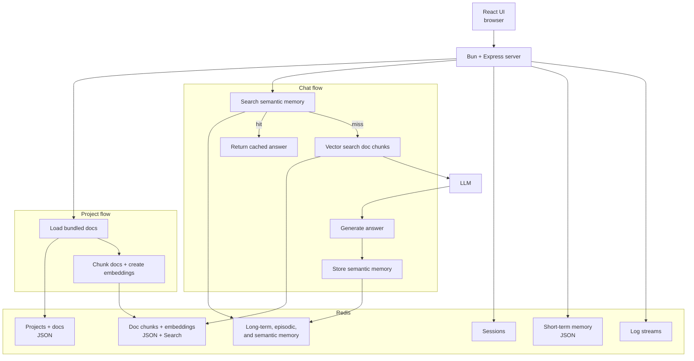

*Published 18 March 2026 · updated 25 March 2026*

> **TL;DR:**
>
> Build a document agent that stores session state, chat history, long-term memory, and vector-indexed doc chunks in Redis. This tutorial uses Bun, Express, OpenAI, and Redis to load bundled docs, retrieve relevant chunks with vector search, and answer questions over those docs with a Redis-backed retrieval-augmented generation (RAG) flow.

> **Note:** This tutorial uses the code from the following git repository:
>
> [https://github.com/redis-developer/agent-doc-manager](https://github.com/redis-developer/agent-doc-manager)

## What you'll learn

- How to use Redis as the primary state layer for a document agent
- How to store projects and docs as JSON in Redis
- How to chunk docs and index embeddings for vector search
- How to keep short-term chat history and long-term memory in Redis
- How to combine vector search and memory to answer questions over docs

## What you'll build

You'll build a Bun-based document agent with two main workflows:

- A project workflow that loads docs into Redis and lets you edit them
- A chat workflow that answers questions using Redis-backed memory and doc retrieval

The default demo path uses bundled markdown docs in the repo, so you can run the app without live crawl dependencies. If you want live crawl later, you can switch the app to Tavily mode.

## What is a document agent?

A document agent is an app that can ingest docs, keep track of context across interactions, and answer or edit content based on those docs. It combines retrieval, memory, and app state so the user can move between indexing, questioning, and editing without losing context.

## What is retrieval-augmented generation (RAG)?

RAG is a pattern where an app retrieves relevant information from a data store and passes it to a large language model (LLM) as context before generating a response. Instead of relying only on the LLM's training data, the model gets grounded in your actual docs.

In this app, the RAG flow works like this:

1. A user asks a question
2. The app searches Redis for relevant doc chunks using vector search
3. The app passes those chunks to the LLM as context
4. The LLM generates an answer grounded in your docs

Redis fits RAG well because it can store the doc chunks, serve the vector search, and hold the chat history — all in one fast data layer.

## Why use Redis for a document agent?

Redis fits this use case because the app needs one fast system that can handle multiple kinds of state:

- Session storage for browser sessions
- JSON storage for projects and source docs
- Vector search for doc chunk retrieval
- Short-term chat history for active conversations
- Long-term, episodic, and semantic memory for agent behavior over time
- Streams for internal logging

That gives you one fast data layer for the full document agent loop instead of stitching together separate stores for sessions, vectors, chat history, and memory.

## How does the app work?

The app has two main flows:

1. **Project flow**: create a project, load bundled docs, store them as JSON in Redis, chunk the docs, and index embeddings for vector search.
2. **Chat flow**: read short-term chat history, search semantic memory first, fall back to doc chunk retrieval via vector search, generate an answer, and store new semantic memory.

Both flows use Redis as the single data layer.



## Prerequisites

- [Bun](https://bun.sh/) runtime
- [Docker](https://www.docker.com/) for the Redis container
- An [OpenAI API key](https://platform.openai.com/api-keys)
- Basic familiarity with Redis commands and TypeScript

If you need a Redis refresher first, start with the [Redis quick start](/tutorials/howtos/quick-start/) and [Node.js client guide](/tutorials/develop/node/gettingstarted/).

## Step 1. Clone the repo

```bash
git clone https://github.com/redis-developer/agent-doc-manager.git
cd agent-doc-manager
```

## Step 2. Configure environment variables

Copy the sample file:

```bash
cp .env.example .env
```

Then add your OpenAI API key:

```bash
OPENAI_API_KEY=your_key_here
```

## Step 3. Run Redis with Docker

The app includes a Docker Compose file that uses `redis:alpine`.

```bash
bun run docker:redis
```

## Step 4. Install dependencies and run the app

```bash
bun install
bun run dev
```

Open `http://localhost:8080`.

## Step 5. Ingest bundled docs into Redis

The default demo path uses:

```bash
CRAWL_SOURCE=local
```

In this mode, the app loads bundled markdown files from `data/documents` instead of calling a live crawl provider. That keeps the happy path stable for local runs, tests, and tutorials.

Create a project in the UI, add a title, and enter a short working brief. In local mode, the app loads the bundled docs into Redis as soon as the project starts.

## How does the app store docs and chunks in Redis?

The app stores each doc as a JSON value and then creates doc chunks for vector search.

At a high level:

1. Read markdown docs from disk
2. Split each doc into chunks
3. Generate an embedding for each chunk
4. Store docs and chunks in Redis JSON
5. Query chunks later with vector search

The code below creates two Redis Search indexes: one for full docs and one for doc chunks. The chunk index includes a vector field so you can run KNN queries against the embeddings.

```ts
const chunkSchema: RediSearchSchema = {
    '$.embedding': {
        type: SCHEMA_FIELD_TYPE.VECTOR,
        TYPE: 'FLOAT32',
        ALGORITHM: SCHEMA_VECTOR_FIELD_ALGORITHM.HNSW,
        DIM: vectorDimensions,
        DISTANCE_METRIC: 'COSINE',
        AS: 'embedding',
    },
    '$.documentId': {
        type: SCHEMA_FIELD_TYPE.TAG,
        AS: 'documentId',
    },
    '$.userId': {
        type: SCHEMA_FIELD_TYPE.TAG,
        AS: 'userId',
    },
    '$.projectId': {
        type: SCHEMA_FIELD_TYPE.TAG,
        AS: 'projectId',
    },
    '$.content': {
        type: SCHEMA_FIELD_TYPE.TEXT,
        AS: 'content',
    },
};

await db.ft.create('idx-document-chunks', chunkSchema, {
    ON: 'JSON',
    PREFIX: 'document-chunks:',
});
```

Once the indexes exist, the app splits each doc into chunks, generates embeddings, and writes everything to Redis with `JSON.MSET`. Each doc is keyed by `documents:{id}` and each chunk by `document-chunks:{id}`.

```ts
await db.json.mSet(
    allDocuments.map((document) => ({
        key: `documents:${document.id}`,
        path: '$',
        value: document,
    })),
);

const jsonChunks = allChunks.map((chunk) => ({
    key: `document-chunks:${randomUlid()}`,
    path: '$',
    value: chunk,
}));

await db.json.mSet(jsonChunks);
```

## How does the app search doc chunks with vector search?

When a user asks a question, the app generates an embedding for the query and runs a KNN vector search against the chunk index. The search returns the most relevant doc chunks, filtered by the user's ID and ranked by cosine distance.

```ts
const embedding = await embedText(query);

const results = await db.ft.search(
    'idx-document-chunks',
    `(@userId:{${userId}})=>[KNN 100 @embedding $BLOB AS vector_score]`,
    {
        PARAMS: {
            BLOB: float32ToBuffer(embedding),
        },
        RETURN: [
            'documentId',
            'userId',
            'projectId',
            'content',
            'vector_score',
        ],
        SORTBY: 'vector_score',
        DIALECT: 2,
    },
);
```

The app filters results by a distance threshold (0.3) so only chunks that are semantically close to the query get returned.

## How does the app manage chat memory?

The app keeps multiple memory layers in Redis:

- **Short-term memory** stores the current chat history for a session
- **Long-term memory** stores user-specific preferences, such as editing rules
- **Episodic memory** stores summaries of past interactions
- **Semantic memory** stores reusable facts that can help any future session

Short-term memory uses Redis JSON with a list of messages. Each session is stored at a key like `users:u{userId}:memory:shortterm:c{sessionId}` and appended to with `JSON.ARRAPPEND`.

```ts
const memory = {
    id: this.options.createUid(),
    role: newMemory.role,
    content: newMemory.content,
    timestamp: Date.now(),
};

await this.db.json.arrAppend(this.sessionKey, '$.memories', memory);
```

For long-term and semantic memory, the app uses Redis Search with vector embeddings. Each memory entry is stored as a JSON doc with an embedding field, so the app can search for relevant memories using KNN queries — the same pattern used for doc chunks.

```ts
const schema: RediSearchSchema = {
    '$.embedding': {
        type: SCHEMA_FIELD_TYPE.VECTOR,
        TYPE: 'FLOAT32',
        ALGORITHM: SCHEMA_VECTOR_FIELD_ALGORITHM.FLAT,
        DIM: requiredOptions.vectorDimensions,
        DISTANCE_METRIC: 'L2',
        AS: 'embedding',
    },
    '$.id': { type: SCHEMA_FIELD_TYPE.TAG, AS: 'id' },
    '$.question': { type: SCHEMA_FIELD_TYPE.TEXT, AS: 'question' },
    '$.answer': { type: SCHEMA_FIELD_TYPE.TEXT, AS: 'answer' },
};

await db.ft.create(index, schema, {
    ON: 'JSON',
    PREFIX: `semantic-memory:`,
});
```

This lets the agent answer questions with both recent chat context and retained knowledge.

## How does the RAG flow work?

When a user sends a new question, the chat controller follows this sequence:

1. Push the user's message to short-term memory in Redis
2. Search semantic memory in Redis for a cached answer
3. If semantic memory hits, return the cached answer
4. If semantic memory misses, search doc chunks with vector search
5. Pass the retrieved chunks plus the chat history to the LLM
6. Store the new question-answer pair as semantic memory for future queries

The code below shows the core of this flow in the chat controller:

```ts
const result = await workingMemory.searchSemanticMemory(message);

if (result.length > 0) {
    response.content = result[0].answer;
} else {
    const documentChunks = await documents.searchChunks(userId, message);

    response.content = await chatAiAdapter.answerQuestionWithRag(
        await chat.memories(),
        documentChunks,
        chunkSearchTool,
    );

    await chatAiAdapter.storeSemanticMemories(
        message,
        response.content,
        memoryTools,
    );
}
```

That gives you a clean semantic-memory-first path before the app falls back to doc retrieval. Repeated questions get sub-millisecond answers from Redis instead of hitting the LLM again.

## How does the app reuse editing preferences with Redis memory?

When a user edits a doc and confirms the changes, the app summarizes the pattern of that edit and stores it as long-term memory. Later, when a new project starts, the app searches for existing editing preferences:

```ts
const editMemories = await workingMemory.search('Markdown editing preferences');

if (editMemories.length > 0 && editMemories[0].type === 'long-term') {
    // Surface the saved editing preference and ask whether to reuse it
}
```

That turns one-off edits into durable agent behavior without hard-coding the rule into the app.

## How does Redis store the data model?

Every piece of state in the app lives in Redis. Here is the full key structure:

```text
session:{sessionId}
  Redis-backed browser session (express-session)

projects:{projectId}
  JSON: { projectId, userId, title, prompt, createdAt }

documents:{documentId}
  JSON: { id, userId, projectId, url, content }

document-chunks:{chunkId}
  JSON: { documentId, userId, projectId, content, embedding }
  Index: idx-document-chunks (vector search on embedding)

users:u{userId}:memory:shortterm:c{chatId}
  JSON: { userId, sessionId, summary, memories[] }

users:u{userId}:memory:longterm:{id}
  JSON: { id, question, answer, embedding }
  Index: per-user vector search

users:u{userId}:memory:episodic:{id}
  JSON: { chatId, summary, embedding }

semantic-memory:{id}
  JSON: { id, question, answer, embedding }
  Index: idx-semantic-memory (vector search)

LOG_STREAM / ERROR_STREAM
  Redis Streams for app logs
```

## Optional: live crawl mode

If you want live crawl instead of the bundled demo docs, switch the app to Tavily mode:

```bash
CRAWL_SOURCE=tavily
TAVILY_API_KEY=your_tavily_key
```

In that mode, the app uses the URL and crawl instructions extracted from the project prompt.

## Troubleshooting

### The app starts but returns a Redis error

Check that `REDIS_URL` in your `.env` file points to a running Redis instance. If you're using Docker, verify the container is running:

```bash
docker ps
```

### The app starts but OpenAI calls fail

Verify that `OPENAI_API_KEY` is set correctly in your `.env` file and that the key has active billing.

### No docs appear after creating a project

Make sure `CRAWL_SOURCE=local` is set in `.env`. In local mode, the app loads bundled markdown files from `data/documents`. If that directory is empty, no docs will appear.

### Docker Compose fails to start

Make sure Docker is running and that port 6379 is not already in use by another Redis instance.

## Next steps

- Explore how agent memory works in depth with the [agent memory with LangGraph and Redis](/tutorials/what-is-agent-memory-example-using-langgraph-and-redis/) tutorial
- Build a RAG chatbot from scratch with the [RAG GenAI chatbot with Redis](/tutorials/howtos/solutions/vector/gen-ai-chatbot/) tutorial
- Learn the basics of vector search with the [vector search getting started](/tutorials/howtos/solutions/vector/getting-started-vector/) guide
- Try [Redis Cloud free](https://redis.io/try-free/) to deploy Redis for your GenAI workloads

## FAQ

### What is retrieval-augmented generation (RAG)?

RAG is a pattern that combines information retrieval with LLM text generation. The app retrieves relevant doc chunks from Redis using vector search, passes them to the LLM as context, and generates an answer grounded in your actual docs rather than the model's training data alone.

### How does Redis store vector embeddings?

Redis stores vector embeddings as fields inside JSON docs. When you create a Redis Search index with a `VECTOR` field type, Redis indexes those embeddings and lets you run KNN (K-nearest neighbor) queries to find the most similar vectors. This app uses HNSW for doc chunks (fast approximate search) and FLAT for memory entries (exact search over a smaller dataset).

### What is agent memory?

Agent memory is the mechanism that lets an AI agent retain and recall information across interactions. This app uses four types: short-term memory (current chat history), long-term memory (user preferences), episodic memory (past interaction summaries), and semantic memory (reusable facts). All four live in Redis.

### What is a good Redis use case for this app?

This app is a good Redis use case because it needs fast retrieval across multiple kinds of state — sessions, docs, vectors, chat history, and memory — all in one data layer.

### Why not use a separate vector database?

You can, but Redis lets you keep doc storage, vector retrieval, and memory in one place. That reduces operational complexity and keeps the app architecture simpler.

### Can I use this with docs other than markdown?

The bundled demo uses markdown, but you can adapt the ingestion pipeline to handle other formats. The key requirement is that you can split the content into text chunks and generate embeddings for each chunk.

### How is this different from a chatbot?

A chatbot typically answers questions from a fixed knowledge base. This document agent goes further — it ingests docs on demand, tracks editing preferences across sessions, stores semantic memory for repeated questions, and lets you modify docs based on learned editing patterns.

### Do I need live crawl to follow this tutorial?

No. The default path uses bundled local docs so you can run the app without Tavily.

### Do I need Redis Cloud?

No. The local tutorial flow uses Docker with `redis:alpine`. You can switch to [Redis Cloud](https://redis.io/try-free/) later by updating `REDIS_URL` in your `.env` file.

## Additional resources

- [Redis docs](https://redis.io/docs/latest/)
- [Redis Search docs](https://redis.io/docs/latest/develop/interact/search-and-query/)
- [Redis JSON docs](https://redis.io/docs/latest/develop/data-types/json/)
- [Redis clients](https://redis.io/docs/latest/develop/clients/)
- [Redis Insight](https://redis.io/insight/)
