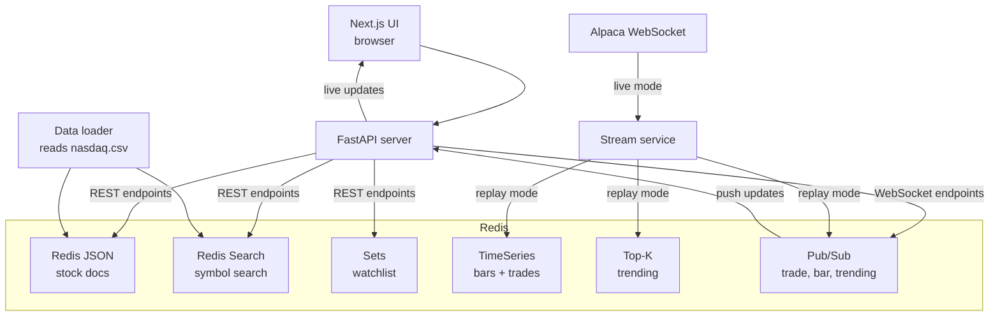

*Published 19 March 2026 · updated 25 March 2026*

> **TL;DR:**
>
> Build a real-time stock watchlist that uses Redis for JSON-backed stock docs, Redis Search search, time series for trades and price bars, sets for the watchlist, Top-K for trending symbols, and pub/sub for WebSocket fanout. The app runs with FastAPI, Next.js, and Docker in replay mode — no API keys required.

> **Note:** This tutorial uses the code from the following git repository:
>
> [https://github.com/redis-developer/redis-stack-stocks](https://github.com/redis-developer/redis-stack-stocks)

## What you'll learn

- How to store stock metadata as JSON docs in Redis and index them with Redis Search
- How to use Redis sets to manage a watchlist
- How to record trades and OHLCV price bars with Redis time series
- How to track trending symbols with a Top-K probabilistic data structure
- How to use pub/sub to push real-time updates over WebSockets
- How to combine six Redis data structures in one app without external stores

## What you'll build

You'll build a four-service stock watchlist app:

- A data loader that reads NASDAQ symbols from CSV and stores them as JSON docs in Redis
- A FastAPI server that exposes REST and WebSocket endpoints backed by Redis
- A stream service that generates market data (replay mode by default, or live via Alpaca)
- A Next.js frontend that renders a watchlist, price chart, news feed, and trending panel

The default flow uses replay mode, so you can run the full app with Docker and no external API keys.

## What is a real-time stock watchlist?

A stock watchlist tracks a set of symbols a user cares about and shows live price changes, charts, and news. "Real-time" means the UI updates as new trades and bars arrive, without polling or page refreshes.

The challenge is keeping all of that state — the symbol catalog, the user's watchlist, price history, trending rankings, and push notifications — fast and consistent. That is where Redis fits.

## Why use Redis for a real-time stock watchlist?

This app needs six kinds of state, and Redis handles all of them in one fast data layer:

- **JSON** stores each stock as a structured document with symbol, name, sector, industry, and news
- **Redis Search** indexes those docs so the UI can search by symbol prefix
- **Sets** track which symbols are on the user's watchlist
- **Time series** records every trade price and OHLCV bar with millisecond timestamps
- **Top-K** maintains a probabilistic leaderboard of the most-traded symbols
- **Pub/sub** notifies the API server when new data arrives so it can push updates over WebSockets

Using one data layer for all six keeps the architecture simple. You don't need a separate search engine, a message broker, a time series database, and a document store — Redis does all of it.

## How does the app work?

The app has four services that all connect to one Redis instance:



The read path looks like this:

1. The UI opens three WebSocket connections (trades, bars, trending).
2. The stream service writes market data to Redis time series and publishes events.
3. The API server receives pub/sub messages and pushes updates to the UI over WebSockets.
4. The UI re-renders prices, charts, and the trending panel in real time.

## Prerequisites

- [Docker](https://www.docker.com/) and Docker Compose
- [Git](https://git-scm.com/)
- Basic familiarity with Redis commands and Python

If you need a Redis refresher first, start with the [Redis quick start](/tutorials/howtos/quick-start/) and [Python client guide](/tutorials/develop/python/fastapi/).

## Step 1. Clone the repo

```bash
git clone https://github.com/redis-developer/redis-stack-stocks.git
cd redis-stack-stocks
```

## Step 2. Configure environment variables

Copy the sample file:

```bash
cp .env.example .env
```

The defaults work for replay mode. No API keys are needed.

## Step 3. Run the app with Docker

```bash
./scripts/docker-up.sh
```

Once all four containers are healthy:

- UI: `http://localhost:3000`
- API: `http://localhost:8000/api/1.0`
- Redis: `redis://localhost:6379`

Open the UI, click the demo button, and the watchlist populates with sample symbols. The stream service starts generating synthetic trades and bars immediately.

## How does the app store stock docs in Redis?

The data loader reads NASDAQ symbols from a CSV file and stores each one as a JSON doc in Redis. Each doc contains the symbol, company name, sector, industry, and an empty news array.

The key pattern is `stocks:{SYMBOL}`, so Apple is stored at `stocks:AAPL`.

```python
db.json().set(
    make_stock_key(stock.symbol),
    Path.root_path(),
    stock.model_dump(mode="json"),
)
```

Before saving any docs, the data loader creates a Redis Search index so the API can search stocks by symbol, name, sector, or industry:

```python
db.ft(INDEX_NAME).create_index(
    (
        TextField("$.symbol", as_name="symbol", sortable=True),
        TextField("$.name", as_name="name"),
        TextField("$.sector", as_name="sector"),
        TextField("$.industry", as_name="industry"),
    ),
    definition=IndexDefinition(
        prefix=[STOCK_KEY_PREFIX],
        index_type=IndexType.JSON,
    ),
)
```

This creates an index named `stocks:index` over every JSON doc with the `stocks:` prefix. The `sortable=True` flag on `symbol` lets the search results come back in alphabetical order.

## How does the app search stocks with Redis Search?

When a user types into the search bar, the UI sends the query to the API, which runs a prefix search against the index:

```python
search = (
    Query(f"@symbol:{normalized}*")
    .sort_by("symbol", asc=True)
    .paging(0, MAX_SEARCH_RESULTS)
)
results = db.ft(INDEX_NAME).search(search)
```

The `@symbol:{normalized}*` query matches any symbol that starts with the user's input. If the user types "AA", the search returns AAPL, AAL, AACG, and every other symbol starting with AA — sorted alphabetically and capped at 100 results.

Under the hood, this maps to the Redis command:

```bash
FT.SEARCH stocks:index "@symbol:AA*" SORTBY symbol ASC LIMIT 0 100
```

## How does the app track the watchlist with Redis sets?

The watchlist is a Redis set stored at the key `watchlist`. Adding and removing symbols uses `SADD` and `SREM`:

```python
@router.post("/watchlist/{symbol}")
async def watch(symbol: str) -> dict[str, str]:
    normalized = symbol.upper()
    if await db.sismember("watchlist", normalized):
        return {"status": "Already in watchlist"}

    await db.sadd("watchlist", normalized)
    await db.publish("watchlist-updated", normalized)
    return {"status": "Added to watchlist"}
```

Sets guarantee uniqueness — you can't add the same symbol twice. `SISMEMBER` checks membership in O(1), `SADD` adds in O(1), and `SMEMBERS` returns all members when the API needs the full watchlist.

After every add or remove, the API publishes a `watchlist-updated` event so the stream service knows to start or stop generating data for that symbol.

## How does the app store time series data?

Every trade and price bar goes into Redis time series. The stream service creates seven time series keys per symbol:

```python
def ensure_price_series(db_sync: Redis, symbol: str) -> None:
    keys = [
        f"stocks:{symbol}:trades:price",
        f"stocks:{symbol}:trades:size",
        f"stocks:{symbol}:bars:open",
        f"stocks:{symbol}:bars:high",
        f"stocks:{symbol}:bars:low",
        f"stocks:{symbol}:bars:close",
        f"stocks:{symbol}:bars:volume",
    ]
    ts = db_sync.ts()

    for key in keys:
        if db_sync.exists(key):
            continue
        ts.create(key, duplicate_policy="last", labels={"symbol": symbol})
```

Each key uses `TS.CREATE` with a `duplicate_policy` of `last` so the most recent value wins if two data points land at the same timestamp. The `labels` parameter tags each key with its symbol, which is useful for cross-key queries with `TS.MGET`.

When a trade arrives, the service writes the price and size to their respective time series with `TS.MADD`:

```python
def record_trade(db_sync, symbol, timestamp_ms, price, size):
    ensure_price_series(db_sync, symbol)
    db_sync.ts().madd(
        [
            (f"stocks:{symbol}:trades:price", str(timestamp_ms), price),
            (f"stocks:{symbol}:trades:size", str(timestamp_ms), size),
        ]
    )
```

Bars work the same way, writing open, high, low, close, and volume in a single `TS.MADD` call:

```python
def record_bar(db_sync, symbol, timestamp_ms, open_price, high, low, close, volume):
    ensure_price_series(db_sync, symbol)
    db_sync.ts().madd(
        [
            (f"stocks:{symbol}:bars:open", str(timestamp_ms), open_price),
            (f"stocks:{symbol}:bars:high", str(timestamp_ms), high),
            (f"stocks:{symbol}:bars:low", str(timestamp_ms), low),
            (f"stocks:{symbol}:bars:close", str(timestamp_ms), close),
            (f"stocks:{symbol}:bars:volume", str(timestamp_ms), volume),
        ]
    )
```

The API server reads this data back with `TS.RANGE` to populate the price chart:

```python
values = db_sync.ts().range(
    f"stocks:{symbol.upper()}:bars:close",
    str(int(start.timestamp() * 1000)),
    str(int(now.timestamp() * 1000)),
    count=30,
)
```

This returns the last 30 close prices in the given time window — enough to render a sparkline or candlestick chart.

## How does the app track trending symbols with Top-K?

Redis Top-K is a probabilistic data structure that tracks the most frequently seen items without storing every occurrence. The app uses it to show the 12 most-traded symbols.

At startup, the stream service reserves a Top-K sketch:

```python
def reset_trending(db_sync: Redis) -> None:
    if db_sync.exists("trending-stocks"):
        db_sync.delete("trending-stocks")
    db_sync.topk().reserve("trending-stocks", 12, 50, 4, 0.9)
```

The parameters are: keep the top 12 items, with a width of 50, depth of 4, and decay of 0.9. The decay factor controls how fast old observations lose weight, so the trending list reflects recent activity.

Every time a trade is recorded, the service adds the symbol to the Top-K:

```python
db_sync.topk().add("trending-stocks", symbol)
```

The API reads the current leaderboard with `TOPK.LIST`:

```python
@router.get("/trending")
def trending() -> list[str | int]:
    return db_sync.topk().list("trending-stocks")
```

Top-K is a good fit here because you don't need exact counts — you need a fast, memory-efficient ranking that updates on every trade.

## How does pub/sub drive real-time updates?

The stream service publishes an event on three channels every time it processes market data:

```python
await db.publish("trade", symbol)
await db.publish("bar", symbol)
await db.publish("trending-stocks", "updated")
```

The API server subscribes to these channels inside WebSocket route handlers. When a message arrives, the handler reads the latest data from Redis and pushes it to the connected browser:

```python
@router.websocket_route("/trade")
async def trades_ws(websocket: WebSocket) -> None:
    await websocket.accept()
    pubsub = db.pubsub()
    await pubsub.subscribe("trade")

    async for event in pubsub.listen():
        if event["type"] == "subscribe":
            continue

        symbol = str(event["data"]).upper()
        await websocket.send_json(
            {
                "symbol": symbol,
                "trade": await trade(symbol),
            }
        )
```

This pattern — publish from the stream service, subscribe in the API server, push over WebSocket — keeps the UI in sync without polling. The browser opens three WebSocket connections when the page loads, and every trade, bar, and trending update flows through in real time.

## How does Redis store the full data model?

Every piece of state in the app lives in Redis. Here is the full key structure:

```text
stocks:{SYMBOL}
  JSON: { symbol, name, sector, industry, last_sale, market_cap, country, ipo, volume, news[] }
  Index: stocks:index (Redis Search on symbol, name, sector, industry)

watchlist
  Set: { "AAPL", "MSFT", "GOOGL", ... }

stocks:{SYMBOL}:trades:price
  Time series: trade prices with millisecond timestamps

stocks:{SYMBOL}:trades:size
  Time series: trade sizes

stocks:{SYMBOL}:bars:open
stocks:{SYMBOL}:bars:high
stocks:{SYMBOL}:bars:low
stocks:{SYMBOL}:bars:close
stocks:{SYMBOL}:bars:volume
  Time series: OHLCV bar data with millisecond timestamps

trending-stocks
  Top-K: probabilistic leaderboard of the 12 most-traded symbols

Pub/sub channels:
  trade            -- published when a new trade is recorded
  bar              -- published when a new bar is recorded
  trending-stocks  -- published when the trending list changes
  watchlist-updated -- published when the watchlist changes
```

## Optional: live mode with Alpaca

Replay mode is the default. To switch the stream service to live Alpaca data, set these in your `.env`:

```bash
MARKET_DATA_MODE=live
APCA_API_KEY_ID=your_key_here
APCA_API_SECRET_KEY=your_secret_here
```

In live mode, the stream service connects to the Alpaca WebSocket, subscribes to real trades and bars for every symbol on the watchlist, and writes them to Redis with the same time series and pub/sub pattern. The API and UI work identically — they don't know whether the data is replayed or live.

## Troubleshooting

### The app starts but returns a Redis error

Check that `REDIS_URL` in your `.env` file points to a running Redis instance. If you're using Docker, verify the container is healthy:

```bash
docker ps
```

### The UI loads but shows no data

Make sure all four containers are running. The data loader must finish before the API starts serving requests. Check the `data` container logs:

```bash
docker logs data
```

### Time series queries return empty results

The stream service needs at least a few seconds to generate data. Wait for the stream container to start, then refresh the UI. You can check whether time series data exists:

```bash
redis-cli TS.GET stocks:AAPL:trades:price
```

### Docker Compose fails to start

Make sure Docker is running and that ports 3000, 6379, and 8000 are not already in use.

## Next steps

- Learn more about Redis time series in the [time series tutorial](/tutorials/modules/redistimeseries/)
- Explore the [time series data type docs](https://redis.io/docs/latest/develop/data-types/timeseries/) for the full command reference
- Build a FastAPI app with Redis caching using the [FastAPI and Redis tutorial](/tutorials/develop/python/fastapi/)
- Try [Redis Cloud free](https://redis.io/try-free/) to deploy Redis for your real-time workloads

## FAQ

### What is Redis time series?

Redis time series is a data type purpose-built for ingesting, querying, and aggregating timestamped data. It supports built-in downsampling, aggregation, and labeling. This app uses it to store trade prices and OHLCV bars with millisecond-precision timestamps.

### What is Top-K in Redis?

Top-K is a probabilistic data structure that tracks the K most frequently seen items in a stream of events. It uses a count-min sketch with a decay factor, so it reflects recent activity without storing every observation. This app uses it to show the 12 most-traded symbols.

### How does pub/sub work in Redis?

Pub/sub lets one part of your app publish messages to a channel and another part subscribe to that channel. Messages are delivered in real time to all active subscribers. This app uses pub/sub to notify the API server when new market data arrives, so it can push updates over WebSockets.

### Can Redis handle real-time stock data?

Yes. Redis processes commands in microseconds and handles hundreds of thousands of writes per second. Time series, pub/sub, and JSON are all designed for high-throughput, low-latency workloads — exactly what a real-time market data pipeline needs.

### Why use Redis sets for the watchlist?

Sets guarantee uniqueness and provide O(1) membership checks. When a user adds a symbol, `SISMEMBER` confirms it's not already there and `SADD` adds it — both in constant time. Sets also give you `SMEMBERS` to read the full watchlist in one call.

### Why use JSON instead of hashes for stock docs?

JSON lets you store nested structures like the news array directly inside the document. Hashes are flat key-value maps, so you'd need a separate key for each stock's news list. JSON also integrates with Redis Search for full-text search over nested fields.

### Do I need Alpaca credentials to follow this tutorial?

No. The default mode is replay, which generates synthetic market data from a bundled fixture file. You can switch to live Alpaca data later by setting `MARKET_DATA_MODE=live` and adding your credentials.

### Do I need Redis Cloud?

No. The Docker flow uses `redis:alpine` locally. You can switch to [Redis Cloud](https://redis.io/try-free/) later by updating `REDIS_URL` in your `.env` file.

### How do I add more symbols to the watchlist?

Use the search bar in the UI to find a symbol and click to add it. Or call the API directly:

```bash
curl -X POST http://localhost:8000/api/1.0/watchlist/TSLA
```

### How does the replay mode generate data?

The replay service reads a base price for each symbol from a fixture file, applies a sine-wave delta on each tick, and writes the resulting trade and bar to Redis time series. It also publishes events on the `trade`, `bar`, and `trending-stocks` channels so the WebSocket flow works identically to live mode.

## Additional resources

- [Redis docs](https://redis.io/docs/latest/)
- [Redis time series docs](https://redis.io/docs/latest/develop/data-types/timeseries/)
- [Redis JSON docs](https://redis.io/docs/latest/develop/data-types/json/)
- [Redis Search docs](https://redis.io/docs/latest/develop/interact/search-and-query/)
- [Redis clients](https://redis.io/docs/latest/develop/clients/)
- [Redis Insight](https://redis.io/insight/)
