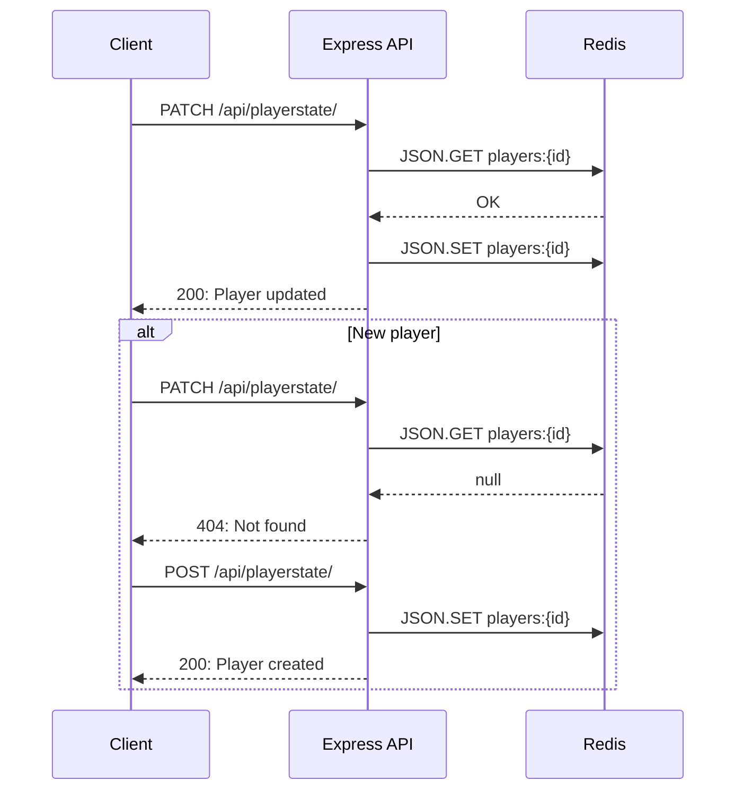
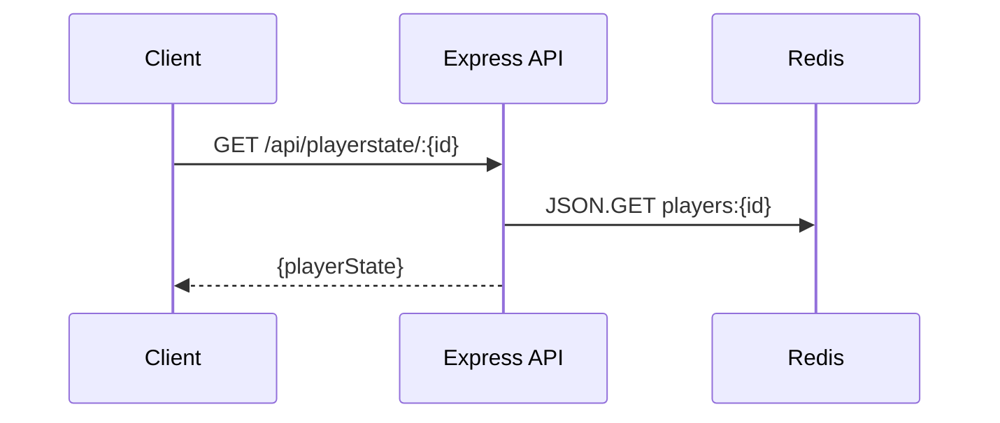
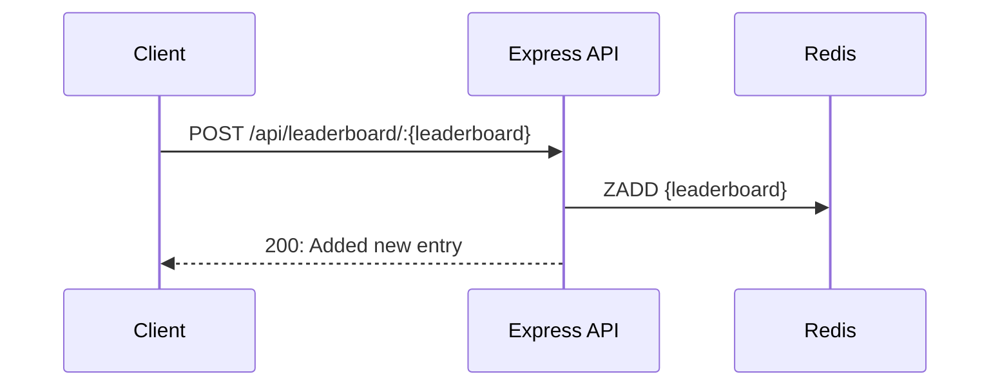

*Published 2 June 2026 · updated 11 June 2026*

> **TL;DR**
>
> Cache Quest is a browser RPG/roguelite whose backend uses Redis for functions: storing HTTP sessions via `connect-redis`, persisting per-player save data as JSON documents indexed with Redis Search, and tracking high scores with sorted-set leaderboards. This tutorial is a walkthrough of the running code. By the end you'll know how to wire all three services into your own game.
>
> Play the game at: [https://redis.io/cache-quest/](https://redis.io/cache-quest/)

## Why Redis for games?

Modern multiplayer games are some of the most demanding real-time applications in the world. Whether it's a battle royale with millions of concurrent players, an MMO with persistent worlds, or a fast-pased mobile game with live events, game backends must process enormous amounts of data with extremely low latency.

Every movement, action, score update, inventory change, message, matchmaking request generates data. But unlike traditional applications, games need to respond in milliseconds. Why? Because lag breaks immersion.

Redis has become a foundational technology for game developers because it delivers ultra-fast performance, massive scalability, and flexible data structures that are ideal for real-time game infrastructure.

### The top use cases for Redis are:

- **Player and game state** real-time synchronization between players and game servers
- **Matchmaking** low-latency queueing and fast matching logic
- **Sessions management** instant access to frequently used session data
- **Real-time messaging** asynchronous, decoupled communication between backend services
- **Leaderboards** real-time score updates and efficient ranking queries
- **Rate limiting** protect servers without affecting game performance

## What you'll learn

- How `connect-redis` plugs into `express-session` to keep session data in Redis instead of in process memory.
- How to model player and game state as a Redis JSON document and query it with Redis Search (`FT.CREATE`, `FT.SEARCH`, `JSON.SET`, `JSON.GET`).
- How to back a leaderboard with a Redis sorted set (`ZADD`, `ZRANGE … REV WITHSCORES`).
- The data save and load flow from the frontend game client.

> **NOTE:** This tutorial uses the code from the following git repository:
>
> [https://github.com/redis-developer/cache-quest](https://github.com/redis-developer/cache-quest)

## What you'll build (and run)

A Redis powered player data save and leaderboard service. When you run it you get:

- **Node/Express** on `http://localhost:3000` serving the KAPLAY.js game from `public/` and three JSON APIs:
	- `POST/PATCH/GET /api/playerstate` — player save data
	-  `POST/PATCH/GET /api/gamestate` — quest/world progression
	-  `POST/GET /api/leaderboard` — scores per map
- **Redis** on `redis://localhost:6379` storing four kinds of data:

    | Key                           | Type       | Purpose                                                 |
    | ----------------------------- | ---------- | ------------------------------------------------------- |
    | `sessions:{id}`               | string     | Serialized Express session (managed by `connect-redis`) |
    | `players:{id}`                | JSON       | A player's stats, position, unlocked skills             |
    | `games:{id}`                  | JSON       | Chapter progression and boss-defeated flags             |
    | `leaderboards:survivor-{map}` | sorted set | High scores by map (member = `"{name}-{id}"`)           |

    All four are keyed off the same session ID in this demo game for simplicity since there is no user registration/character creation. If you were to add such features, be sure to implement player IDs for your users and a game IDs for each game playthrough.

## Prerequisites

- Node.js 20+ and npm
- Docker (recommended — `docker compose up -d` boots both the game and a Redis instance)
- A local clone of the repo
- Experience with JavaScript and Express. **No prior Redis knowledge required** — every Redis command is introduced inline.

## Quickstart using Docker

This game is meant to be hosted on a web server back by Redis Cloud. For local testing and development, use Docker.

```bash
git clone https://github.com/redis-developer/cache-quest.git
cd cache-quest

# Easiest path: Docker brings up Redis + the game container.
cp .env.example .env
cp .env.docker.example .env.docker
docker compose up -d
```

Open `http://localhost:3000`. You should see the title screen.

## Step 1: Redis Cloud

If you don't already have a Redis Cloud account, you can sign up for free [here](https://redis.io/try-free/?utm_medium=webinar&utm_source=live-link&utm_campaign=wb-2026-04-30-cache-quest-building-a-lag-free-game-backend). You can then create a free database and connect to Redis Cloud by changing the `REDIS_URL` in the `.env` file.

### 1. Log into the [Redis Cloud](https://cloud.redis.io/) console and find the following:

- The `public endpoint` (looks like `redis-#####.####.us-region-2-#.ec2.redns.redis-cloud.com:#####`)
- Your `username` (`default` is the default username, otherwise find the one you setup)
- Your `password` (either setup through Data Access Control, or available in the `Security` section of the database
  page).

### 2. Combine the above values into a connection string and put it in your `.env`.
It should look something like the following:

```bash
REDIS_URL="redis://default:<password>@redis-#####.####.us-region-2-#.ec2.redns.redis-cloud.com:#####"
REDIS_SESSION_PREFIX = "sessions:"
REDIS_SESSION_SECRET = "diet Dr.Pepper"
PORT = 3000
```

### 3. Install dependencies and start the dev server:

```bash
npm install
npm run dev
```

Open `http://localhost:3000`. You should see the title screen.

## Step 2: Redis Client

Every server-side file that needs Redis imports a single helper:

```js
// server/redis.js

import { createClient } from 'redis';

let clients = {};

export default async function getClient(options) {
    options = Object.assign({}, { url: process.env.REDIS_URL }, options);

    if (!options.url) {
        throw new Error('You must pass a URL to connect');
    }

    let client = clients[options.url];
    if (client) return client;

    client = createClient(options);

    client
        .on('error', (err) => {
            console.error('Redis Client Error', err);
            void refreshClient(client);
        })
        .connect();

    clients[options.url] = client;
    return client;
}
```

#### Two things to mention:

1. **Clients are memoized by URL.** The `clients` object caches one connection per URL. Every `await getClient()` call after the first reuses the same connection — no thrashing connections per request, no connection pool to manage by hand.
2. **The `error` handler self-heals.** If the connection drops, `refreshClient()` evicts the stale entry from `clients` and calls `getClient()` again, which rebuilds the connection on the next call.

The pattern to copy: **don't `createClient()` inline at the top of every module**. Wrap it in a getter that returns a shared, lazily-connected client. It keeps boot time fast and recovers from transient network errors without restarting the process.

## Step 3: Sessions with `connect-redis` + `express-session`

Express sessions need somewhere to store their data. By default that's process memory, which dies with the process and doesn't scale beyond one server. `connect-redis` is a drop-in store backed by Redis. Each session becomes one string key in Redis containing the serialized session object.

```js
// server/app.js

import session from 'express-session';
import { RedisStore } from 'connect-redis';
import getClient from './redis.js';

const redisStore = new RedisStore({
    client: await getClient(),
    disableTTL: true,
    prefix: process.env.REDIS_SESSION_PREFIX, // "sessions:"
});

app.use(
    session({
        store: redisStore,
        resave: false,
        saveUninitialized: true,
        secret: process.env.REDIS_SESSION_SECRET,
        rolling: true, // refreshes expiration on every response
        cookie: {
            secure: false,
            httpOnly: false,
            maxAge: 7 * 24 * 60 * 60 * 1000, // 7 days
        },
    }),
);
```

#### Under the hood

Three configurations deserve attention:

- **`prefix: "sessions:"`** namespaces every session key. The value is a JSON-stringified blob of the session object. `connect-redis` handles the serialization.

- **`disableTTL: true`** tells `connect-redis` _not_ to set a Redis TTL on each session. Why? Because Express already has its own expiration concept (the cookie's `maxAge`). Setting both means two clocks fighting each other and sessions getting evicted server-side while the browser still thinks it's logged in. Pick one source of truth; this app picks the cookie.

- **`rolling: true`** writes the session back on every response, which (together with the cookie `maxAge`) extends the session every time the user does something. A player who plays for an hour stays logged in another 7 days, automatically.

#### Why the session ID matters

> **NOTE:** For simplicity, this demo does not implement user registration, authentication, or character creation. This demo uses the session ID as the game and player IDs. This enables users to play the demo without creating an account or logging in.

There's a `/session` route the client hits on first load:

```js
app.use('/session', (req, res) => {
    res.send({ id: req.session.id });
});
```

The session ID gets returned to the browser and becomes the **JSON document ID** for player and game states. **Simply put, this session ID is the unique identifier for both the `gamestate` and `playerstate` in Redis**. The session ID is also appended to the playerNames on the leaderboards to allow for multiple players with the same playerName.

| Key                      | Type         | Purpose                                                   |
| ------------------------ | ------------ | --------------------------------------------------------- |
| `players:{id}`           | JSON         | One player's save                                         |
| `games:{id}`             | JSON         | One game's progression                                    |
| `player-idx`, `game-idx` | Search index | Indexing to find player and game states with Redis Search |

## Step 4: Player and game state as JSON documents with Redis Search

Player save data is a deeply nested object: stats, current map, position, unlocked skills, kill counts. Storing that in Redis used to mean either flattening it into a hash (painful) or serializing it to a JSON string (opaque to Redis). The **Redis JSON** capability solved this: each key holds an actual JSON value, and Redis can read/write subtrees of it. **Redis Search** layers on top so you can index and query those JSON fields.

The player store and the game store are near-identical files. We'll walk through `playerstate/store.js` in full; the same pattern applies to `gamestate/store.js`.

### 1. Create the search index

Redis search indexes are secondary structures that sit alongside your data. When you create an index, you’re telling Redis: "Watch all keys that match this prefix, and build a searchable structure from these specific fields." You create it once at boot:

```js
// server/components/playerstate/store.js

import { SCHEMA_FIELD_TYPE } from 'redis';

const PLAYER_INDEX = 'player-idx';
const PLAYER_PREFIX = 'players:';

async function haveIndex() {
    const redis = await getClient();
    const indexes = await redis.ft._list();
    return indexes.some((index) => index === PLAYER_INDEX);
}

export async function createIndexIfNotExists() {
    const redis = await getClient();
    if (!(await haveIndex())) {
        await redis.ft.create(
            PLAYER_INDEX,
            {
                '$.id': { AS: 'id', type: SCHEMA_FIELD_TYPE.TEXT },
                '$.name': { AS: 'name', type: SCHEMA_FIELD_TYPE.TEXT },
            },
            {
                ON: 'JSON',
                PREFIX: PLAYER_PREFIX,
            },
        );
    }
}
```

#### Under the hood

The Redis command is [**`FT.CREATE index ON JSON PREFIX count prefix SCHEMA`**](https://redis.io/docs/latest/commands/ft.create/):

```
FT.CREATE player-idx ON JSON PREFIX 1 players:
  SCHEMA $.id AS id TEXT $.name AS name TEXT
```

- **`ON: "JSON"`** tells the index that the documents it's indexing are stored with Redis JSON (rather than as plain hashes).
- **`PREFIX: "players:"`** is the key-pattern filter. Any key whose name starts with `players:` is automatically indexed. You don't have to tell the index about each new player — `JSON.SET players:abc123 $ {...}` is enough.
- **`$.id` and `$.name`** are JSONPath expressions identifying which fields inside the document get indexed. `$` is the root.
- **`AS: "id"`** is the alias used in queries (`@id:(...)`).
- **`SCHEMA_FIELD_TYPE.TEXT`** declares each field as a full-text field. (Other types: `TAG` for exact-match strings, `NUMERIC` for ranges, `VECTOR` for embeddings.)

The `haveIndex` / `createIndexIfNotExists` pattern is the **idempotent init** trick: it's safe to call on every server boot, because it only does the `FT.CREATE` if `FT._LIST` doesn't already report the index. (Trying to create an existing index would throw.)

`gamestate/store.js` uses the same shape with a different index name (`game-idx`), prefix (`games:`), and one fewer indexed field.

### 2. Write a player document

Create or update a player state in Redis using `JSON.SET`

#### Game client

- `createPlayerData()`
- `savePlayerData()`

```js
// public/src/systems/saveload.js

export async function createPlayerData() {
    const playerData = playerState.get();
    console.log('Creating player data:', playerData);

    const response = await fetch(`/api/playerstate/`, {
        method: 'POST',
        headers: {
            'Content-Type': 'application/json',
        },
        body: JSON.stringify({ playerData }),
    });

    if (!response.ok) {
        console.error(`Error creating player data: ${response.statusText}`);
    }

    return `Create player successful, Player ID: ${playerData.id}`;
}

export async function savePlayerData() {
    const playerData = playerState.get();
    console.log('Saving player data:', playerData);

    let response = await fetch(`/api/playerstate/`, {
        method: 'PATCH',
        headers: {
            'Content-Type': 'application/json',
        },
        body: JSON.stringify({ playerData }),
    });

    if (!response.ok) {
        // If player not found, create new player data
        if (response.status === 404) {
            console.log('No save file found, creating new save.');
            return await createPlayerData();
        } else {
            console.error(`Error saving player data: ${response.statusText}`);
            return `Save player failed, Player ID: ${playerData.id}`;
        }
    }

    return `Save player successful, Player ID: ${playerData.id}`;
}
```

#### API routes

- `POST` to `api/playerstate/` calls `create()` on initial player creation.
- `PATCH` to `api/playerstate/` calls `update()` on subsequent player data saves.

```js
// server/components/playerstate/router.js

router.post(
    '/',
    handler(async (req) => {
        const { playerData } = req.body;

        return create(playerData);
    }),
);

router.patch(
    '/',
    handler(async (req) => {
        const { playerData } = req.body;

        return update(playerData);
    }),
);
```

#### Game backend server

- Player state
    - `create()`
    - `update()`

```js
// server/components/playerstate/store.js

export async function create(playerData) {
    const redis = await getClient();
    const result = await redis.json.set(
        formatId(playerData.id),
        '$',
        playerData,
    );

    if (result?.toUpperCase() === 'OK') {
        return { status: 200, message: 'Player created' };
    } else {
        return { status: 400, message: 'Player is invalid' };
    }
}

export async function update(playerData) {
    const redis = await getClient();
    const PlayerOrError = await one(playerData.id);

    if (!PlayerOrError || isFinite(PlayerOrError.status)) {
        return { status: 404, message: 'Not Found' };
    }

    const result = await redis.json.set(
        formatId(playerData.id),
        '$',
        playerData,
    );
    // ... same OK/400 envelope ...
}
```

#### Under the hood

The Redis command [**`JSON.SET key path value`**](https://redis.io/docs/latest/commands/json.set/):

> **NOTE:** Replacing the whole document on each save (which this demo does) is the simplest choice for save data. The player and game states are small enough so the JSON document fits neatly in one round trip. In production, if you want finer-grained updates you'd use partial-path `JSON.SET` or `JSON.MERGE` instead. Smaller, finer-grained updates will greatly reduce network bandwidth and latency once your player and game states grow in size.

```js
// playerId = jpKRE2B80KRt56huN9
// playerName = HeroLink32

JSON.SET players:jpKRE2B80KRt56huN9 $ '{"id":jpKRE2B80KRt56huN9,"name":"HeroLink32","health":{...},...}'
```

- **`$`** is the JSONPath of where to write new data. The dollar sign, `$`, is the root of the document. (You can write a partial update to a specific path, e.g. `JSON.SET players:jpKRE2B80KRt56huN9 $.health.dungeon 100` to update just one field.)
- **`value`** is the JSON to store at that path.

The `update()` function does one defensive thing the `create()` doesn't: it first calls `one()` to confirm the document exists, returning 404 if not. This is what lets the client's save flow distinguish "you've never saved before" from "you have, here's the update". More on this in `Step 6. Tying it together on the client`.

### 3. Read a player document

Retrieve a player state using `JSON.GET`

#### Game client

- `loadPlayerData()`

```js
// public/src/systems/saveload.js

export async function loadPlayerData(playerId) {
    const response = await fetch(`/api/playerstate/${playerId}`);

    if (!response.ok) {
        if (response.status === 404) {
            console.warn('No player data found.');
            return null;
        } else {
            console.error(`Error loading player data: ${response.statusText}`);
        }
    }

    const data = await response.json();
    playerState.load(data);
    console.log('Loading player data:', data);

    return `Load player successful, Player ID: ${data.id}`;
}
```

#### API route

- `GET` to `api/playerstate/{playerId}` calls `one()` on load player data

```js
// server/components/playerstate/router.js

router.get(
    '/:id',
    handler(async (req) => {
        const { id } = req.params;

        return one(id);
    }),
);
```

#### Game backend server

- Player state `one()`

```js
// get a single player state
export async function one(id) {
    const redis = await getClient();
    const Player = await redis.json.get(formatId(id));
    if (!Player) return { status: 404, message: 'Not Found' };
    return Player;
}
```

#### Under the hood

The Redis command [**`JSON.GET key`**](https://redis.io/docs/latest/commands/json.get/):

```js
// playerId = jpKRE2B80KRt56huN9

JSON.GET players:jpKRE2B80KRt56huN9

// output
"{\"id\":jpKRE2B80KRt56huN9,\"name\":\"HeroLink32\",\"health\":{\"dungeon\":100,\"survivor\":100},...}"
```

- **`JSON.GET`** returns the full JSON value at that key (or `null` if it doesn't exist). The Node client deserializes it into a plain object.

### 4. Search by field

This is not implemented in the game client but the backend functionality is there.

```js
export async function search(id, name) {
    const redis = await getClient();
    const searches = [];

    if (id) searches.push(`@id:(${id})`);
    if (name) searches.push(`@name:(${name})`);

    return redis.ft.search(PLAYER_INDEX, searches.join(' '));
}
```

#### Under the hood

The Redis command is [**`FT.SEARCH index query`**](https://redis.io/docs/latest/commands/ft.search/):

```js
// playerId = jpKRE2B80KRt56huN9
// playerName = HeroLink32

FT.SEARCH player-idx "@id(jpKRE2B80KRt56huN9) @name(HeroLink32)"
```

- **`@id:(playerId)`** — match documents where the `id` field contains "playerId." The session ID is used in this demo for simplicity. You can generate a permanent playerId when you implement your own user registration and persist it in this field.
- **`@name:(playerName)`** — match documents where the `name` field contains "playerName" (full-text match, on a `TEXT` field).

- Multiple clauses joined with a space are AND'd together.

For more advanced queries you can wrap groups in parentheses and use `|` for OR (`@name:(HeroLink32|Zeldah71)`), `-` for NOT, `[10 30]` for numeric ranges, etc.

> **Note:** The game-state store at `server/components/gamestate/store.js` is structurally identical to this one with `Game` substituted for `Player` and only `$.id` indexed (no `$.name`).

## Step 5. Leaderboards as sorted sets

A **sorted set** in Redis is a collection of unique string _members_, each tagged with a numeric _score_. Redis keeps the set ordered by score automatically, and gives you O(log N) inserts and O(log N + M) range reads. That's the algorithmic shape of a leaderboard, baked into the data structure.

| Key                               | Type       | Purpose          |
| --------------------------------- | ---------- | ---------------- |
| `leaderboards:survivor-Grassland` | sorted set | Grassland scores |
| `leaderboards:survivor-Mountains` | sorted set | Mountains scores |
| `leaderboards:survivor-Badlands`  | sorted set | Badlands scores  |

### 1. Add an entry

Add new highscore to a leaderboard using `ZADD`

#### Game client

- `saveScore()`

```js
// public/src/systems/saveload.js

export async function saveScore(score) {
    let response = await fetch(`/api/leaderboard/`, {
        method: 'POST',
        headers: {
            'Content-Type': 'application/json',
        },
        body: JSON.stringify({
            key: LEADERBOARD_PREFIX + playerState.get().leaderboard,
            score: score,
            member: `${playerState.get().name}-${playerState.get().id}`,
        }),
    });

    if (!response.ok) {
        console.error(`Error updating leaderboard: ${response.statusText}`);
    }

    console.log(`Saved score: ${score}`);
}
```

#### API route

- `POST` to `/api/leaderboard/` calls `addLeaderboardEntry()` on new highscore

```js
// server/components/leaderboard/router.js

router.post(
    '/',
    handler(async (req) => {
        const { key, score, member } = req.body;

        return addLeaderboardEntry(key, score, member);
    }),
);
```

#### Game backend server

- `addLeaderboardEntry()`

```js
// server/components/leaderboard/store.js

export async function addLeaderboardEntry(key, score, member) {
    const redis = await getClient();

    //ZADD key score member
    const result = await redis.zAdd(
        key,
        { value: member, score: score },
        { GT: true },
    );

    if (result > 0) {
        return { status: 200, message: 'Added new leaderboard entry' };
    } else {
        return { status: 400, message: 'ZADD failed...' };
    }
}
```

#### Under the hood

The Redis command is [**`ZADD key GT score member`**](https://redis.io/docs/latest/commands/zadd/):

```js
// leaderboareName = survivor-Grassland
// playerId = jpKRE2B80KRt56huN9
// playerName = HeroLink32

ZADD leaderboards:survivor-Grassland GT 12500 "HeroLink32-jpKRE2B80KRt56huN9"
```

- **`score`** must be numeric. The set is kept ordered by score.
- `zAdd` returns the number of _new_ members added. If the member already existed and you only changed its score, the return is `0`. This demo game client will only call `addLeaderboardEntry` on a player achieving a new personal high score.
- The `ZADD … GT` option to ensure the score only updates on the individual player new highscore.
- **`member`** is a unique string. If you `ZADD` the same member again with a different score, you update the existing entry rather than adding a new one.
- That's why this demo encodes the session/player ID into the member, to allow for different players with the same playerName.

### 2. Read the top N

Retrieve the top scores from a leaderboard using `ZRANGE`

#### Game client

- `getLeaderboardEntries()`

```js
// public/src/systems/saveload.js

export async function getLeaderboardEntries(count) {
    let response = await fetch(
        `/api/leaderboard/${LEADERBOARD_PREFIX + playerState.get().leaderboard}?count=${count}`,
        {
            method: 'GET',
            headers: {
                'Content-Type': 'application/json',
            },
        },
    );

    if (!response.ok) {
        console.error(`Error updating leaderboard: ${response.statusText}`);
    }

    let rankSubtract = count;
    const entries = await response.json();

    return entries.map((entry) => {
        if (rankSubtract > 0) rankSubtract--;
        return {
            rank: count - rankSubtract,
            name: entry.value.substring(0, entry.value.indexOf('-')),
            score: entry.score,
        };
    });
}
```

#### API route

- `GET` to `/api/leaderboard/leaderboards:{leaderboardName}?count=10` retrieves the top 10 scores.

```js
// server/components/leaderboard/router.js

router.get(
    '/:key',
    handler(async (req) => {
        const { key } = req.params;
        const { count } = req.query;

        return getLeaderboard(key, count);
    }),
);
```

#### Game backend server

- `getLeaderboard()`

```js
// server/components/leaderboard/store.js

export async function getLeaderboard(key, count) {
    const redis = await getClient();
    const result = await redis.zRangeWithScores(key, 0, count - 1, {
        REV: 'true',
    });

    if (result.length === 0) {
        return { status: 404, message: 'No leaderboard entries found' };
    }
    return result;
}
```

#### Under the hood

The command is [**`ZRANGE key start stop REV WITHSCORES`**](https://redis.io/docs/latest/commands/zrange/):

```js
// leaderboardName = survivor-Grassland

ZRANGE leaderboards:survivor-Grassland 0 9 REV WITHSCORES
```

- **`start` and `stop`** are _0-indexed_, inclusive on both ends. `0 9` returns the first ten entries.
- **`REV`** reverses the sort order. By default sorted sets are returned low-to-high; for a leaderboard you want high-to-low, so you flip it.
- **`WITHSCORES`** asks for `[member, score, member, score, …]` instead of just members. The Node client returns it as an array of `{ value, score }` objects.

### 3. Sorted set member-encoding

> **Note:** This feature is implemented solely for this demo to allow users to play this game without creating a login. In production, you will want to implement proper user registration with a sorted set of _IDs_ and a parallel JSON document or hash for the per-entry detail. The sorted set ranks, the document holds the data.

A sorted set has no schema beyond `(string, number)`. To prevent users with the same `playerName` from overwriting each other's scores, we concatenate their `playerName` with their `playerId`.

```js
// public/src/systems/saveload.js

const LEADERBOARD_PREFIX = 'leaderboards:survivor-';

export async function saveScore(score) {
    let response = await fetch(`/api/leaderboard/`, {
        method: 'POST',
        headers: { 'Content-Type': 'application/json' },
        body: JSON.stringify({
            key: LEADERBOARD_PREFIX + playerState.get().leaderboard,
            score: score,
            member: `${playerState.get().name}-${playerState.get().id}`,
        }),
    });
    // ...
}
```

And on read, splits on the first `-` to pull the display name back out:

```js
export async function getLeaderboardEntries(count) {
    //...
    const entries = await response.json();

    return entries.map((entry) => {
        if (rankSubtract > 0) rankSubtract--;
        return {
            rank: count - rankSubtract,
            name: entry.value.substring(0, entry.value.indexOf('-')),
            score: entry.score,
        };
    });
}
```

## Step 6. Tying it all together

The client's `public/src/systems/saveload.js` is where the Redis-backed APIs become the game function: "save my progress".

### 1. The save flow

- `PATCH` then `POST` on `404`



#### Game client

The server will return a `404` if no player data is found. That single existence check on the server lets the client avoid one of its own and the same code handles "first save" and "every save after."

1. Always try `PATCH` first.
2. If the server responds 404 (the document doesn't exist yet), fall back to `POST` to create it.
3. If you know a player save does not already exist (i.e., when a new player initially plays the game), call `createPlayerData()` instead.

The same pattern repeats for game state via `saveGameData()` / `createGameData()`.

```js
// public/src/systems/saveload.js

export async function savePlayerData() {
    const playerData = playerState.get();
    console.log('Saving player data:', playerData);

    let response = await fetch(`/api/playerstate/`, {
        method: 'PATCH',
        headers: { 'Content-Type': 'application/json' },
        body: JSON.stringify({ playerData }),
    });

    if (!response.ok) {
        if (response.status === 404) {
            console.log('No save file found, creating new save.');
            return await createPlayerData();
        } else {
            console.error(`Error saving player data: ${response.statusText}`);
            return `Save player failed, Player ID: ${playerData.id}`;
        }
    }

    return `Save player successful, Player ID: ${playerData.id}`;
}
```

### 2. The load flow



#### Game client

The main menu calls `getSessionId()` first, then passes that ID to `loadPlayerData(session.id)` and `loadGameData(session.id)`.

If no data exist in Redis, `createPlayerData()` and `createGameData()`

```js
// public/src/scenes/mainmenu.js

export default async function mainMenu(k) {
    //...

    //get session id
    const session = await getSessionId();

    // load player and game data from Redis
    let loadPlayer = await loadPlayerData(session.id);
    let loadGame = await loadGameData(session.id);

    //if player and game exists load data
    if (loadPlayer && loadGame) {
        console.log(loadPlayer);
        console.log(loadGame);

        //...
    } else {
        //else create new game

        //...
        const createPlayer = await createPlayerData();
        const createGame = await createGameData();

        // debugLog("log", `New game created, player ID: ${session.id}`);
        console.log(createPlayer);
        console.log(createGame);
        k.go(playerState.get().map);
    }
}
```

### 3. The highscore



#### Game client

When a player dies in survivor mode, if they have a personal high score...

```js
// public/src/entities/player.js

function setEventsSurvivor(player) {
    //...
    player.onDeath(async () => {
        console.log('player died');
        let highScore = false;
        const leaderboard = playerState.get().leaderboard;

        if (player.currentScore > playerState.get().highScore[leaderboard]) {
            playerState.set('highScore', leaderboard, player.currentScore);
            highScore = true;
            await saveScore(player.currentScore);
        }

        gameOver(
            { width: 400, height: 330, text: 24 },
            player.currentScore,
            highScore,
        );

        k.pressButton('pause');

        await savePlayerData();
        // await saveGameData();

        await k.wait(0.5);
        k.onButtonPress('start', () => k.go(playerState.get().map));
    });
}
```

...call `saveScore()` to `POST` new highscore to Redis.

```js
// public/src/systems/saveload.js

export async function saveScore(score) {
    let response = await fetch(`/api/leaderboard/`, {
        method: 'POST',
        headers: {
            'Content-Type': 'application/json',
        },
        body: JSON.stringify({
            key: LEADERBOARD_PREFIX + playerState.get().leaderboard,
            score: score,
            member: `${playerState.get().name}-${playerState.get().id}`,
        }),
    });

    if (!response.ok) {
        console.error(`Error updating leaderboard: ${response.statusText}`);
    }

    console.log(`Saved score: ${score}`);
}
```

## FAQ

#### **Why `disableTTL: true` on the session store?**

Because the cookie's `maxAge` (set in `app.js`) already controls expiration. If you let `connect-redis` set its own TTL too, you have two clocks ticking at different rates and risk evicting a session server-side while the browser still believes it's valid. Pick one — this app picks the cookie, which is why `rolling: true` works smoothly.

#### **What happens if Redis restarts?**

The `redis:alpine` image in `compose.yml` mounts a `redis-data` volume, so data survives container restarts. If Redis is wiped, every player loses their session (and therefore their save), since the session ID is the document key. For production you would host Redis on its own server and enable persistence or use Redis Cloud.

#### **Why JSON documents instead of Redis hashes?**

Hashes are flat — every field is a top-level string. Player save data is nested (`health.dungeon`, `skillUnlocked.swordBeam`). You can either flatten everything into dotted keys (painful, error-prone) or use a JSON document and let Redis JSON walk the structure for you. With JSON you also get partial-path updates: `JSON.SET players:jpKRE2B80KRt56huN9 $.health.dungeon 100` updates one field without sending the whole document.

#### **Why use JSON.SET...$ (root) in both `update()` and `create()` player/game state?**

Replacing the whole document on each save (which this demo does) is the simplest choice for save data. The player and game states are small enough so the JSON document fits neatly in one round trip. In production, if you want finer-grained updates you'd use partial-path `JSON.SET` or `JSON.MERGE` instead. Smaller, finer-grained updates will greatly reduce network bandwidth and latency once your player and game states grow in size.

#### **Why isn't there a TTL on player documents?**

Save data is meant to outlive sessions. A user who returns 8 days later (after their session cookie expires) gets a _new_ session ID, which means a new empty save — yes, in this demo, that's a feature. If you want returning-player support, swap the session ID out for a stable user ID.

#### **Can I run this against Redis Cloud?**

Yes. Set `REDIS_URL` in `.env` to the connection string from your Redis Cloud database's _Public endpoint_ (the README has the exact format). Redis Cloud supports both JSON and Search by default. Skip the `docker compose` step and run `npm run dev`.

#### **How do I reset a player's progress?**

```
DEL players:{id} games:{id}
```

#### **Why does the leaderboard member include the player ID?**

Sorted set members are unique strings. If two players were both named "Redis", their entries would collide and one would overwrite the other. Encoding the ID makes each member globally unique while still letting the client extract the display name on read.

> **Note:** The sorted set member-encoding method works fine for this demo game with no user registration. In production, switch to a sorted set of _IDs_ and a parallel JSON document or hash for the per-entry detail. The sorted set ranks, the document holds the data.

#### **Where is the search index defined?**

Each server boot calls `playerstate.initialize()` and `gamestate.initialize()` from `server/app.js`. Those call `createIndexIfNotExists()` which uses `FT._LIST` to check for the index before issuing `FT.CREATE`. The pattern is idempotent — it's safe on every boot.

## Troubleshooting

**`REDIS_URL not set` on startup.**
Copy `.env.example` to `.env` and confirm `REDIS_URL` is present. If you're using Docker, also confirm `.env.docker` exists with `REDIS_URL="redis://redis:6379"`.

**`connect-redis` can't reach Redis.**
From the host machine, your `REDIS_URL` should be `redis://localhost:6379`. From _inside_ the game container (Docker), it has to be `redis://redis:6379` (the service name from `compose.yml`). The two env files give you both perspectives.

**`Error: Unknown command 'FT.CREATE'` or `'JSON.SET'`.**
If you're using an older version of Redis, it doesn't have the Search / JSON modules by default. Use the `redis:alpine` image from the included `compose.yml` (which is recent enough to bundle them) or Redis 8+, or use Redis Cloud (which supports them by default). Standalone Redis 7.x and older without modules won't work.

**Session cookie doesn't persist across reloads.**
Confirm `cookie.maxAge` is set and the browser isn't blocking third-party cookies for `localhost`. Also check that `REDIS_SESSION_SECRET` is set — `express-session` silently misbehaves without it in some Express versions.

**Leaderboard route returns `{ status: 404, message: "No leaderboard entries found" }`.**
You haven't saved a score for that map yet. Trigger an entry from the game, or insert one manually: `redis-cli ZADD leaderboards:survivor-Grassland 100 "Tester-123"`.

## Next steps

- ### Sign up for [Redis Cloud](https://redis.io/try-free/?utm_medium=webinar&utm_source=live-link&utm_campaign=wb-2026-04-30-cache-quest-building-a-lag-free-game-backend) and run the game against a free hosted database. This effectively implements cloud save for your save data and leaderboards.
- ### Build with another tutorial: [How to build matchmaking and game session state with Redis](https://redis.io/tutorials/matchmaking-and-game-session-state-with-redis/)
- ### Watch the Webinar: [Building a Lag-Free Game Backend](https://redis.io/resources/videos/cache-quest-building-a-lag-free-game-backend/)

## Additional resources

- [Redis JSON](https://redis.io/docs/latest/develop/data-types/json/)
- [Redis Search](https://redis.io/docs/latest/develop/ai/search-and-query/)
- [Redis sorted set](https://redis.io/docs/latest/develop/data-types/sorted-sets/)
