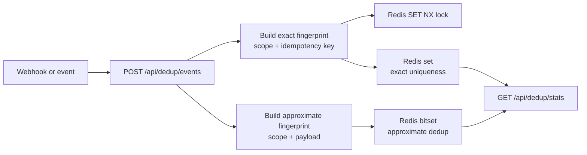
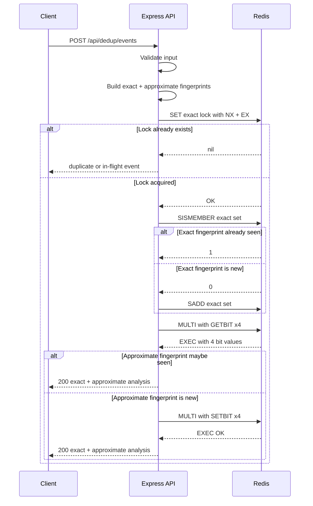
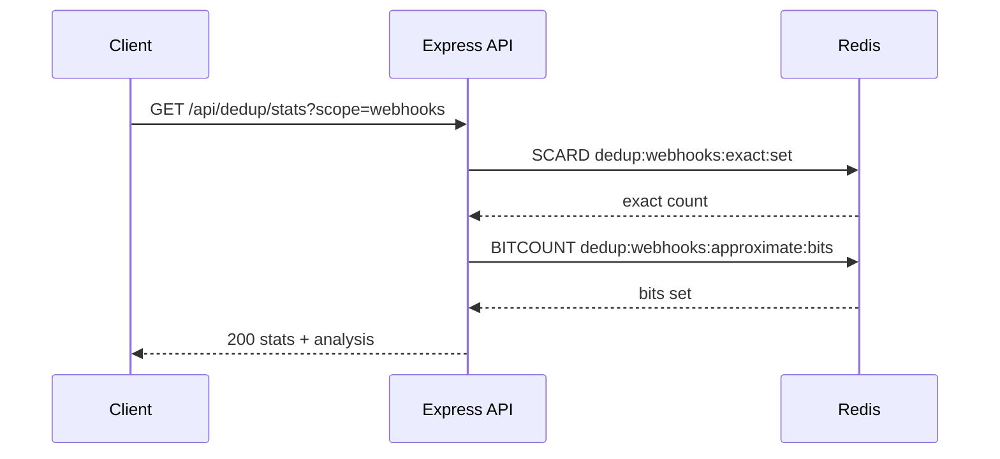
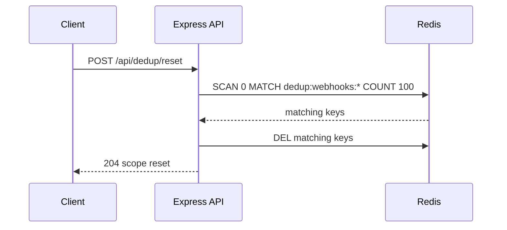

*Published 19 March 2026 · updated 25 March 2026*

> **TL;DR:**
>
> Use Redis to stop duplicate events before they fan out. This tutorial shows how to build a data deduplication app with Redis `SET NX` for idempotency, Redis sets for exact uniqueness, and a Redis-backed bitset for approximate dedup, all behind a simple Node.js API.

> **Note:** This tutorial uses the code from the following git repository:
>
> [https://github.com/redis-developer/data-deduplication-with-redis](https://github.com/redis-developer/data-deduplication-with-redis)

If your webhook handler, event consumer, or import job sees the same payload twice, you usually pay for it twice. Redis gives you a fast way to claim each event once, remember exact duplicates, and approximate repeated payloads without pulling in a second service.

This app exposes three routes:

- `POST /api/dedup/events` to process a webhook or event
- `GET /api/dedup/stats` to inspect the dedup state for a scope
- `POST /api/dedup/reset` to clear a scope and replay the same workload

## What you'll learn

- How to use Redis `SET NX` as an idempotency gate
- How to store exact fingerprints in a Redis set
- How to model approximate dedup with Redis bit operations and pipelines
- How to pick TTLs for replay safety without holding keys forever
- How to wire the whole flow into a small Express API

## What you'll build

You'll build a Bun and Express API that accepts webhook-style events and runs them through exact and approximate dedup checks. The API returns a detailed response showing whether each event is new or a duplicate, plus analysis data like the estimated false-positive rate.

A first-time event response looks like this:

```json
{
    "scope": "webhooks",
    "exact": {
        "key": "webhooks:evt-123",
        "lockKey": "dedup:webhooks:exact:lock:webhooks:evt-123",
        "lockAcquired": true,
        "seenBefore": false,
        "isNew": true
    },
    "approximate": {
        "key": "webhooks:{\"amount\":49.95,\"orderId\":\"ord-123\"}",
        "maybeSeenBefore": false,
        "isNew": true
    },
    "analysis": {
        "falsePositive": false,
        "bitsSet": 4,
        "exactCount": 1,
        "estimatedFalsePositiveRate": 0.0000000035
    }
}
```

## What is data deduplication?

Data deduplication is the process of detecting and discarding repeated events so your system processes each one only once. Webhooks retry on timeout, message brokers can deliver the same payload twice, and import jobs sometimes overlap. Without a dedup layer, each duplicate fans out into duplicate side effects—extra charges, duplicate notifications, or corrupted aggregates.

## Why use Redis for data deduplication?

Redis is a strong fit for dedup because it combines the primitives you need in one fast data layer:

- `SET NX` claims an event atomically—no check-then-insert race
- Sets give you exact membership checks with `SISMEMBER` in O(1) time
- Bit operations (`SETBIT`, `GETBIT`) let you build a Bloom-style filter without a separate service
- Built-in TTL removes stale keys automatically so you don't need cleanup jobs
- Pipelines batch multiple bit operations into a single round-trip for throughput

A database can do some of this, but Redis gives you sub-millisecond latency and single-command atomicity where it matters most—at the ingestion gate.

## Prerequisites

- [Bun](https://bun.sh/) runtime
- [Docker](https://www.docker.com/) and Docker Compose
- A Redis instance, either local or [Redis Cloud](https://redis.io/try-free/)
- Basic familiarity with REST APIs and JSON

## Step 1. Clone the repo

```bash
git clone https://github.com/redis-developer/data-deduplication-with-redis.git
cd data-deduplication-with-redis
```

## Step 2. Configure environment variables

Copy the sample file:

```bash
cp .env.example .env
```

If you run Redis locally, the default `REDIS_URL` points at `redis://localhost:6379`. If you use [Redis Cloud](https://redis.io/try-free/), replace that value with your cloud connection string. The file also documents optional variables like `DEDUP_BLOOM_BITS` (default 16384) and `DEDUP_BLOOM_HASH_COUNT` (default 4).

## Step 3. Start Redis and the app

```bash
bun docker
```

The compose file starts Redis and the Express server on port 8080.

## Step 4. Run the tests

```bash
bun test
```

The test suite includes unit tests for validation schemas and integration tests that cover the full dedup lifecycle—sending a new event, sending a duplicate, checking stats, and resetting a scope.

## Exact vs approximate dedup

Exact dedup answers a simple question: have I seen this event before? Approximate dedup answers a slightly different one: does this payload look familiar enough that I should treat it as a repeat?

| Mode              | Redis primitive                | What it protects                                    | Tradeoff                          |
| ----------------- | ------------------------------ | --------------------------------------------------- | --------------------------------- |
| Exact dedup       | `SET NX`, `SADD`, `SISMEMBER`  | Duplicate webhook retries, repeated job submissions | Uses more memory per unique event |
| Approximate dedup | `SETBIT`, `GETBIT`, `BITCOUNT` | Large streams where "close enough" is useful        | Can return false positives        |

## Dedup architecture for webhooks and events



The app uses one Redis scope at a time. That keeps the demo easy to reason about and makes the tradeoffs visible in the stats endpoint.

## How does the idempotency gate work?

The first line of defense is the idempotency key. When `POST /api/dedup/events` arrives, the app normalizes the `scope` and combines it with the `idempotencyKey` to build an exact fingerprint. It then claims a lock key in Redis with `SET NX`.

Example request:

```bash
curl -X POST http://localhost:8080/api/dedup/events \
  -H "Content-Type: application/json" \
  -d '{
    "scope": "webhooks",
    "idempotencyKey": "evt-123",
    "payload": {"orderId": "ord-123", "amount": 49.95},
    "ttlSeconds": 300
  }'
```

Under the hood, Redis receives:

```text
SET dedup:webhooks:exact:lock:webhooks:evt-123 1 NX EX 300
```

If Redis returns `OK`, this is the first time the app has seen that exact event key. If Redis returns `nil`, the handler knows a duplicate is in flight or already processed. The `NX` flag makes this atomic—no check-then-insert race, even under concurrent requests. The `EX 300` sets a TTL so the lock expires automatically after the number of seconds you send in `ttlSeconds`.

## How does exact duplicate detection work?

`SET NX` is great for the first claim, but you also want a permanent record of every unique event you have processed. The app stores each exact fingerprint in a Redis set so you can answer:

- How many unique events have I seen?
- Did this same idempotency key show up again?
- Can I safely reset a scope and replay it?

When the lock is acquired and the fingerprint is not already in the set, the app adds it:

```text
SISMEMBER dedup:webhooks:exact:set webhooks:evt-123
SADD dedup:webhooks:exact:set webhooks:evt-123
```

`SISMEMBER` is an O(1) lookup. The set grows by one member per unique event in a scope, so you can count exact members later with `SCARD`.

That exact path is what the integration test exercises when it sends the same event twice and expects the first call to be new and the second call to be a duplicate.

## How does approximate duplicate detection work?

For the approximate path, the app hashes the normalized payload into several bit offsets and writes them into a Redis bitset. On later requests, it checks those offsets first. If all bits are already set, the payload was "maybe seen before." If any bit is zero, the payload is definitely new.

The app pipelines these bit operations with `MULTI`/`EXEC` so they run in a single round-trip to Redis:

```text
MULTI
GETBIT dedup:webhooks:approximate:bits 4821
GETBIT dedup:webhooks:approximate:bits 11037
GETBIT dedup:webhooks:approximate:bits 7294
GETBIT dedup:webhooks:approximate:bits 1562
EXEC
```

When adding a new member, the same pipeline pattern applies with `SETBIT`:

```text
MULTI
SETBIT dedup:webhooks:approximate:bits 4821 1
SETBIT dedup:webhooks:approximate:bits 11037 1
SETBIT dedup:webhooks:approximate:bits 7294 1
SETBIT dedup:webhooks:approximate:bits 1562 1
EXEC
```

This gives you a cheap "maybe seen before" signal. In the app, that signal is enough to show how false positives happen and why approximate dedup is a tradeoff, not a bug.

## How do you pick TTL and filter settings?

The lock TTL is set per-request via the `ttlSeconds` field in the event payload (default: 300 seconds). The Bloom filter dimensions are set server-side via environment variables: `DEDUP_BLOOM_BITS` (default 16384) and `DEDUP_BLOOM_HASH_COUNT` (default 4). Those values keep the sample easy to run locally, but you can tune them for your workload:

- Use a shorter TTL when events replay quickly and stale locks would block retries
- Use a longer TTL when downstream processing is slow or retries are common
- Increase the bitset size when false positives become too frequent
- Increase hash count only when the extra CPU cost is worth the accuracy gain

You can check the current filter state at any time:

```bash
curl http://localhost:8080/api/dedup/stats?scope=webhooks
```

Example response:

```json
{
    "scope": "webhooks",
    "exactCount": 1,
    "bitsSet": 4,
    "bitSize": 16384,
    "hashCount": 4,
    "estimatedFalsePositiveRate": 0.0000000035
}
```

## How it works

The full dedup lifecycle breaks into three request flows:







Redis stores lock keys as strings with TTL, exact fingerprints in sets, and approximate fingerprints in a bitset. TTL handles lock cleanup automatically—even if a client never retries, the lock expires and Redis removes the key.

## FAQ

### How do I prevent duplicate webhook processing with Redis?

Start with `SET NX` on an idempotency key that combines the scope and event ID. If the key already exists, skip the work. In this app, the exact path also stores the fingerprint in a Redis set so you can inspect how many unique events you have processed.

### When should I use `SET NX` vs a Bloom filter?

Use `SET NX` when you need a hard yes-or-no answer for a specific event. Use a Bloom-style filter when you need a fast "maybe seen before" check for a large stream and can accept false positives.

### What TTL should idempotency keys use?

Pick a TTL that covers the retry window of the sender and the longest realistic processing delay in your app. For most webhook use cases, a few minutes is enough. For slower batch jobs, stretch it to match the replay window. In this app, the TTL is set per-request via the `ttlSeconds` field (default: 300 seconds).

### How do I trade off memory and false positives?

More memory lowers the false-positive rate. More hash functions can help too, but only up to a point. If the filter starts flagging too many new items as repeats, increase the bitset size first. Use the `/api/dedup/stats` endpoint to monitor the current `estimatedFalsePositiveRate` and `bitsSet` count for a given scope.

## Troubleshooting

### The app starts but returns a Redis error

Check that `REDIS_URL` in your `.env` file points to a running Redis instance. If you are using Docker, verify the container is healthy:

```bash
docker ps
```

### The stats endpoint shows zero events

Make sure you have sent at least one event to `POST /api/dedup/events` before checking stats. The stats endpoint reads the current scope from Redis, so an empty scope returns zeroes.

### Stats show unexpected false positives

If the approximate path reports `maybeSeenBefore: true` for events you know are new, the bitset is saturated. Increase `DEDUP_BLOOM_BITS` in your `.env` file to give the filter more room, or reset the scope with `POST /api/dedup/reset` to start fresh.

### Docker Compose fails to start

Make sure Docker is running and that port 8080 is not already in use by another service.

## Next steps

- Build a Slack bot with Redis coordination in [Chat SDK Slackbot with distributed locking](/tutorials/chat-sdk-slackbot-distributed-locking/)
- Compare dedup patterns with fraud detection in [Fraud detection with Redis](/tutorials/howtos-frauddetection/)
- See another Redis risk-scoring app in [Fraud detection and transaction risk scoring](/tutorials/howtos-solutions-fraud-detection-transaction-risk-scoring/)
- Study event-driven service patterns in [Microservices inter-service communication](/tutorials/howtos-solutions-microservices-interservice-communication/)

## Additional resources

- [Redis docs](https://redis.io/docs/latest/)
- [Redis clients](https://redis.io/docs/latest/develop/clients/)
- [Redis Insight](https://redis.io/insight/)
