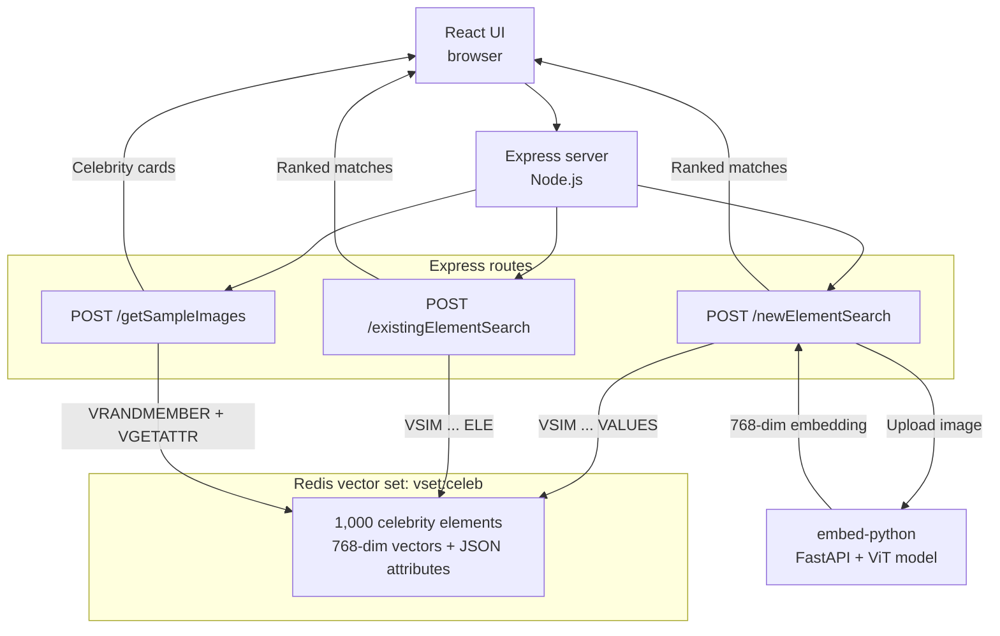

*Published 23 March 2026 · updated 3 September 2026*

> **TL;DR:**
>
> Build a face similarity search app that uses Redis [vector sets](https://redis.io/docs/latest/develop/data-types/vector-sets/) to find celebrity lookalikes. Upload a photo or take a selfie, generate a face embedding with a Vision Transformer model, and run a [`VSIM`](https://redis.io/docs/latest/commands/vsim/) query to find the nearest matches in a pre-loaded dataset of 1,000 celebrity face vectors — all powered by Redis.

> **Note:** This tutorial uses the code from the following git repository:
>
> [https://github.com/redis-developer/vectorsets-face-similarity-demo](https://github.com/redis-developer/vectorsets-face-similarity-demo)


## What you'll learn

- How to store face embeddings in a Redis vector set with [`VADD`](https://redis.io/docs/latest/commands/vadd/)
- How to run similarity searches against existing elements and new image vectors with [`VSIM`](https://redis.io/docs/latest/commands/vsim/)
- How to filter similarity results by metadata attributes
- How Vision Transformer (ViT) models generate image embeddings for face comparison
- How to connect an Express and React app to Redis vector sets

## What you'll build

You'll run a three-service face similarity search app:

- A **Python embedding service** that converts uploaded face images into 768-dimension vectors using a ViT (Vision Transformer) model fine-tuned on celebrity faces
- An **Express server** that handles image uploads, calls the embedding service, and queries Redis vector sets with `VSIM`
- A **React frontend** that lets you upload a photo or take a selfie, then displays the closest celebrity matches ranked by similarity score

The app ships with a pre-loaded dataset of 1,000 celebrity face embeddings. You select or upload a face, and the app finds which celebrities look most similar using vector search in Redis.

## What is face similarity search?

Face similarity search compares a query face against a database of known faces to find the closest matches. Instead of comparing raw pixel data, the app converts each face into a **vector embedding** — a compact numerical representation that captures the visual features of the face. Two faces that look alike produce vectors that are close together in the embedding space.

The typical flow is:

1. **Embed** — Convert each face image into a fixed-length vector (768 floats in this app) using a neural network.
2. **Store** — Save the vectors in a data structure optimized for nearest-neighbor search.
3. **Query** — Given a new face vector, find the stored vectors closest to it.

Redis vector sets handle steps 2 and 3 natively. You store embeddings with [`VADD`](https://redis.io/docs/latest/commands/vadd/) and query them with [`VSIM`](https://redis.io/docs/latest/commands/vsim/), which returns the K nearest neighbors ranked by cosine similarity.

## Why use Redis vector sets for face similarity?

Redis vector sets give you a fast, schema-free path to nearest-neighbor search without the overhead of a separate vector database or a secondary index.

- **Native data type** — Vector sets are a first-class Redis data type (Redis 8+), just like strings or sorted sets. No external plugins needed.
- **Built-in HNSW index** — Every vector set automatically builds an HNSW (Hierarchical Navigable Small World) graph for approximate nearest-neighbor search. You don't create or manage indexes yourself.
- **Attribute filtering** — Each element can carry a JSON attribute payload. `VSIM` supports inline `FILTER` expressions so you can narrow results by metadata (e.g., name length, country) without a separate query.
- **Simple API** — Two commands cover the core workflow: `VADD` to insert, `VSIM` to search. No schema definitions, no index rebuild steps.
- **Real-time updates** — Add or remove elements at any time. The HNSW graph updates incrementally, so the set is always queryable.

For a deeper introduction to vector sets, see the [Getting started with vector sets](/tutorials/howtos/vector-sets-basics/) tutorial.

## How does the app work?

The app has three services that all connect through one Redis instance:



Two search paths exist:

1. **New element search** — The user uploads a photo not in the dataset. The server sends the image to the Python embedding service, gets a 768-dim vector back, and runs `VSIM ... VALUES` to find the nearest neighbors.
2. **Existing element search** — The user picks a celebrity card already in the dataset. The server runs `VSIM ... ELE` using that element's ID, so Redis compares against the stored vector directly.

## Prerequisites

- [Docker](https://www.docker.com/) and Docker Compose
- [Git](https://git-scm.com/)
- Basic familiarity with Redis commands

If you're new to Redis vector sets, start with the [Getting started with vector sets](/tutorials/howtos/vector-sets-basics/) tutorial first.

## Step 1. Clone the repo

```bash
git clone https://github.com/redis-developer/vectorsets-face-similarity-demo.git
cd vectorsets-face-similarity-demo
```

## Step 2. Run the app with Docker

Start all three services:

```bash
docker compose up -d
```

The repo includes a pre-built Redis snapshot (`database/redis-data/dump.rdb`) containing 1,000 celebrity face embeddings. Redis loads this automatically on startup — no manual import needed.

Once all containers are healthy:

- App: `http://localhost:3000`
- Embedding service: `http://localhost:8009`
- Redis: `redis://localhost:6379`

> **Note:** The first startup takes a few minutes. The Python embedding service downloads the ViT model weights (~350 MB) on first launch. Docker caches the weights in a volume, so subsequent starts are fast.

You can verify the dataset loaded correctly:

```bash
docker exec redis redis-cli VCARD 'vset:celeb'
```

You should see `1000`, confirming that all celebrity embeddings are in the vector set.

Open `http://localhost:3000` in your browser. You'll see a grid of random celebrity face cards on the left. Click any card to find similar-looking celebrities, or upload your own photo to find your celebrity lookalike.

## How does the app generate face embeddings?

The app uses two embedding strategies depending on the dataset. For the celebrity dataset, a Python microservice runs a **Vision Transformer (ViT)** model fine-tuned on celebrity face classification.

The embedding service is a FastAPI app that accepts an image upload and returns a 768-dimension vector:

```python
from transformers import ViTImageProcessor, ViTForImageClassification

MODEL_ID = "tonyassi/celebrity-classifier"

processor = ViTImageProcessor.from_pretrained(MODEL_ID)
model = ViTForImageClassification.from_pretrained(
    MODEL_ID, output_hidden_states=True
)
model.eval()

@app.post("/embed")
async def embed(file: UploadFile = File(...)):
    image = Image.open(io.BytesIO(await file.read())).convert("RGB")
    inputs = processor(images=image, return_tensors="pt")
    with torch.no_grad():
        out = model(**inputs, output_hidden_states=True)
        last_hidden = out.hidden_states[-1]       # (1, seq_len, 768)
        cls = last_hidden[:, 0, :]               # (1, 768) — CLS token
        emb = torch.nn.functional.normalize(cls, dim=-1)  # L2 normalize
    return {"embedding": emb.squeeze(0).tolist()}  # length 768
```

The key steps:

1. **Preprocess** — The `ViTImageProcessor` resizes and normalizes the image for the model.
2. **Forward pass** — The model produces hidden states for each image patch. The CLS token (index 0 of the last hidden layer) captures a global summary of the face.
3. **Normalize** — L2 normalization ensures that cosine similarity and dot product give the same ranking, which is what Redis vector sets use internally.

The result is a 768-float vector where faces that look similar cluster near each other in the embedding space.

## How does the app store face data in Redis?

Each celebrity is stored as an element in a Redis vector set using the [`VADD`](https://redis.io/docs/latest/commands/vadd/) command. The pre-built dataset file contains commands like:

```bash
VADD 'vset:celeb' VALUES 768 0.0234 -0.0891 0.0412 ... 'e1' SETATTR '{"label":"Aaron Eckhart","imagePath":"images/00000_Aaron_Eckhart.jpg","charCount":13}'
```

Breaking down the command:

- `vset:celeb` — The vector set key name.
- `VALUES 768` — Each embedding has 768 dimensions.
- `0.0234 -0.0891 0.0412 ...` — The 768 floating-point values of the face embedding.
- `e1` — A unique element ID for this celebrity.
- `SETATTR '{...}'` — JSON metadata attached to the element. This app stores the celebrity name (`label`), the image file path (`imagePath`), and the name's character count (`charCount`).

The vector set automatically builds an HNSW index as elements are added. There's no separate `CREATE INDEX` step — the set is queryable immediately after the first `VADD`.

You can inspect any element's metadata with [`VGETATTR`](https://redis.io/docs/latest/commands/vgetattr/):

```bash
VGETATTR 'vset:celeb' 'e1'
```

```json
{
    "label": "Aaron Eckhart",
    "imagePath": "images/00000_Aaron_Eckhart.jpg",
    "charCount": 13
}
```

And check the vector set's structure with [`VINFO`](https://redis.io/docs/latest/commands/vinfo/):

```bash
VINFO 'vset:celeb'
```

```json
[
    "quant-type",
    "int8",
    "hnsw-m",
    16,
    "vector-dim",
    768,
    "projection-input-dim",
    0,
    "size",
    1000,
    "max-level",
    4,
    "attributes-count",
    1000,
    "vset-uid",
    1,
    "hnsw-max-node-uid",
    1000
]
```

This confirms the set holds 1,000 elements with 768-dimension vectors and uses int8 quantization for compact storage.

## How does the app search for similar faces?

The app uses two forms of the [`VSIM`](https://redis.io/docs/latest/commands/vsim/) command depending on whether the query face is already in the dataset.

### Searching with an existing element

When a user clicks a celebrity card from the sidebar, the server runs `VSIM` with the `ELE` keyword. This tells Redis to use the stored vector for that element as the query:

```bash
VSIM 'vset:celeb' ELE 'e42' WITHSCORES WITHATTRIBS COUNT 10
```

The Express server builds this query in `existing-element-search/index.ts`:

```typescript
function buildQuery(input, dataset) {
    const keyPrefix = dataset.VECTOR_SET.KEY;
    let filterQuery = '';
    if (input.filterQuery) {
        filterQuery = `FILTER '${input.filterQuery}'`;
    }
    return `VSIM '${keyPrefix}' ELE '${input.id}' WITHSCORES WITHATTRIBS ${filterQuery} COUNT ${input.count}`;
}
```

Redis returns a flat array of `[elementId, score, attributes, ...]` triples. The server parses these into structured results:

```json
[
    "e42",
    "1",
    "{\"label\":\"Ben Stiller\",\"imagePath\":\"images/00041_Ben_Stiller.jpg\",\"charCount\":11}",
    "e43",
    "0.9812",
    "{\"label\":\"Ben Affleck\",\"imagePath\":\"images/00042_Ben_Affleck.jpg\",\"charCount\":11}",
    "e127",
    "0.9534",
    "{\"label\":\"Matt Damon\",\"imagePath\":\"images/00126_Matt_Damon.jpg\",\"charCount\":10}"
]
```

The first result is always the query element itself with a perfect score of 1. The server filters it out before sending results to the UI.

### Searching with a new image

When a user uploads a photo or takes a selfie, the face isn't in the dataset. The server:

1. Uploads the image to disk.
2. Sends it to the Python embedding service to get a 768-dim vector.
3. Runs `VSIM` with the `VALUES` keyword, passing the vector directly:

```bash
VSIM 'vset:celeb' VALUES 768 0.0234 -0.0891 0.0412 ... WITHSCORES WITHATTRIBS COUNT 10
```

The Express server builds this query in `new-element-search/index.ts`:

```typescript
async function buildQuery(input, dataset, datasetName) {
    const keyPrefix = dataset.VECTOR_SET.KEY;
    const DIM = dataset.VECTOR_SET.DIM;

    let imageEmbeddings = await getCelebEmbedding(input.localImageUrl);
    const imageEmbeddingsStr = imageEmbeddings
        .map((val) => val.toString())
        .join(' ');

    let filterQuery = '';
    if (input.filterQuery) {
        filterQuery = `FILTER '${input.filterQuery}'`;
    }

    const query = `VSIM '${keyPrefix}' VALUES ${DIM} ${imageEmbeddingsStr} WITHSCORES WITHATTRIBS ${filterQuery} COUNT ${input.count}`;
    return { query };
}
```

The `getCelebEmbedding` function sends the image to the Python service:

```typescript
async function getCelebEmbedding(imagePath: string): Promise<number[]> {
    const form = new FormData();
    const buffer = fs.readFileSync(resolvedPath);
    form.append('file', buffer, { filename, contentType: 'image/jpeg' });

    const res = await fetch(config.EMBED_PYTHON_URL, {
        method: 'POST',
        body: form,
    });
    const json = await res.json();
    return json.embedding; // number[768]
}
```

Both search paths return the same response shape — a ranked list of celebrity matches with similarity scores and metadata — so the frontend renders them identically.

## How does the app filter results by attributes?

The `VSIM` command supports a `FILTER` clause that narrows results based on element attributes. This app uses it to let users filter by name length (character count).

For example, to find similar faces where the celebrity name is at least 15 characters long:

```bash
VSIM 'vset:celeb' ELE 'e42' WITHSCORES WITHATTRIBS FILTER '.charCount>=15' COUNT 10
```

The filter expression `.charCount>=15` references the `charCount` field in the element's JSON attributes. Redis evaluates the filter against each candidate before including it in the results.

The frontend sends the filter as part of the search request:

```typescript
function buildFilterQuery(searchData) {
    const filters = [];
    for (const [key, value] of Object.entries(searchData)) {
        if (value !== '' && value !== null && value !== undefined) {
            if (typeof value === 'string') {
                filters.push(`.${key}=="${value}"`);
            } else if (typeof value === 'number' && value) {
                filters.push(`.${key}>=${value}`);
            }
        }
    }
    return filters.join(' and ');
}
```

This supports both exact string matches (`.country=="UNITED_STATES"`) and numeric comparisons (`.charCount>=15`). Multiple filters combine with `and`.

> **Note:** Filter expressions use [JSONPath-like dot notation](https://redis.io/docs/latest/commands/vsim/) to reference attribute fields. The attribute must exist in the element's `SETATTR` JSON for the filter to match.

## How does the app display random sample images?

The sidebar shows a random selection of celebrity cards using two vector set commands. First, [`VRANDMEMBER`](https://redis.io/docs/latest/commands/vrandmember/) picks random element IDs:

```bash
VRANDMEMBER 'vset:celeb' 100
```

Then [`VGETATTR`](https://redis.io/docs/latest/commands/vgetattr/) retrieves the JSON attributes for each element:

```bash
VGETATTR 'vset:celeb' 'e42'
```

The server combines these into image cards:

```typescript
async vsGetRandomElements(key: string, count: number) {
  const elementIds = await this.vsGetRandomElementIds(key, count);
  if (elementIds && Array.isArray(elementIds)) {
    return await this.vsGetElmAttrs(key, elementIds);
  }
  return [];
}
```

Each click of the refresh button fetches a new random set, so users see different celebrities each time.

## What Redis vector set commands does this app use?

Here's a summary of every vector set command the app relies on:

| Command                                                             | Purpose                                 | Example                                                 |
| ------------------------------------------------------------------- | --------------------------------------- | ------------------------------------------------------- |
| [`VADD`](https://redis.io/docs/latest/commands/vadd/)               | Store a face embedding with metadata    | `VADD 'vset:celeb' VALUES 768 ... 'e1' SETATTR '{...}'` |
| [`VSIM`](https://redis.io/docs/latest/commands/vsim/)               | Find similar faces by element or vector | `VSIM 'vset:celeb' ELE 'e42' WITHSCORES COUNT 10`       |
| [`VRANDMEMBER`](https://redis.io/docs/latest/commands/vrandmember/) | Pick random elements for the sidebar    | `VRANDMEMBER 'vset:celeb' 100`                          |
| [`VGETATTR`](https://redis.io/docs/latest/commands/vgetattr/)       | Retrieve an element's JSON attributes   | `VGETATTR 'vset:celeb' 'e42'`                           |
| [`VCARD`](https://redis.io/docs/latest/commands/vcard/)             | Count elements in the set               | `VCARD 'vset:celeb'`                                    |
| [`VINFO`](https://redis.io/docs/latest/commands/vinfo/)             | Inspect set structure and config        | `VINFO 'vset:celeb'`                                    |

## Ready to build face similarity search with Redis?

You've learned how to:

- Store face embeddings in a Redis vector set with `VADD` and JSON attributes.
- Search for similar faces using `VSIM` with both existing elements and new image vectors.
- Filter results by metadata attributes like name length.
- Generate face embeddings with a ViT vision model and connect them to Redis through an Express API.

Vector sets make similarity search straightforward — two commands (`VADD` and `VSIM`) handle the entire storage and retrieval workflow, with built-in HNSW indexing and attribute filtering.

## Next steps

- Explore the full [vector sets data type docs](https://redis.io/docs/latest/develop/data-types/vector-sets/).
- Try the [Getting started with vector sets](/tutorials/howtos/vector-sets-basics/) tutorial for a text-based similarity example.
- Read the [`VADD`](https://redis.io/docs/latest/commands/vadd/) and [`VSIM`](https://redis.io/docs/latest/commands/vsim/) command references for all available options.
- Learn about [vector search with Redis Search](/tutorials/howtos/solutions/vector/getting-started-vector/) for more complex queries combining vector similarity with full-text search.
- Build a [semantic text search app](/tutorials/howtos/solutions/vector/semantic-text-search/) using Redis vectors with text embeddings.
