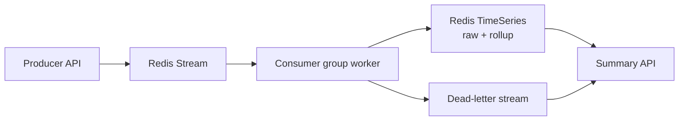
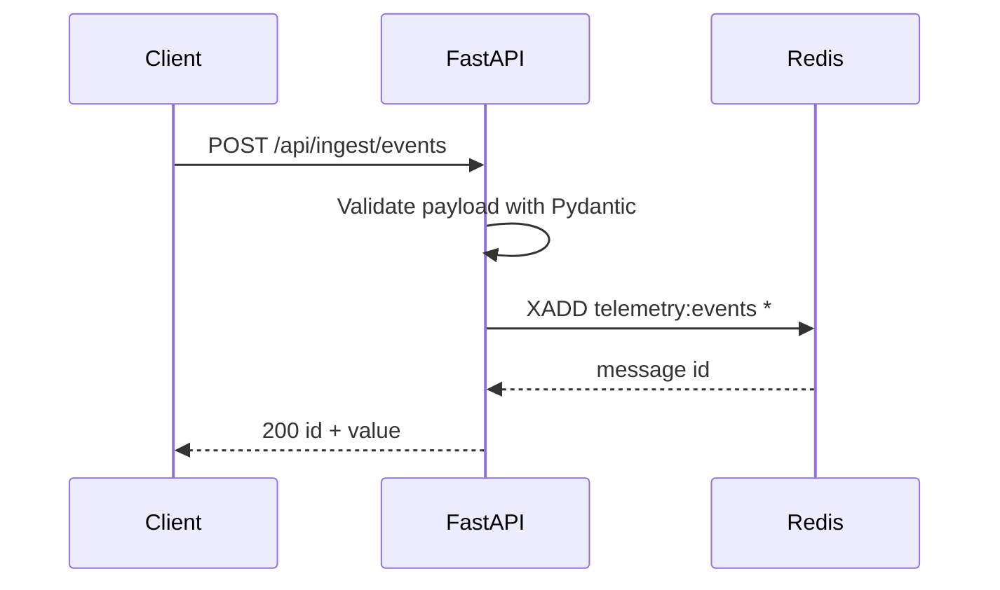
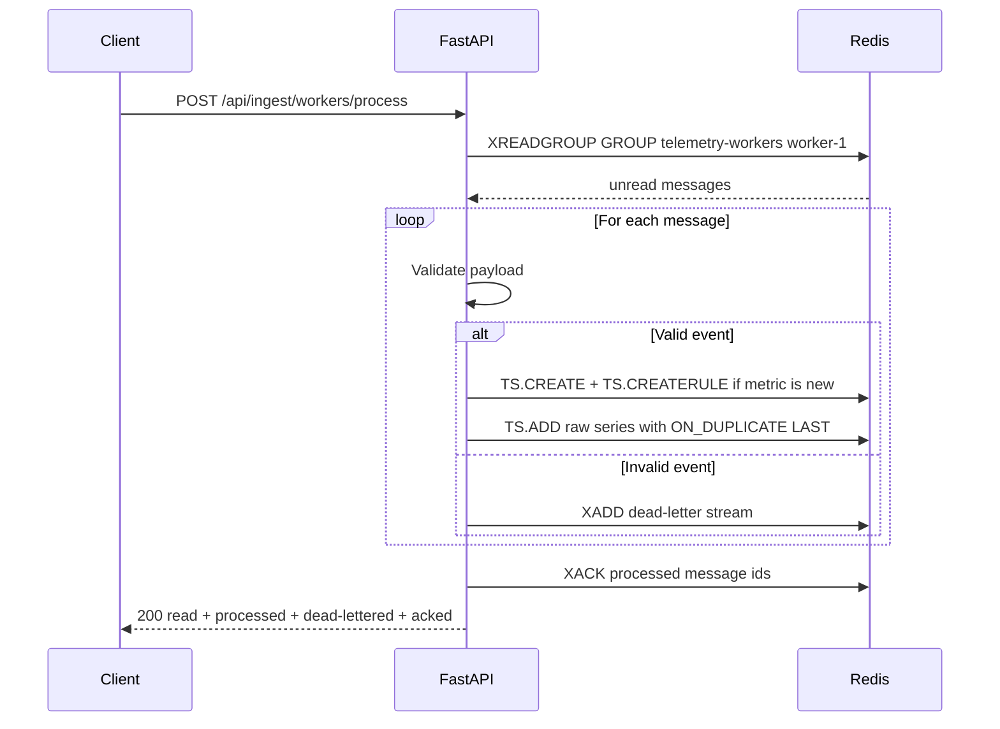
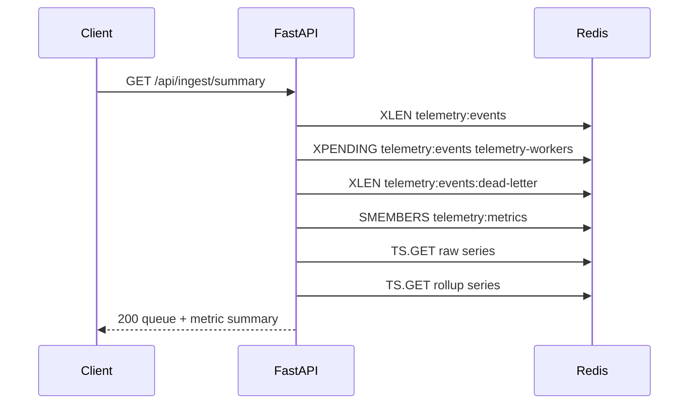

*Published 19 March 2026 · updated 25 March 2026*

> **TL;DR:**
>
> Build a fast data ingest pipeline with Redis by using Redis Streams for durable ingestion, a consumer group for worker processing, and Redis TimeSeries for rollups and recent-value queries. The demo app in this tutorial uses FastAPI, Python, and Redis to accept telemetry events, process them in a worker flow, and expose a simple summary view.

> **Note:** This tutorial uses the code from the following git repository:
>
> [https://github.com/redis-developer/fast-data-ingest-pipeline-with-redis](https://github.com/redis-developer/fast-data-ingest-pipeline-with-redis)

When telemetry, IoT readings, or webhook events arrive faster than your app can process them, you need a buffer that accepts writes quickly and lets workers drain the backlog at their own pace. Redis gives you that buffer and the tooling to process, aggregate, and query the data—all in one place.

This app exposes four routes:

- `POST /api/ingest/events` to enqueue a telemetry event
- `POST /api/ingest/workers/process` to drain queued events through a consumer group
- `GET /api/ingest/summary` to inspect queue health and latest metric values
- `GET /api/ingest/events/recent` to list the most recent stream entries

## What you'll learn

- How to ingest events into Redis Streams with `XADD`
- How to consume stream entries with a consumer group using `XREADGROUP`
- How to write processed metrics into Redis TimeSeries with `TS.ADD`
- How to create automatic rollup rules with `TS.CREATERULE`
- How to handle malformed events with a dead-letter stream
- How to surface queue health and latest rollup values through an API

## What you'll build

You'll build a FastAPI app with three parts:

- A producer endpoint that appends telemetry events to a Redis Stream
- A worker endpoint that drains the stream through a consumer group and writes rollups
- A summary endpoint that reports queue health and the latest raw and rollup values



A successful enqueue response looks like this:

```json
{
    "id": "1742428800000-0",
    "value": {
        "source": "sensor-a",
        "metric": "cpu",
        "value": 12.5,
        "occurredAt": "2026-03-19T12:00:00Z"
    }
}
```

And the summary endpoint returns queue totals alongside the latest metric values:

```json
{
    "queue": {
        "total": 5,
        "pending": 0,
        "dead_lettered": 1
    },
    "metrics": [
        {
            "metric": "cpu",
            "raw": { "timestampMs": 1742428800000, "value": 12.5 },
            "rollup": { "timestampMs": 1742428760000, "value": 11.8 }
        }
    ]
}
```

## What is a fast data ingest pipeline?

A fast ingest pipeline accepts events quickly, persists them durably, and lets workers process them without losing data when the app restarts or a consumer slows down. Redis Streams are a good fit because they keep the write path simple, support consumer groups, and preserve unread messages until a worker acknowledges them.

## Why use Redis for fast ingest?

Redis gives you one fast data layer for the whole flow:

- Streams for durable ingestion
- Consumer groups for parallel processing
- TimeSeries for metric rollups and recent values
- Dead-letter streams for bad messages that need follow-up

A message broker can handle ingestion, and a time-series database can handle storage, but Redis lets you keep both in one place with sub-millisecond latency on the write path.

## Prerequisites

- Python 3.10 or later
- Docker and Docker Compose
- `uv` for local development
- A Redis instance, either local or [Redis Cloud](https://redis.io/try-free/)

## Step 1. Clone the demo repo

```bash
git clone https://github.com/redis-developer/fast-data-ingest-pipeline-with-redis.git
cd fast-data-ingest-pipeline-with-redis
```

## Step 2. Configure the environment

Copy the starter environment file:

```bash
cp .env.example .env
```

If you run Redis locally, the default `REDIS_URL` points at `redis://localhost:6379`. If you use [Redis Cloud](https://redis.io/try-free/), replace that value with your cloud connection string. The file also documents these defaults:

- `INGEST_STREAM_KEY=telemetry:events`
- `INGEST_DEAD_LETTER_KEY=telemetry:events:dead-letter`
- `INGEST_CONSUMER_GROUP=telemetry-workers`
- `INGEST_METRICS_KEY=telemetry:metrics`
- `INGEST_ROLLUP_BUCKET_MS=60000`

## Step 3. Start Redis and the app

```bash
make docker
```

The compose file starts Redis and the FastAPI server on port 8080.

## Step 4. Run the tests

```bash
make test
```

The test suite includes unit tests for validation schemas, store operations with a fake Redis, and controller tests that verify the full enqueue-process-acknowledge flow.

## Step 5. Enqueue telemetry events

Post an event to the producer endpoint:

```bash
curl -X POST http://localhost:8080/api/ingest/events \
  -H 'Content-Type: application/json' \
  -d '{"source":"sensor-a","metric":"cpu","value":12.5}'
```

Example response:

```json
{
    "id": "1742428800000-0",
    "value": {
        "source": "sensor-a",
        "metric": "cpu",
        "value": 12.5,
        "occurredAt": "2026-03-19T12:00:00Z"
    }
}
```

The `id` is the Redis Stream message id. The `value` echoes the validated event, including the `occurredAt` timestamp that defaults to the current time if you omit it.

## Step 6. Process stream entries with a worker

Drain queued events through the consumer group:

```bash
curl -X POST http://localhost:8080/api/ingest/workers/process \
  -H 'Content-Type: application/json' \
  -d '{"consumer":"worker-1","count":10}'
```

Example response:

```json
{
    "read": 1,
    "processed": 1,
    "dead_lettered": 0,
    "acked": 1
}
```

The worker reads up to `count` entries from the stream, validates each one, writes valid events into TimeSeries, dead-letters invalid ones, and acknowledges everything so the consumer group moves forward.

## Step 7. Inspect the summary view

```bash
curl http://localhost:8080/api/ingest/summary
```

Example response:

```json
{
    "queue": {
        "total": 1,
        "pending": 0,
        "dead_lettered": 0
    },
    "metrics": [
        {
            "metric": "cpu",
            "raw": { "timestampMs": 1742428800000, "value": 12.5 },
            "rollup": null
        }
    ]
}
```

The `rollup` value is `null` until the 1-minute aggregation window completes. After 60 seconds, `rollup` shows the average value for that bucket.

## How does stream ingestion work?

When `POST /api/ingest/events` arrives, the app validates the payload with Pydantic and appends it to a Redis Stream:

```text
XADD telemetry:events * source sensor-a metric cpu value 12.5 occurredAt 2026-03-19T12:00:00Z
```

`XADD` with `*` tells Redis to auto-generate a time-based message id. The stream keeps every entry in order and durably until a consumer acknowledges it. This is the fast path—one round-trip, no locking, no coordination with consumers.

## How does the consumer group process events?

The worker call to `POST /api/ingest/workers/process` reads pending entries with a consumer group:

```text
XREADGROUP GROUP telemetry-workers worker-1 COUNT 10 STREAMS telemetry:events >
```

The `>` tells Redis to deliver only entries that no consumer in the group has seen yet. Each entry is validated into a `TelemetryEvent`. Valid events move forward to TimeSeries. Invalid events go to the dead-letter stream:

```text
XADD telemetry:events:dead-letter * messageId 1742428800000-0 reason "invalid telemetry payload" payload "{...}"
```

After processing, the worker acknowledges all claimed entries so they leave the pending list:

```text
XACK telemetry:events telemetry-workers 1742428800000-0
```

Consumer groups give you parallel processing for free. You can run multiple workers with different consumer names and Redis will distribute unread entries across them without duplicating acknowledged work.

## How does TimeSeries record and roll up metrics?

The first time the app sees a new metric name, it creates a raw series and a rollup series with a compaction rule:

```text
TS.CREATE telemetry:series:raw:cpu RETENTION 86400000 LABELS metric cpu kind raw
TS.CREATE telemetry:series:rollup:1m:cpu RETENTION 86400000 LABELS metric cpu kind rollup
TS.CREATERULE telemetry:series:raw:cpu telemetry:series:rollup:1m:cpu AGGREGATION avg 60000
```

The rule tells Redis to compute a 1-minute average from the raw series and write it into the rollup series automatically. The app also tracks known metric names in a Redis set so the summary endpoint can enumerate them later.

Each valid event writes a data point:

```text
TS.ADD telemetry:series:raw:cpu 1742428800000 12.5 ON_DUPLICATE LAST
```

`ON_DUPLICATE LAST` handles the case where two events for the same metric arrive with the same millisecond timestamp. Without this policy, the second write would fail and the event would be dead-lettered—losing valid data. With `LAST`, Redis keeps the most recent value for that timestamp.

## How does the summary endpoint query Redis?

The summary endpoint gathers queue health and metric data in a few calls:

```text
XLEN telemetry:events
XLEN telemetry:events:dead-letter
XPENDING telemetry:events telemetry-workers - + 1000
SMEMBERS telemetry:metrics
TS.GET telemetry:series:raw:cpu
TS.GET telemetry:series:rollup:1m:cpu
```

`XLEN` counts total entries in each stream. `XPENDING` returns entries that were delivered to a consumer but not yet acknowledged—this is your "in-flight" count. `SMEMBERS` lists every metric name the app has seen, and `TS.GET` returns the latest data point from each series.

## How it works

The full ingest lifecycle breaks into three request flows:







Redis stores stream entries as append-only logs, metric names in a set, and data points in TimeSeries keys. The consumer group tracks delivery state, so unacknowledged messages stay in the pending list until the worker processes them.

> **Note:** This tutorial uses a single app to show the pattern end to end. In production, you can split the producer and worker into separate services.

## FAQ

### How do I ingest data fast with Redis?

Append events to a Redis Stream with `XADD`. Streams accept writes in sub-millisecond time and keep entries durable until a consumer acknowledges them. Pair the stream with a consumer group so workers can drain the backlog in parallel.

### When should I use Redis Streams vs Pub/Sub?

Use Streams when you need durability and replay. Stream entries persist until you delete them, and consumer groups track what each worker has read. Use Pub/Sub when delivery is best effort and you do not need backlog handling.

### When should I use Redis TimeSeries for metrics?

Use TimeSeries when you want time-based rollups, recent-value lookups, and efficient range queries over metric data. The built-in aggregation rules handle rollups automatically—you write raw data points and Redis maintains the rollup series for you.

### How do I scale stream consumers safely?

Use a consumer group so multiple workers can read from the same stream without duplicating acknowledged work. Each worker registers with a unique consumer name and Redis distributes unread entries across them.

### How do I handle duplicate timestamps in Redis TimeSeries?

Pass `ON_DUPLICATE LAST` (or `SUM`, `MIN`, `MAX`) when calling `TS.ADD`. Without a duplicate policy, a second write at the same millisecond timestamp returns an error. In this app, the worker uses `ON_DUPLICATE LAST` so the most recent value wins and no valid data is lost.

## Troubleshooting

### The app starts but returns a Redis error

Check that `REDIS_URL` in your `.env` file points to a running Redis instance. This demo requires Redis with time-series support. If you are using Docker, verify the container is healthy:

```bash
docker ps
```

### The summary endpoint shows no data

Make sure you have sent at least one event to `POST /api/ingest/events` and then processed it with `POST /api/ingest/workers/process`. The summary reads from TimeSeries keys that only exist after the worker writes to them.

### Docker Compose fails to start

Make sure Docker is running and that port 8080 is not already in use by another service.

## Next steps

- Extend the app with a dashboard that graphs the rollup values
- Add a second worker and compare the pending queue behavior
- See another stream-driven pattern in [building a Redis-backed job queue](/tutorials/redis-backed-job-queue-for-background-workers/)
- Learn more about streams in the [Redis Streams basics tutorial](/tutorials/develop-dotnet-streams-stream-basics/)

## Additional resources

- [Redis docs](https://redis.io/docs/latest/)
- [Redis Streams docs](https://redis.io/docs/latest/develop/data-types/streams/)
- [Redis TimeSeries docs](https://redis.io/docs/latest/develop/data-types/timeseries/)
- [Redis clients](https://redis.io/docs/latest/develop/clients/)
- [Redis Insight](https://redis.io/insight/)
