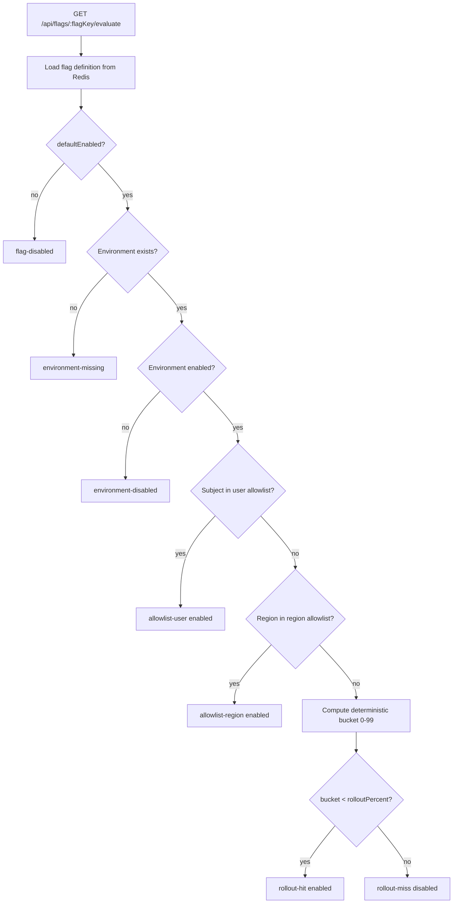
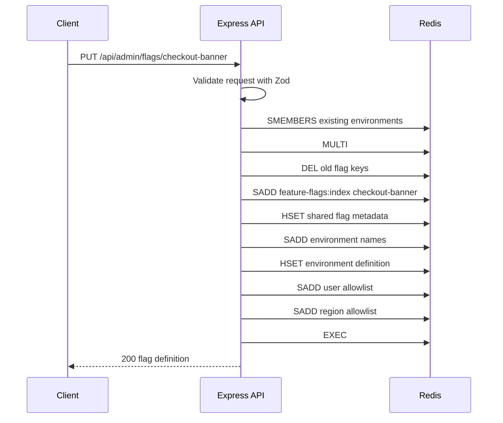
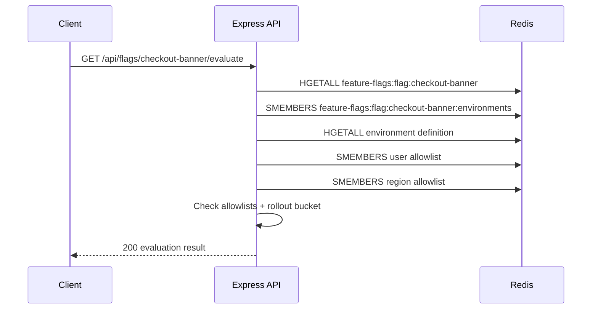
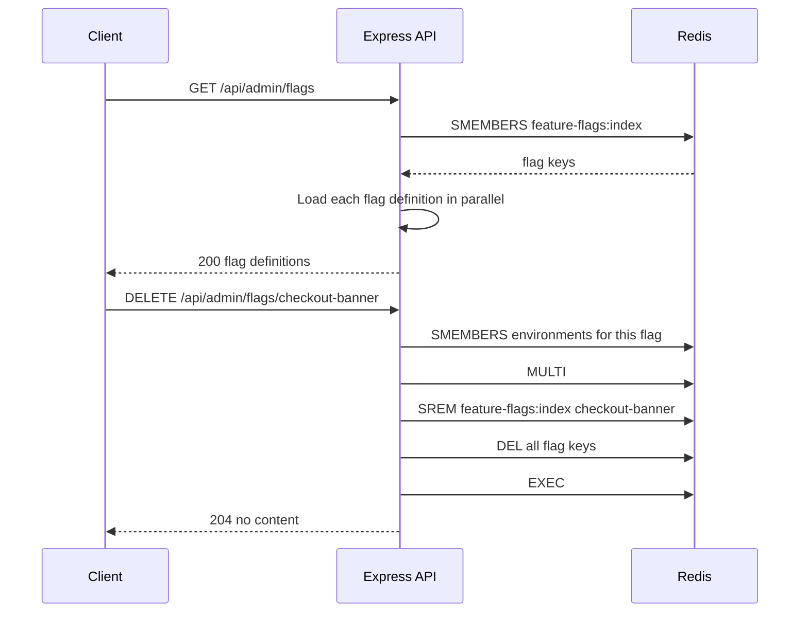

*Published 19 March 2026 · updated 25 March 2026*

> **TL;DR:**
>
> Build feature flags and remote config in Redis by storing each flag definition as a hash, storing rollout cohorts in sets, and evaluating a subject with a deterministic hash bucket. In this tutorial, you will create a Redis-backed API that lets you create, list, evaluate, and delete flag definitions for a given subject, environment, and region.

> **Note:** This tutorial uses the code from the following git repository:
>
> [https://github.com/redis-developer/feature-flags-and-remote-config-with-redis](https://github.com/redis-developer/feature-flags-and-remote-config-with-redis)

When your app needs to turn a feature on for 10% of users in one region and off everywhere else, you need a store that can answer that question fast. Redis gives you sub-millisecond reads, clean data structures for cohorts and config, and deterministic hashing for percentage rollouts -- all without adding another service to your stack.

This app exposes five routes:

- `GET /api/admin/flags` to list all flag definitions
- `PUT /api/admin/flags/:flagKey` to create or update a flag definition
- `DELETE /api/admin/flags/:flagKey` to delete a flag definition
- `GET /api/flags/:flagKey` to read a single flag definition
- `GET /api/flags/:flagKey/evaluate` to evaluate a flag for a subject

## What you'll learn

- How to model feature flags and remote config in Redis
- How to store flag metadata in hashes and cohorts in sets
- How to evaluate percentage rollouts deterministically
- How to use `MULTI`/`EXEC` pipelines for atomic flag updates
- How to serve flag definitions and evaluations from a Redis-backed API

## What you'll build

You'll build a Bun and Express API with two flows:

- An admin flow that creates, lists, and deletes flag definitions
- A read flow that loads a flag definition and evaluates it for a subject

An evaluation response looks like this:

```json
{
    "flagKey": "checkout-banner",
    "environment": "production",
    "subject": "user-123",
    "enabled": true,
    "reason": "allowlist-user",
    "bucket": 42,
    "value": {
        "title": "Fast checkout for every team"
    }
}
```

The app stores the data that drives each flag in Redis:

- `feature-flags:index` tracks the known flag keys
- `feature-flags:flag:<flagKey>` stores the flag metadata
- `feature-flags:flag:<flagKey>:environments` tracks the environment names for a flag
- `feature-flags:flag:<flagKey>:environment:<environment>` stores the environment-specific rollout and config
- `feature-flags:flag:<flagKey>:environment:<environment>:users` stores user allowlists
- `feature-flags:flag:<flagKey>:environment:<environment>:regions` stores region allowlists

## What are feature flags and remote config?

Feature flags let you turn features on or off for specific users, environments, or regions without redeploying your app. Remote config extends that idea by attaching a payload -- such as copy, thresholds, or layout options -- to each flag so the app can change behavior at runtime.

Both patterns need a fast backing store. The flag evaluation runs on every request, so the lookup must be cheap. Redis gives you that speed plus clean data structures for storing flag metadata, rollout rules, and allowlists.

## Why use Redis for feature flags and remote config?

Redis fits this use case because it keeps the decision path fast and simple:

- Redis reads are fast, so flag evaluation stays cheap even when every request checks a flag.
- Redis sets are a clean fit for cohorts and allowlists. `SISMEMBER` checks membership in O(1) time.
- Redis hashes give you a compact way to store flag metadata and environment-specific config.
- `MULTI`/`EXEC` pipelines make flag updates atomic -- no partial state visible to readers.
- Deterministic hashing makes percentage rollouts consistent for the same subject.

This first version keeps evaluation direct against Redis. If you later want process-local caching, you can layer Pub/Sub invalidation on top.

## Prerequisites

- [Bun](https://bun.sh/)
- [Docker](https://www.docker.com/)
- A Redis instance, either local or [Redis Cloud](https://redis.io/try-free/)

If you need a Redis refresher first, start with the [Redis quick start](/tutorials/howtos/quick-start/) and the [What is Redis?](/tutorials/what-is-redis/) tutorial.

## Step 1. Clone the repo

```bash
git clone https://github.com/redis-developer/feature-flags-and-remote-config-with-redis.git
cd feature-flags-and-remote-config-with-redis
```

## Step 2. Configure environment variables

Copy the sample file:

```bash
cp .env.example .env
```

For local development, the sample file points to Redis on the default local port:

```bash
REDIS_URL="redis://localhost:6379"
LOG_LEVEL="info"
```

`LOG_LEVEL` controls the verbosity of the server logs. The app also writes structured logs to a Redis stream at the key configured by `LOG_STREAM_KEY` (default `logs`).

When you run the app with Docker Compose, the server container talks to Redis at `redis://redis:6379`.

## Step 3. Run Redis and the app

You can start the stack with the provided script:

```bash
bun docker
```

Or run Compose directly:

```bash
docker compose up -d --build
```

The server listens on `http://localhost:8080`.

## Step 4. Run the tests

```bash
bun test
```

The test suite includes unit tests for validation schemas and the evaluator, plus integration tests that cover the full flag lifecycle -- upserting a flag, evaluating it for an allowlisted user, and verifying a rollout miss.

## Step 5. Upsert a flag definition

Send a flag definition to the admin endpoint:

```bash
curl -X PUT http://localhost:8080/api/admin/flags/checkout-banner \
  -H "Content-Type: application/json" \
  -d '{
    "description": "Controls checkout banner copy",
    "defaultEnabled": true,
    "environments": {
      "production": {
        "enabled": true,
        "rolloutPercent": 25,
        "value": {
          "title": "Fast checkout for every team"
        },
        "allowlistUsers": ["user-123"],
        "allowlistRegions": ["us-west"]
      }
    }
  }'
```

The response returns the stored flag definition with timestamps:

```json
{
    "flagKey": "checkout-banner",
    "description": "Controls checkout banner copy",
    "defaultEnabled": true,
    "environments": {
        "production": {
            "enabled": true,
            "rolloutPercent": 25,
            "value": { "title": "Fast checkout for every team" },
            "allowlistUsers": ["user-123"],
            "allowlistRegions": ["us-west"],
            "updatedAt": "2026-03-19T12:00:00.000Z"
        }
    },
    "updatedAt": "2026-03-19T12:00:00.000Z"
}
```

## Step 6. List all flag definitions

Retrieve every flag the app knows about:

```bash
curl http://localhost:8080/api/admin/flags
```

Example response:

```json
[
  {
    "flagKey": "checkout-banner",
    "description": "Controls checkout banner copy",
    "defaultEnabled": true,
    "environments": { ... },
    "updatedAt": "2026-03-19T12:00:00.000Z"
  }
]
```

Under the hood, this reads the index set and loads each flag definition in parallel.

## Step 7. Evaluate the flag

Ask the API to evaluate a flag for a subject:

```bash
curl "http://localhost:8080/api/flags/checkout-banner/evaluate?environment=production&subject=user-123"
```

Example response:

```json
{
    "flagKey": "checkout-banner",
    "environment": "production",
    "subject": "user-123",
    "enabled": true,
    "reason": "allowlist-user",
    "bucket": 42,
    "value": {
        "title": "Fast checkout for every team"
    }
}
```

If the subject is not allowlisted and the rollout percentage is `0`, the evaluation returns `enabled: false` with `reason: "rollout-miss"`.

## Step 8. Delete a flag definition

Remove a flag and all of its environment data:

```bash
curl -X DELETE http://localhost:8080/api/admin/flags/checkout-banner
```

The endpoint returns `204 No Content`. Subsequent evaluations or reads for that flag return `404`.

## Step 9. Understand the Redis data model

The app uses a small set of keys per flag:

```text
feature-flags:index
feature-flags:flag:checkout-banner
feature-flags:flag:checkout-banner:environments
feature-flags:flag:checkout-banner:environment:production
feature-flags:flag:checkout-banner:environment:production:users
feature-flags:flag:checkout-banner:environment:production:regions
```

The important part is the split:

1. A set (`feature-flags:index`) tracks every known flag key.
2. A hash (`feature-flags:flag:<flagKey>`) stores the shared metadata -- description, default enabled state, and last update time.
3. A set (`feature-flags:flag:<flagKey>:environments`) tracks the environment names for a flag.
4. A hash per environment stores rollout percentage, enabled state, and the remote config payload.
5. Sets hold the allowlists for fast `SISMEMBER` membership checks.

## Feature flag evaluation architecture



## How does the flag upsert work?

When `PUT /api/admin/flags/:flagKey` arrives, the app validates the request body with Zod and then writes the flag to Redis inside a single `MULTI`/`EXEC` pipeline. The pipeline first deletes any existing keys for the flag, then writes the new data -- so readers never see a partial update.

Under the hood, Redis receives:

```text
MULTI
DEL feature-flags:flag:checkout-banner feature-flags:flag:checkout-banner:environments ...
SADD feature-flags:index checkout-banner
HSET feature-flags:flag:checkout-banner description "Controls checkout banner copy" defaultEnabled "true" updatedAt "2026-03-19T12:00:00.000Z"
SADD feature-flags:flag:checkout-banner:environments production
HSET feature-flags:flag:checkout-banner:environment:production enabled "true" rolloutPercent "25" value "{...}" updatedAt "2026-03-19T12:00:00.000Z"
SADD feature-flags:flag:checkout-banner:environment:production:users user-123
SADD feature-flags:flag:checkout-banner:environment:production:regions us-west
EXEC
```

The `DEL` at the top of the pipeline removes stale environment keys from a previous version of the flag. This is important because environments can be renamed or removed between upserts. Without the delete, old environment keys would linger.

After the pipeline executes, the app reads the flag back from Redis and returns the full definition to the caller.

## How does flag evaluation work?

When `GET /api/flags/:flagKey/evaluate` arrives, the app loads the flag definition from Redis and runs it through a pure evaluation function. The load step issues parallel reads:

```text
HGETALL feature-flags:flag:checkout-banner
SMEMBERS feature-flags:flag:checkout-banner:environments
```

For each environment, the app loads the environment hash and allowlist sets in parallel:

```text
HGETALL feature-flags:flag:checkout-banner:environment:production
SMEMBERS feature-flags:flag:checkout-banner:environment:production:users
SMEMBERS feature-flags:flag:checkout-banner:environment:production:regions
```

The evaluator then checks the loaded data in order:

1. If `defaultEnabled` is false, return `flag-disabled`.
2. If the requested environment does not exist, return `environment-missing`.
3. If the environment's `enabled` field is false, return `environment-disabled`.
4. If the subject is in the user allowlist, return `allowlist-user` (enabled).
5. If the region is in the region allowlist, return `allowlist-region` (enabled).
6. Compute a deterministic bucket and compare it to `rolloutPercent`.

The evaluation is a pure function -- it takes the loaded definition and the input, and returns the result. No additional Redis calls happen during evaluation.

## How do percentage rollouts work with Redis?

The evaluator hashes the flag key, environment, and subject into a stable bucket from `0` to `99`:

```text
sha256("checkout-banner:production:user-456") --> hex --> first 8 chars --> mod 100 --> bucket
```

If the bucket is less than `rolloutPercent`, the flag is enabled for that subject. If not, it is disabled. The same input always produces the same bucket, so a user's experience stays consistent across requests.

This approach does not require any state in Redis beyond the rollout percentage itself. The deterministic hash runs in the app, and Redis only stores the percentage threshold.

## How does the admin list and delete work?

The list endpoint reads all flag keys from the index set and loads each definition in parallel:

```text
SMEMBERS feature-flags:index
```

For each key in the set, the app calls the same load logic used by evaluation -- `HGETALL` for the flag hash, `SMEMBERS` for the environments, and parallel loads for each environment definition.

The delete endpoint removes a flag and all of its associated keys in a single pipeline:

```text
MULTI
SREM feature-flags:index checkout-banner
DEL feature-flags:flag:checkout-banner feature-flags:flag:checkout-banner:environments feature-flags:flag:checkout-banner:environment:production feature-flags:flag:checkout-banner:environment:production:users feature-flags:flag:checkout-banner:environment:production:regions
EXEC
```

`SREM` removes the flag key from the index so it no longer appears in the list. `DEL` removes all the hash and set keys associated with the flag. Both run inside a `MULTI`/`EXEC` pipeline so the delete is atomic.

## How it works

The full flag lifecycle breaks into three request flows:







Redis stores flag metadata in hashes, environment names in sets, and allowlists in sets. The evaluator runs as a pure function over the loaded data. `MULTI`/`EXEC` pipelines keep writes atomic so readers never see partial flag state.

## FAQ

### Can Redis power feature flags?

Yes. Redis works well for feature flags because it is fast, simple to model, and good at set membership checks and small structured records.

### How do I do percentage rollouts with Redis?

Hash the flag key, environment, and subject into a deterministic bucket from `0` to `99`. Then compare that bucket to the rollout percentage for the environment. The same input always produces the same bucket, so a user's experience stays consistent.

### How do apps refresh config without polling every request?

This first build reads the latest definition from Redis when it evaluates a flag, so there is no separate config poller. If you want process-local caching, add Pub/Sub invalidation and clear the local cache when a flag changes.

### What data model should I use for flags in Redis?

Use a hash for the shared flag record, a hash for each environment's rollout and config, and sets for allowlisted users and regions. Track flag keys in an index set so you can list and enumerate them.

### How do I list all feature flags stored in Redis?

Store every flag key in an index set with `SADD`. To list all flags, call `SMEMBERS` on the index set and load each flag definition in parallel. In this app, the endpoint is `GET /api/admin/flags`.

### How do I delete a feature flag from Redis?

Remove the flag key from the index set with `SREM` and delete all associated hash and set keys with `DEL`. Run both inside a `MULTI`/`EXEC` pipeline so the delete is atomic. In this app, the endpoint is `DELETE /api/admin/flags/:flagKey`.

## Troubleshooting

### The app starts but returns a Redis error

Check that `REDIS_URL` in your `.env` file points to a running Redis instance. If you are using Docker, verify the container is healthy:

```bash
docker ps
```

### The evaluate endpoint returns a 404

Make sure you have upserted the flag definition first with `PUT /api/admin/flags/:flagKey`. The evaluate endpoint reads the flag from Redis, so the flag must exist before you can evaluate it.

### Docker Compose fails to start

Make sure Docker is running and that ports 8080 and 6379 are not already in use by another service.

## Next steps

- Try the [Redis quick start](/tutorials/howtos/quick-start/) if you want a quicker Redis setup refresher.
- Read [What is Redis?](/tutorials/what-is-redis/) for a broader overview of the data model choices in this tutorial.
- Explore [Build 5 Rate Limiters with Redis](/tutorials/howtos/ratelimiting/) to see another Redis pattern that depends on deterministic request decisions.
- Add Pub/Sub invalidation next by pairing this tutorial with the [Chat application using Redis](/tutorials/howtos/chatapp/) tutorial.

## Additional resources

- [Redis docs](https://redis.io/docs/latest/)
- [Redis clients](https://redis.io/docs/latest/develop/clients/)
- [Redis Insight](https://redis.io/insight/)
