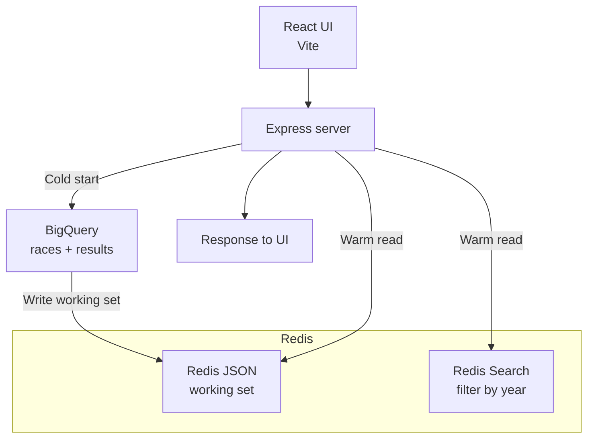

*Published 18 March 2026 · updated 25 March 2026*

> **TL;DR:**
>
> Use Redis to prefetch a working set from BigQuery, store each record as Redis JSON, and query the cached data with Redis Search for fast app reads. In this tutorial you'll build and run a Formula One dashboard that warms Redis from BigQuery, then serves year filters and race details without hitting the warehouse on every request. [Clone the repo](https://github.com/redis-developer/demo-redis-bigquery) and follow the steps below to get started.

BigQuery is excellent at large analytical queries, but it is not where you want to serve every UI read from. If your app repeatedly asks for the same stable dataset, you can move those reads into Redis and keep BigQuery as the system of record.

This tutorial shows that pattern with a JavaScript app that loads Formula One race data from BigQuery, stores the race documents in Redis, and serves a React dashboard from the cached data.

## What you'll learn

- How to use cache prefetching to move repeated BigQuery reads into Redis
- How to store BigQuery records as Redis JSON documents
- How to filter cached documents with Redis Search
- How to build a read-heavy dashboard that uses Redis for fast app reads
- What tradeoffs come with prefetching data from a warehouse into Redis

## What you'll build

You'll build a Formula One dashboard that prefetches race data from BigQuery into Redis, then serves the dashboard UI entirely from Redis-backed API routes. The app uses:

- An Express server that reads BigQuery and writes Redis JSON
- A Redis Search index for year-based filtering
- A React frontend for browsing races by year and viewing race details

The default flow loads the full working set into Redis on first request, so every subsequent read hits Redis instead of BigQuery.

## Prerequisites

- [Bun](https://bun.sh/)
- [Docker](https://www.docker.com/) for the Redis container and the full app container flow
- A Google Cloud project with BigQuery enabled
- The [Formula One dataset](https://www.kaggle.com/datasets/rohanrao/formula-1-world-championship-1950-2020) loaded into BigQuery
- Local application default credentials for Google Cloud
- Basic familiarity with Redis commands and JavaScript apps

> **Note:** You need the Formula One dataset loaded into a BigQuery table before the app can prefetch it. Follow the Kaggle dataset link above to download it, then load it into your Google Cloud project.

If you need a Redis refresher first, start with the [Redis quick start](/tutorials/howtos/quick-start/) and [Node.js client guide](/tutorials/develop/node/gettingstarted/).

## Why put Redis in front of BigQuery?

BigQuery is built for large scans, aggregations, and warehouse-style query patterns. A dashboard UI usually needs something else:

- Fast repeated reads
- Predictable query latency
- Simple object retrieval
- Lightweight filtering over a working set

That is where Redis fits.

In this app, BigQuery stays the source of truth. Redis holds a prefetched working set of race documents that the app can query directly.

**Direct BigQuery reads:**

- Good for large analytical queries
- Higher latency for UI lookups
- Query warehouse on every request
- Better for full-table analytics

**Prefetched Redis reads:**

- Good for repeated app reads
- Fast in-memory lookups
- Warm cache once, then reuse
- Better for app-facing working sets

Use this pattern when the data changes less often than it gets read, and when you can tolerate refresh-based freshness instead of write-through consistency.

## How does the app work?

The app has four parts:

1. BigQuery stores the Formula One dataset.
2. The Express server reads the race and results tables from BigQuery.
3. Redis stores each race document as JSON and indexes the `year` field with Redis Search.
4. The React UI requests year filters and race details from Redis-backed API routes.



The read path looks like this:

1. The app receives a request for a race year.
2. If Redis is empty, the server loads the working set from BigQuery.
3. The server stores the race documents in Redis JSON.
4. The server queries Redis Search for the requested year.
5. The UI renders the result without going back to BigQuery for each page interaction.

## Step 1. Clone the repo

```bash
git clone https://github.com/redis-developer/demo-redis-bigquery.git
cd demo-redis-bigquery
```

## Step 2. Configure environment variables

Copy the sample file:

```bash
cp .env.example .env
```

Then update these values:

- `REDIS_URL`
- `GOOGLE_APPLICATION_CREDENTIALS`
- `GOOGLE_CLOUD_PROJECT_ID`

Optional values:

- `PORT`
- `ENABLE_IMAGE_ENRICHMENT`

> **Tip:** Set `ENABLE_IMAGE_ENRICHMENT=false` if you want the fastest startup path and don't need runtime Wikipedia lookups for images.

## Step 3. Run Redis with Docker

The app includes a Docker Compose file that uses `redis:alpine`.

If you want to run only Redis in Docker and run the app locally:

```bash
docker compose up redis -d
```

If you want to run the full stack in Docker:

```bash
bun run docker:up
```

Open `http://localhost:8080`.

## Step 4. Run the app locally

For the local dev flow, Vite serves the frontend and proxies API requests to the Express server:

```bash
bun install
bun run dev
```

Open `http://localhost:5173`.

## How is the data modeled in Redis?

Each race is stored as one JSON document:

- Key pattern: `races:{race_id}`
- Value: a JSON document containing the race, circuit info, results, and winner

The app also creates a Redis Search index named `races-idx` over the cached JSON documents.

The index definition below creates a Redis Search index on the `race_id` and `year` fields of every JSON document with the `races:` prefix. This lets you run `FT.SEARCH` queries against those fields instead of scanning keys manually.

```js
await redis.ft.create(
    'races-idx',
    {
        '$.race_id': {
            AS: 'race_id',
            type: SCHEMA_FIELD_TYPE.NUMERIC,
        },
        '$.year': {
            AS: 'year',
            type: SCHEMA_FIELD_TYPE.NUMERIC,
        },
    },
    {
        ON: 'JSON',
        PREFIX: 'races:',
    },
);
```

## How do you prefetch BigQuery data into Redis?

The app warms Redis on demand. If the cache is empty, the server reads the races and results tables from BigQuery, assembles one document per race, and writes the full working set to Redis JSON.

The code below queries both BigQuery tables and writes every race document to Redis in a single `JSON.MSET` call. Each document is keyed by `races:{race_id}` so the search index picks it up automatically.

```js
const [races] = await getBigQueryClient().query(QUERIES.RACES);
const [results] = await getBigQueryClient().query(QUERIES.RESULTS);

await redis.json.mSet(
    races.map((race) => {
        return {
            key: `races:${race.race_id}`,
            path: '$',
            value: race,
        };
    }),
);
```

This is cache prefetching, not cache-aside:

- Cache-aside waits for a miss and fills one item at a time.
- Prefetching loads the working set before the app keeps reading from it.

> **Note:** For a broader pattern overview, read the [cache prefetching guide](/tutorials/howtos/solutions/caching-architecture/cache-prefetching/).

## How does the app query Redis?

To filter all races for a given year, the app runs an `FT.SEARCH` query against the index. This returns every matching JSON document in one call.

```bash
FT.SEARCH races-idx "@year==2024" DIALECT 2
```

To read a single race when you already know the key, the app uses `JSON.GET` directly. This skips the search index and returns the full document.

```bash
JSON.GET races:1104
```

That split is useful:

- Use Redis Search when you need field-based filtering across many documents.
- Use Redis JSON when you already know the key and want the whole document.

## Why is this pattern useful for dashboards?

Dashboards often repeat the same reads:

- Filter by year
- Open one record
- Go back to a list
- Open another record

If every interaction calls the warehouse again, latency stacks up fast. By moving the working set into Redis, the app gets a fast read layer that is easier to scale for UI traffic.

This doesn't replace BigQuery. It complements it:

- BigQuery remains the system of record
- Redis becomes the app-facing read layer

## What tradeoffs should you know?

Cache prefetching is not free. You are trading warehouse latency for cache management.

Main tradeoffs:

- **Freshness**: cached data is only as fresh as your warmup or refresh flow
- **Warmup cost**: the first load has to read BigQuery and write Redis
- **Memory use**: Redis now stores your app-facing working set
- **Scope**: this pattern works best when the working set is bounded and predictable

For highly volatile data, you may want cache-aside, write-through, or a hybrid design instead.

## Troubleshooting

### The app starts but returns a Redis error

Check that `REDIS_URL` points to your Redis instance and that Redis is running on the expected port.

### The app starts but BigQuery requests fail

Check these values in `.env`:

- `GOOGLE_APPLICATION_CREDENTIALS`
- `GOOGLE_CLOUD_PROJECT_ID`

Also verify that your local Google Cloud credentials can read the dataset.

### Docker starts but the app has no data

The app still needs valid BigQuery credentials. Docker only supplies the app runtime and Redis container. It doesn't create the dataset for you.

### Warmup is slower than you expect

Disable image enrichment during startup:

```bash
ENABLE_IMAGE_ENRICHMENT=false
```

That skips runtime Wikipedia lookups and keeps the Redis lesson front and center.

## FAQ

### What is cache prefetching?

Cache prefetching loads a bounded working set into Redis before the app starts reading from it. Unlike cache-aside, which waits for a miss and fills one key at a time, prefetching writes the full dataset in one pass so every subsequent read hits the cache.

### When should I use Redis instead of querying BigQuery directly?

Use Redis when your app repeatedly reads the same stable dataset and needs fast, predictable latency. BigQuery is better for large analytical scans and ad hoc queries. If your reads are frequent and your data changes less often than it gets read, Redis gives you a faster read layer without hitting the warehouse on every request.

### Do I need Redis Cloud to follow this tutorial?

No. The local flow uses Docker with `redis:alpine`. You can switch to [Redis Cloud](https://redis.io/try-free/) later by updating `REDIS_URL` in your `.env` file.

### How do I refresh the Redis cache when BigQuery data changes?

This tutorial uses on-demand warmup: the server loads BigQuery data into Redis on the first request if the cache is empty. For production, add a scheduled refresh job that re-runs the prefetch on a cadence that matches how often your data changes. You can also call `FLUSHDB` or delete specific keys before re-warming.

## Next steps

Once you have this working, you can go in a few directions:

- Add a scheduled refresh job instead of warming the cache from a request path
- Add more Redis Search filters, such as country or circuit
- Compare this pattern to [REST API response caching with Redis and Node.js](/tutorials/how-to-cache-rest-api-responses-using-redis-and-nodejs/)
- Compare it to the broader [cache prefetching pattern](/tutorials/howtos/solutions/caching-architecture/cache-prefetching/)

## Additional resources

- [Redis docs](https://redis.io/docs/latest/)
- [Redis clients](https://redis.io/docs/latest/develop/clients/)
- [Redis Search docs](https://redis.io/docs/latest/develop/interact/search-and-query/)
- [Redis Insight](https://redis.io/insight/)
