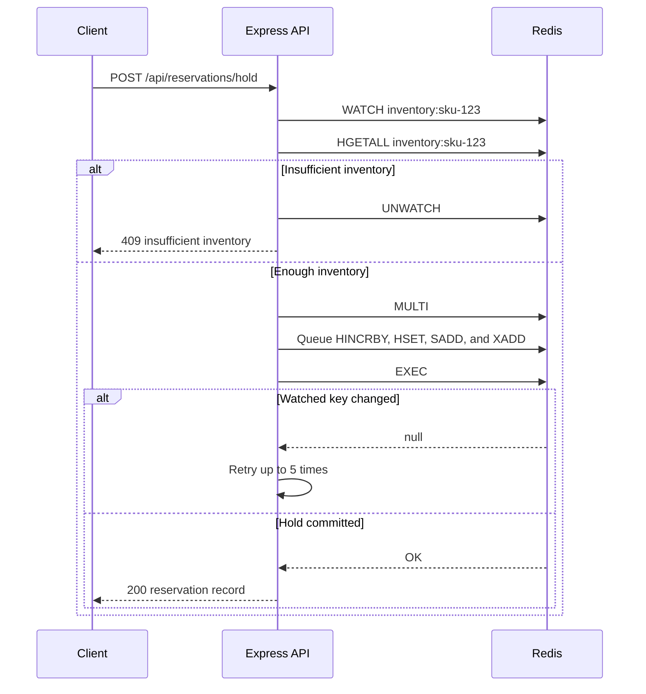
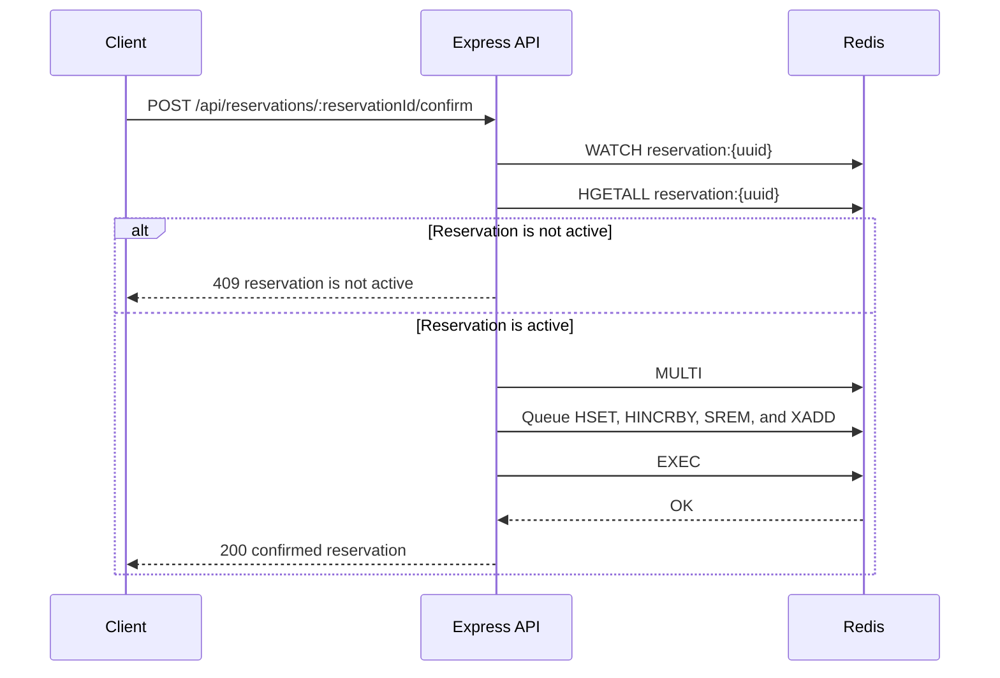
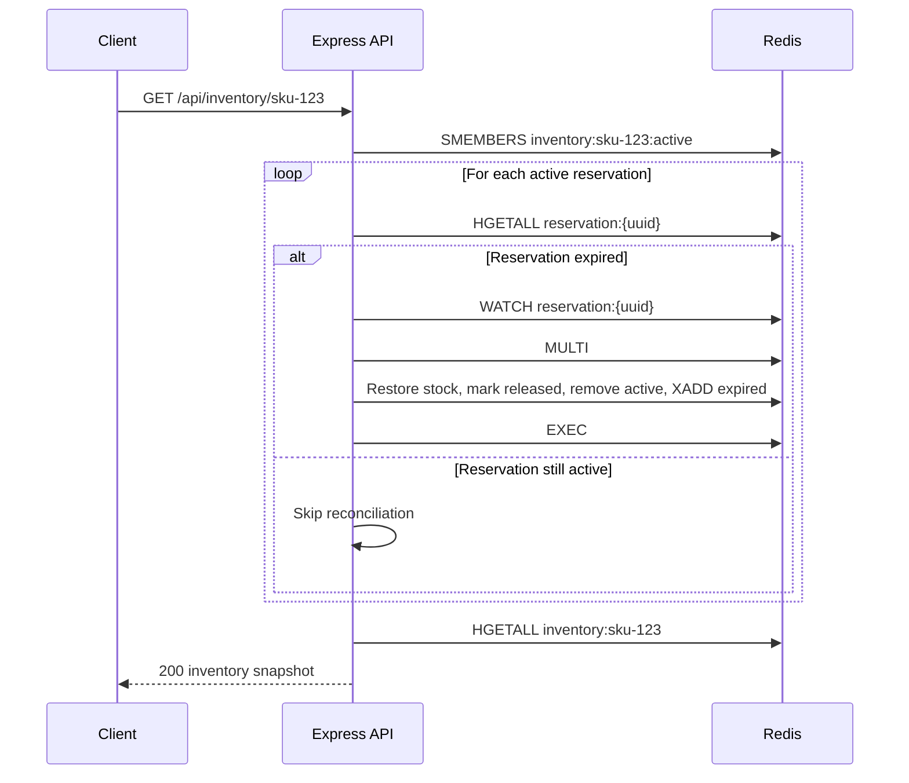

*Published 19 March 2026 · updated 25 March 2026*

> **TL;DR:**
>
> Learn how to reserve inventory in real time with Redis by building a checkout API that seeds stock, places a hold, confirms or releases a reservation, and records every state change in an audit stream. This app keeps inventory fast and consistent by storing stock counts, reservation records, and active holds in Redis.

When two shoppers click "buy" at the same time, your system needs to decide who gets the last item before either write commits. A plain database read-then-write is not fast enough -- both requests can read the same count and both can succeed. Redis solves that problem with `WATCH` and `MULTI`, giving you an atomic hold flow that prevents overselling while keeping checkout fast.

This tutorial shows how to reserve inventory in real time with Redis. You will build a Bun and Express API that holds stock for a cart, confirms the order after payment, releases the hold on cancellation, and recovers expired reservations automatically when inventory is read.

> **Note:** This tutorial uses the code from the following git repository:
>
> [https://github.com/redis-developer/inventory-reservation-in-real-time-with-redis](https://github.com/redis-developer/inventory-reservation-in-real-time-with-redis)

## What you'll learn

- How to model inventory availability and reservation state in Redis hashes
- How to protect stock with an atomic hold flow using `WATCH` and `MULTI`
- How to confirm or release a reservation without overselling
- How to recover expired holds when inventory is read
- How to write reservation events to a Redis Stream for auditability

## What you'll build

You'll build a checkout API with these endpoints:

- `POST /api/inventory/seed`
- `GET /api/inventory/:sku`
- `POST /api/reservations/hold`
- `GET /api/reservations/:reservationId`
- `POST /api/reservations/:reservationId/confirm`
- `POST /api/reservations/:reservationId/release`
- `GET /api/audit?sku=:sku&limit=:limit`

The app keeps the primary run path in Docker, so you can start Redis and the server together and verify the full flow locally.

## What is inventory reservation?

Inventory reservation is a pattern that temporarily holds stock for a cart so no other order can claim the same units. Instead of decrementing stock on purchase and hoping for the best, the system moves units from an "available" pool into a "reserved" pool while the customer completes payment.

The reservation lifecycle has three states:

- **Available** -- units that any cart can claim.
- **Reserved** -- units held for a specific cart. No other request can take them.
- **Confirmed** -- units that have been paid for. The hold converts to a permanent deduction.

If the customer abandons the cart or the hold window expires, reserved units move back to available. That keeps stock accurate without requiring manual cleanup.

This pattern matters because a simple read-then-write creates a race condition. Two concurrent requests can both read `available = 1`, both decide they can proceed, and both write `available = 0`. One customer gets the item and the other gets an oversell. Inventory reservation eliminates that race by using an atomic hold that fails if the stock changes between the read and the write.

## Why use Redis for inventory reservation?

Redis is a strong fit for inventory reservation because it gives you fast reads, atomic updates, and simple data structures that match the problem:

- A hash for current stock counts (`available`, `reserved`, `confirmed`)
- A hash for each reservation record (cart, SKU, quantity, state, timestamps)
- A set for active reservation IDs per SKU
- A stream for audit events

`WATCH` and `MULTI` give you optimistic locking without external lock managers. If another request changes the inventory key between your read and your commit, Redis aborts the transaction and your app retries. That keeps the hold flow safe under concurrency without blocking other readers.

## Prerequisites

- [Docker](https://docs.docker.com/get-docker/) and Docker Compose
- [Bun](https://bun.sh/) if you want to run the app outside Docker
- Basic familiarity with REST APIs and JSON

## Step 1. Clone the repo

```bash
git clone https://github.com/redis-developer/inventory-reservation-in-real-time-with-redis.git
cd inventory-reservation-in-real-time-with-redis
```

## Step 2. Configure environment variables

Copy the sample file:

```bash
cp .env.example .env
```

The default local Redis URL is `redis://localhost:6379`. When you run the app with Docker Compose, the server container talks to Redis at `redis://redis:6379` instead.

## Step 3. Run the app with Docker

```bash
docker compose up -d --build
```

That starts Redis on port `6379` and the Node.js app on port `8080`.

## Step 4. Run the tests

```bash
docker compose exec server bun test
```

The test suite covers the full reservation lifecycle: seeding inventory, placing a hold, confirming and releasing reservations, reading the audit trail, and verifying that expired holds are recovered automatically.

## Step 5. Seed inventory

Start by adding stock for a SKU:

```bash
curl -X POST http://localhost:8080/api/inventory/seed \
  -H "Content-Type: application/json" \
  -d '{"sku":"sku-123","quantity":5}'
```

The response includes the current snapshot:

```json
{
    "sku": "sku-123",
    "available": 5,
    "reserved": 0,
    "confirmed": 0,
    "activeReservations": [],
    "updatedAt": "2026-03-19T04:06:20.496Z"
}
```

Under the hood, the app writes the inventory hash and clears any previous active set for the SKU:

```text
MULTI
HSET inventory:sku-123 available "5" reserved "0" confirmed "0" sku "sku-123" updatedAt "..."
DEL inventory:sku-123:active
EXEC
```

## Step 6. Hold stock for a cart

Place a hold for a cart with a short reservation window:

```bash
curl -X POST http://localhost:8080/api/reservations/hold \
  -H "Content-Type: application/json" \
  -d '{"cartId":"cart-1","sku":"sku-123","quantity":2,"ttlSeconds":30}'
```

The API returns a reservation record with a `reservationId`, `state`, and `expiresAt` value.

## Step 7. Read the updated inventory

Check the inventory snapshot after the hold:

```bash
curl http://localhost:8080/api/inventory/sku-123
```

The available count drops, the reserved count increases, and the reservation ID appears in `activeReservations`.

## Step 8. Confirm or release the reservation

If payment succeeds, confirm the reservation:

```bash
curl -X POST http://localhost:8080/api/reservations/<reservationId>/confirm
```

If the cart is abandoned or the user cancels, release it:

```bash
curl -X POST http://localhost:8080/api/reservations/<reservationId>/release
```

Both paths update the reservation state and write an audit event.

## Step 9. Inspect the audit trail

Read the latest reservation events:

```bash
curl "http://localhost:8080/api/audit?sku=sku-123&limit=10"
```

This endpoint returns the latest holds, confirmations, releases, and expiry recoveries for the SKU.

## How it works

### Redis data model

The app uses four Redis key patterns:

| Key                           | Type   | Purpose                                                                            |
| ----------------------------- | ------ | ---------------------------------------------------------------------------------- |
| `inventory:{sku}`             | Hash   | Live stock snapshot: `available`, `reserved`, `confirmed`, `sku`, `updatedAt`      |
| `reservation:{reservationId}` | Hash   | One record per hold: `cartId`, `sku`, `quantity`, `state`, `expiresAt`, timestamps |
| `inventory:{sku}:active`      | Set    | Reservation IDs still considered active for a SKU                                  |
| `inventory:audit`             | Stream | Append-only log of hold, confirm, release, and expired events                      |

### How does the hold flow work?

The hold is the most important operation because it must prevent two concurrent requests from claiming the same stock. The app uses optimistic locking with `WATCH` and `MULTI`:

1. `WATCH` the inventory key so Redis tracks changes.
2. `HGETALL` to read the current stock counts.
3. Check that enough stock is available. If not, `UNWATCH` and return an error.
4. Open a `MULTI` block and queue five writes.
5. `EXEC` the transaction. If another request changed the inventory key after the `WATCH`, Redis returns `null` and the app retries (up to 5 attempts).

The Redis commands issued during a successful hold:

```text
WATCH inventory:sku-123
HGETALL inventory:sku-123
MULTI
HINCRBY inventory:sku-123 available -2
HINCRBY inventory:sku-123 reserved 2
HSET reservation:<uuid> cartId "cart-1" sku "sku-123" quantity "2" state "active" expiresAt "..." createdAt "..." updatedAt "..."
SADD inventory:sku-123:active <uuid>
XADD inventory:audit * event "hold" cartId "cart-1" sku "sku-123" quantity "2" reservationId "<uuid>" state "active" happenedAt "..."
EXEC
```

If two requests try to hold the same SKU at the same time, only one transaction commits. The other sees a `null` result from `EXEC`, meaning the watched key changed. That request retries with fresh data, and if stock is now insufficient, it returns a `409 Insufficient inventory` error.

### How does confirmation work?

Confirmation converts reserved units into confirmed units. The app watches the reservation key (not the inventory key) to guard against concurrent state changes on the same reservation:

```text
WATCH reservation:<uuid>
HGETALL reservation:<uuid>
MULTI
HSET reservation:<uuid> state "confirmed" updatedAt "..."
HINCRBY inventory:sku-123 reserved -2
HINCRBY inventory:sku-123 confirmed 2
SREM inventory:sku-123:active <uuid>
XADD inventory:audit * event "confirm" cartId "cart-1" sku "sku-123" quantity "2" reservationId "<uuid>" state "confirmed" happenedAt "..."
EXEC
```

The app verifies that the reservation exists and is still in `active` state before queueing the transaction. If the reservation was already confirmed or released, the endpoint returns `409 Reservation is not active`.

### How does release work?

Release restores reserved units back to available. The flow mirrors confirmation, but the counts move in the opposite direction:

```text
WATCH reservation:<uuid>
HGETALL reservation:<uuid>
MULTI
HSET reservation:<uuid> state "released" updatedAt "..."
HINCRBY inventory:sku-123 available 2
HINCRBY inventory:sku-123 reserved -2
SREM inventory:sku-123:active <uuid>
XADD inventory:audit * event "release" cartId "cart-1" sku "sku-123" quantity "2" reason "manual_release" reservationId "<uuid>" state "released" happenedAt "..."
EXEC
```

The release audit event includes a `reason` field set to `manual_release` so you can distinguish voluntary releases from automatic expiry recoveries.

### How does expired reservation recovery work?

The app does not use a background cleanup worker. Instead, it reconciles expired reservations every time inventory is read. When `GET /api/inventory/:sku` is called, the app:

1. Reads all members of the active set with `SMEMBERS inventory:{sku}:active`.
2. For each reservation ID, loads the reservation hash and checks `expiresAt`.
3. If the reservation has expired and is still `active`, runs a `WATCH`/`MULTI` block to restore stock.

The Redis commands for one expired reservation:

```text
SMEMBERS inventory:sku-123:active
WATCH reservation:<uuid>
HGETALL reservation:<uuid>
MULTI
HINCRBY inventory:sku-123 available 2
HINCRBY inventory:sku-123 reserved -2
HSET reservation:<uuid> state "released" updatedAt "..."
SREM inventory:sku-123:active <uuid>
XADD inventory:audit * event "expired" reason "reservation_ttl_elapsed" cartId "cart-1" sku "sku-123" quantity "2" reservationId "<uuid>" state "released" happenedAt "..."
EXEC
```

This read-time reconciliation keeps the system simple. There is no separate cron job or worker process to manage. The tradeoff is that expired stock is not restored until the next read, which is acceptable for most checkout flows.

### How does the audit stream work?

Every state change appends an entry to the `inventory:audit` stream with `XADD`. Each entry includes the event type (`hold`, `confirm`, `release`, or `expired`), the reservation ID, SKU, quantity, cart ID, and a timestamp.

The audit endpoint reads the stream with `XRANGE`, optionally filters by SKU, and returns the most recent entries:

```text
XRANGE inventory:audit - +
```

The app filters and slices in memory rather than using stream consumer groups, because the audit endpoint is a simple read-only query. For production systems with high event volume, you could add a consumer group or cap the stream with `MAXLEN`.

### Request flow

The request flow breaks into three sequences:







## FAQ

### How do I prevent overselling with Redis?

Use `WATCH` and `MULTI` for optimistic locking. The app watches the inventory key, reads available stock, and queues the reservation inside a `MULTI` block. If another request changes the inventory between the `WATCH` and the `EXEC`, Redis aborts the transaction and the app retries with fresh data. Only one concurrent request can commit successfully for the same stock.

### How do I hold inventory for a cart with TTL?

Pass `ttlSeconds` when you create the hold. The app computes an `expiresAt` timestamp and stores it in the reservation hash. Redis does not manage the expiration directly -- instead, the app checks `expiresAt` when inventory is read and restores stock for any reservation past its window.

### What happens when a reservation expires?

The next inventory read reconciles expired active holds. The app reads the active set, loads each reservation, compares `expiresAt` to the current time, and runs a `WATCH`/`MULTI` block to restore the stock counts. It also writes an `expired` event to the audit stream with the reason `reservation_ttl_elapsed`.

### How do I use WATCH and MULTI to prevent race conditions in Redis?

`WATCH` tells Redis to track a key for changes. After the watch, your app reads the key and prepares a `MULTI` transaction. When `EXEC` runs, Redis checks whether the watched key was modified by another client. If it was, `EXEC` returns `null` and none of the queued commands run. Your app can then retry with updated data. This is called optimistic locking -- it does not block other clients, but it guarantees that your transaction only commits if the data has not changed since you read it.

### What Redis data structures work best for inventory management?

This app uses four types:

- **Hashes** for stock counts (`available`, `reserved`, `confirmed`) and reservation records. `HINCRBY` gives you atomic counter updates.
- **Sets** for tracking which reservation IDs are still active. `SADD`, `SREM`, and `SMEMBERS` make membership management simple.
- **Streams** for an append-only audit log. `XADD` writes events, and `XRANGE` reads them back.

### What is the difference between available, reserved, and confirmed inventory?

- **Available** is stock that any cart can claim right now.
- **Reserved** is stock held for a specific cart. It cannot be claimed by another request until the hold expires or is released.
- **Confirmed** is stock where payment succeeded and the order is finalized. These units are permanently deducted from the sellable pool.

The sum of available + reserved + confirmed equals the total stock that was seeded for a SKU.

### Can Redis replace a database for inventory state?

Redis handles the live reservation state well -- fast reads, atomic holds, and simple data structures. For the checkout hot path, it is the right tool. After confirmation, sync the finalized order and payment result to your system of record (a relational database, an ERP, etc.) so you have durable long-term storage and reporting.

### Should reservation state live in Redis or the system of record?

Keep the live reservation state in Redis for fast checkout. The hold, confirm, and release operations need sub-millisecond latency and atomic guarantees that Redis provides. Once a reservation is confirmed, write the result to your system of record for durability, reporting, and reconciliation.

## Troubleshooting

### The app starts but returns a Redis error

Check that `REDIS_URL` in your `.env` file points to a running Redis instance. If you are using Docker, verify the container is healthy:

```bash
docker ps
```

### The hold endpoint returns insufficient stock

Make sure you have seeded the SKU first with `POST /api/inventory/seed`. The hold flow reads the inventory hash, which must exist before you can reserve stock.

### Docker Compose fails to start

Make sure Docker is running and that port 8080 is not already in use by another service.

## Next steps

- Explore [available-to-promise inventory with Redis](/tutorials/howtos-solutions-real-time-inventory-available-to-promise/)
- See how Redis supports [local inventory search](/tutorials/howtos-solutions-real-time-inventory-local-inventory-search/)
- Compare this pattern with a [shopping cart app using Node.js and Redis](/tutorials/how-to-build-a-shopping-cart-app-using-nodejs-and-redis/)

## Additional resources

- [Redis docs](https://redis.io/docs/latest/)
- [Redis hashes](https://redis.io/docs/latest/develop/data-types/hashes/)
- [Redis sets](https://redis.io/docs/latest/develop/data-types/sets/)
- [Redis Streams](https://redis.io/docs/latest/develop/data-types/streams/)
- [Redis transactions](https://redis.io/docs/latest/develop/interact/transactions/)
- [Redis clients](https://redis.io/docs/latest/develop/clients/)
- [Redis Insight](https://redis.io/insight/)
