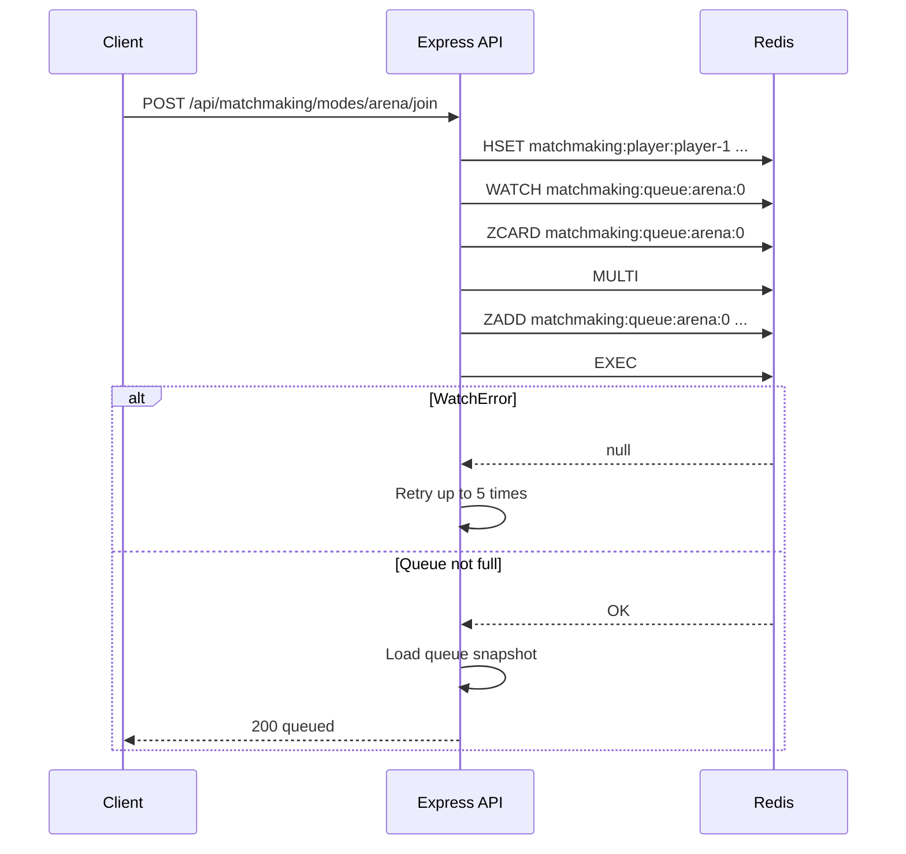
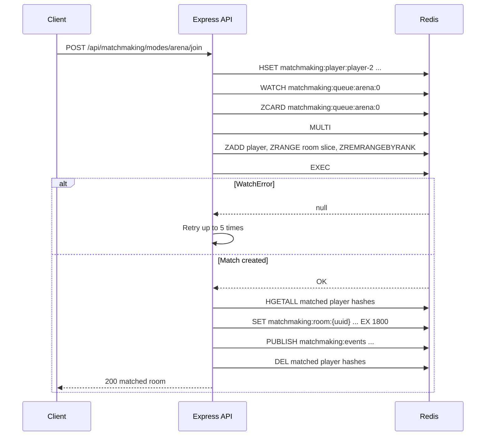
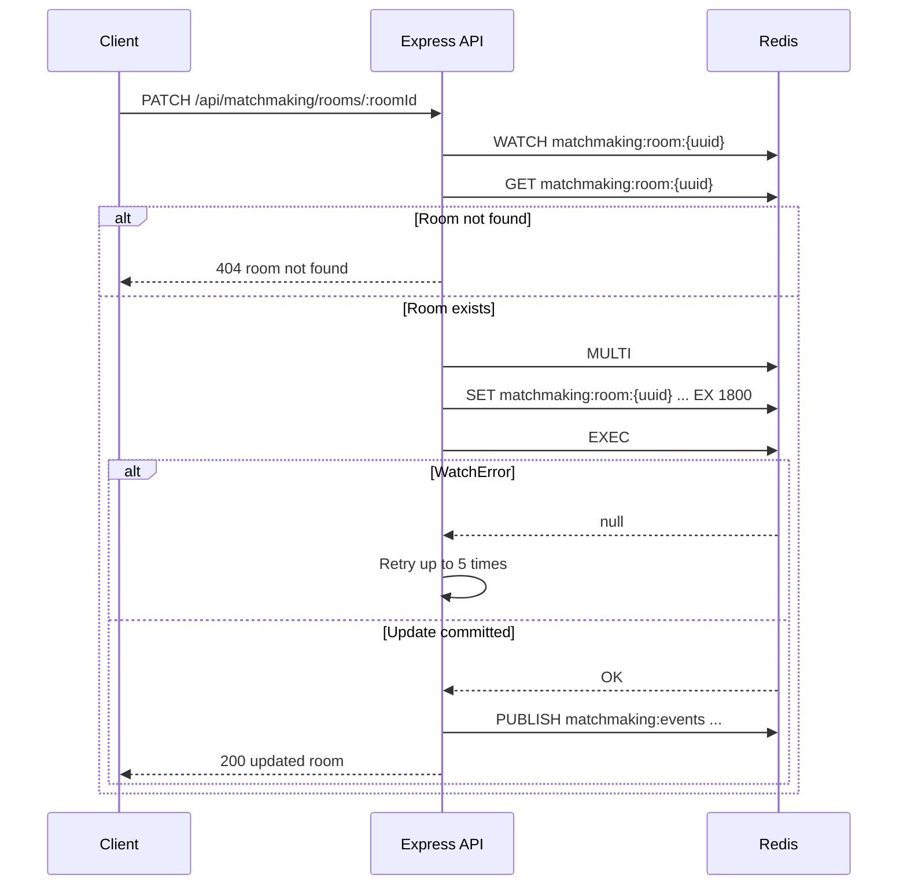

*Published 19 March 2026 · updated 25 March 2026*

> **TL;DR:**
>
> Build matchmaking and game session state with Redis by storing queued players in sorted sets, player metadata in hashes, and active room state as JSON strings with TTLs. The app uses `WATCH` and `MULTI` for optimistic locking so concurrent join requests never double-match a player into two rooms. In this tutorial, you will clone the starter-based demo app, run it with Docker, and see how Redis groups players into a room, exposes queue snapshots, and updates room status through a small Express API.

To build matchmaking with Redis, store queued players in a sorted set keyed by mode and skill bucket, keep player metadata in hashes, and create rooms as JSON strings with a TTL. Use `WATCH` and `MULTI` to make the join-and-match flow atomic so two concurrent requests cannot pop the same players from the queue.

> **Note:** This tutorial uses the code from the following git repository:
>
> [https://github.com/redis-developer/matchmaking-and-game-session-state-with-redis](https://github.com/redis-developer/matchmaking-and-game-session-state-with-redis)

## What you'll learn

- How to model a matchmaking queue in Redis with sorted sets and hashes
- How to group players into skill buckets so similar players match first
- How to use `WATCH` and `MULTI` to prevent race conditions when matching players
- How to store room state as JSON and expire stale rooms automatically
- How to publish room lifecycle events with Pub/Sub
- How to expose matchmaking operations through a small REST API

## What you'll build

A Redis-backed matchmaking service with these endpoints:

- `POST /api/matchmaking/modes/:mode/join`
- `GET /api/matchmaking/modes/:mode/queue?skill=...`
- `GET /api/matchmaking/rooms/:roomId`
- `PATCH /api/matchmaking/rooms/:roomId`

The app keeps the primary run path in Docker, so you can start Redis and the server together and verify the full flow locally.

## What is matchmaking?

Matchmaking is the process of grouping players into a game session based on criteria like game mode and skill level. Instead of letting players manually find opponents, the system accepts join requests, holds players in a queue, and creates a room when enough players with compatible criteria are waiting.

The matchmaking lifecycle has three phases:

- **Queued** -- a player joins and waits for enough compatible players.
- **Matched** -- the queue reaches the configured room size, and a room is created with those players.
- **Completed or abandoned** -- the room is updated after the game ends or a player leaves.

This pattern matters because matchmaking is a concurrent problem. Multiple players join at the same time, and the system must guarantee that each player ends up in exactly one room. A simple read-then-write creates a race condition where two requests both see enough players in the queue and both try to create a room from the same set of players.

## Why use Redis for matchmaking?

Redis is a strong fit for matchmaking because it gives you fast reads, atomic updates, and simple data structures that match the problem:

| Structure     | Use                                                                |
| ------------- | ------------------------------------------------------------------ |
| Sorted set    | Queue ordered by join time, grouped by mode and skill bucket       |
| Hash          | Player metadata (display name, skill, mode) while waiting in queue |
| String (JSON) | Room state with a TTL so stale rooms expire automatically          |
| Pub/Sub       | Room lifecycle events for downstream systems                       |

`WATCH` and `MULTI` give you optimistic locking without external lock managers. If another request changes the queue between your read and your commit, Redis aborts the transaction and your app retries. That keeps the join flow safe under concurrency without blocking other readers.

## Prerequisites

- [Docker](https://docs.docker.com/get-docker/) and Docker Compose
- [Bun](https://bun.sh/) if you want to run the app outside Docker
- Basic familiarity with Redis keys, hashes, and sorted sets

## Step 1. Clone the repo

```bash
git clone https://github.com/redis-developer/matchmaking-and-game-session-state-with-redis.git
cd matchmaking-and-game-session-state-with-redis
```

## Step 2. Configure environment variables

Copy the sample file:

```bash
cp .env.example .env
```

The default local Redis URL is `redis://localhost:6379`. When you run the app with Docker Compose, the server container talks to Redis at `redis://redis:6379` instead.

## Step 3. Run the app with Docker

```bash
bun docker
```

That brings up Redis and the API server. The server listens on `http://localhost:8080`.

## Step 4. Run the tests

```bash
bun test
```

The test suite covers the core matchmaking lifecycle: queueing a player, reading a queue snapshot, matching two players into a room, reading room state, updating room status, and verifying that concurrent joins do not double-match players.

## Step 5. Join a queue

```bash
curl -X POST http://localhost:8080/api/matchmaking/modes/arena/join \
  -H 'Content-Type: application/json' \
  -d '{
    "playerId": "player-1",
    "skill": 14,
    "displayName": "Nova"
  }'
```

If the queue is not full yet, the response returns a `queued` status and a queue snapshot:

```json
{
    "status": "queued",
    "queue": {
        "mode": "arena",
        "skillBucket": 0,
        "size": 1,
        "players": [
            {
                "playerId": "player-1",
                "displayName": "Nova",
                "mode": "arena",
                "skill": 14,
                "skillBucket": 0,
                "joinedAt": "2026-03-19T12:00:00.000Z"
            }
        ]
    }
}
```

Under the hood, the app stores the player metadata in a hash and adds the player to the queue sorted set inside a `WATCH`/`MULTI` block:

```text
HSET matchmaking:player:player-1 playerId "player-1" displayName "Nova" mode "arena" skill "14" skillBucket "0" joinedAt "..."
WATCH matchmaking:queue:arena:0
ZCARD matchmaking:queue:arena:0
MULTI
ZADD matchmaking:queue:arena:0 1710849600000 "player-1"
EXEC
```

## Step 6. Join a second player

When another player joins the same mode and skill bucket, the service creates a room and returns it immediately.

```bash
curl -X POST http://localhost:8080/api/matchmaking/modes/arena/join \
  -H 'Content-Type: application/json' \
  -d '{
    "playerId": "player-2",
    "skill": 16,
    "displayName": "Orbit"
  }'
```

The response includes the new room with both players:

```json
{
    "status": "matched",
    "room": {
        "roomId": "a1b2c3d4-...",
        "mode": "arena",
        "skillBucket": 0,
        "status": "active",
        "players": [
            {
                "playerId": "player-1",
                "displayName": "Nova",
                "mode": "arena",
                "skill": 14,
                "skillBucket": 0,
                "joinedAt": "2026-03-19T12:00:00.000Z"
            },
            {
                "playerId": "player-2",
                "displayName": "Orbit",
                "mode": "arena",
                "skill": 16,
                "skillBucket": 0,
                "joinedAt": "2026-03-19T12:00:01.000Z"
            }
        ],
        "createdAt": "2026-03-19T12:00:01.000Z",
        "updatedAt": "2026-03-19T12:00:01.000Z",
        "expiresAt": "2026-03-19T12:30:01.000Z"
    }
}
```

## Step 7. Inspect the queue

```bash
curl "http://localhost:8080/api/matchmaking/modes/arena/queue?skill=14"
```

After matching, the queue is empty:

```json
{
    "queue": {
        "mode": "arena",
        "skillBucket": 0,
        "size": 0,
        "players": []
    }
}
```

## Step 8. Read and update a room

Use the `roomId` from the match response:

```bash
curl "http://localhost:8080/api/matchmaking/rooms/<roomId>"
```

After the match ends, update the room status and optionally set a winner:

```bash
curl -X PATCH http://localhost:8080/api/matchmaking/rooms/<roomId> \
  -H 'Content-Type: application/json' \
  -d '{
    "status": "completed",
    "winnerId": "player-2"
  }'
```

The response includes the updated room:

```json
{
    "room": {
        "roomId": "a1b2c3d4-...",
        "mode": "arena",
        "skillBucket": 0,
        "status": "completed",
        "winnerId": "player-2",
        "players": ["..."],
        "createdAt": "2026-03-19T12:00:01.000Z",
        "updatedAt": "2026-03-19T12:05:00.000Z",
        "expiresAt": "2026-03-19T12:30:01.000Z"
    }
}
```

## How it works

### Redis data model

The app uses three Redis key patterns:

| Key                                      | Type          | Purpose                                    |
| ---------------------------------------- | ------------- | ------------------------------------------ |
| `matchmaking:queue:{mode}:{skillBucket}` | Sorted set    | Queue of player IDs ordered by join time   |
| `matchmaking:player:{playerId}`          | Hash          | Player metadata while waiting in queue     |
| `matchmaking:room:{roomId}`              | String (JSON) | Room state with a TTL for automatic expiry |

Room lifecycle events are published to the `matchmaking:events` Pub/Sub channel.

### How does the join flow work?

The join flow is the most important operation because it must prevent two concurrent requests from matching the same players. The app uses optimistic locking with `WATCH` and `MULTI`:

1. Store the player's metadata hash (this key is independent, so it does not need to be inside the transaction).
2. Open a dedicated connection and `WATCH` the queue sorted-set key.
3. `ZCARD` to read the current queue size.
4. If adding this player fills the queue, open a `MULTI` block and queue `ZADD`, `ZRANGE`, and `ZREMRANGEBYRANK` commands.
5. `EXEC` the transaction. If another request changed the queue after the `WATCH`, Redis returns `null` and the app retries (up to 5 attempts).

The Redis commands for a successful match:

```text
HSET matchmaking:player:player-2 playerId "player-2" displayName "Orbit" mode "arena" skill "16" skillBucket "0" joinedAt "..."
WATCH matchmaking:queue:arena:0
ZCARD matchmaking:queue:arena:0
MULTI
ZADD matchmaking:queue:arena:0 1710849601000 "player-2"
ZRANGE matchmaking:queue:arena:0 0 1
ZREMRANGEBYRANK matchmaking:queue:arena:0 0 1
EXEC
HGETALL matchmaking:player:player-1
HGETALL matchmaking:player:player-2
SET matchmaking:room:<uuid> '{"roomId":"...","mode":"arena",...}' EX 1800
PUBLISH matchmaking:events '{"eventType":"room.created",...}'
DEL matchmaking:player:player-1
DEL matchmaking:player:player-2
```

If two requests try to match in the same queue at the same time, only one transaction commits. The other sees a `WatchError` from `EXEC`, meaning the watched key changed. That request retries with fresh data, and if the queue no longer has enough players, it returns a `queued` result instead.

### How does matching happen?

When the `ZCARD` check shows that adding the current player will fill the queue, the app queues three commands inside `MULTI`:

1. `ZADD` -- adds the new player to the sorted set with the current timestamp as the score.
2. `ZRANGE 0 ROOM_SIZE-1` -- reads the oldest players (lowest scores) from the set.
3. `ZREMRANGEBYRANK 0 ROOM_SIZE-1` -- atomically removes those same players.

Because all three run inside a single `MULTI`/`EXEC`, no other client can modify the set between the read and the removal. The player IDs returned by `ZRANGE` are then used to load the full player hashes and create the room.

### How is room state stored?

Room state is saved as a JSON string at `matchmaking:room:{roomId}` with an `EX` TTL so the key expires automatically. The `SET` command with `EX` combines storage and expiration in a single call:

```text
SET matchmaking:room:<uuid> '{"roomId":"...","mode":"arena","status":"active",...}' EX 1800
```

Each room includes:

- `roomId`, `mode`, `skillBucket`, `status`
- `players` -- the full player records from the queue
- timestamps for creation, updates, and expiry

Updates also use `WATCH`/`MULTI` to guard against concurrent patches:

```text
WATCH matchmaking:room:<uuid>
GET matchmaking:room:<uuid>
MULTI
SET matchmaking:room:<uuid> '{"status":"completed","winnerId":"player-2",...}' EX 1800
EXEC
```

### Why use a skill bucket?

Skill buckets keep the queue from matching players with very different ratings. In this demo, the bucket size is configurable, and the app uses a simple `floor(skill / bucketSize)` rule to group players. With the default bucket size of 25:

- Skills 0-24 land in bucket 0
- Skills 25-49 land in bucket 1
- Skills 50-74 land in bucket 2
- Skills 75-100 land in bucket 3

Each bucket gets its own sorted-set key, so a player with skill 14 never queues against a player with skill 80.

### How does Pub/Sub fit in?

Every room creation and update publishes an event to the `matchmaking:events` channel:

```text
PUBLISH matchmaking:events '{"eventType":"room.created","roomId":"...","mode":"arena","status":"active","playerIds":["player-1","player-2"],...}'
```

Downstream systems can subscribe to this channel to push real-time updates to clients, trigger game server provisioning, or update a leaderboard. The publish is fire-and-forget -- if no subscriber is listening or Pub/Sub is unavailable, the room lifecycle still completes normally.

### Request flow

The request flow breaks into three sequences:







## FAQ

### How do I build matchmaking with Redis?

Store queued players in sorted sets keyed by mode and skill bucket, with join timestamps as scores. Keep player metadata in hashes. When the queue reaches the configured room size, atomically pop the oldest players with `WATCH`/`MULTI` and create a room as a JSON string with a TTL. Publish room events to a Pub/Sub channel for downstream systems.

### What Redis data types work for game lobbies?

Sorted sets work well for queues because they keep players ordered by join time and support efficient range queries. Hashes store structured player metadata. Strings hold serialized room state as JSON. Pub/Sub pushes room lifecycle events to subscribers. TTLs handle automatic cleanup of stale rooms and player data.

### How do I store short-lived game session state?

Store the session as a JSON string with the `SET` command and pass the `EX` option to set a TTL in seconds. Redis deletes the key automatically when the TTL expires, so abandoned sessions do not stay around forever. For this app, rooms use a 30-minute TTL by default.

### How do I push room updates in real time?

Use Redis Pub/Sub. The app publishes to a `matchmaking:events` channel on every room creation and update. Downstream services subscribe to the channel and push updates to connected clients over WebSockets or server-sent events. The publish is non-blocking -- if no subscriber is listening, the room lifecycle still completes.

### Why store player data in a hash if the queue already has player ids?

The sorted set only needs the ordered player ids. The hash stores display name, mode, skill, and join time so the queue snapshot can be rebuilt without stuffing all of that into the queue entry itself.

### What happens if a room is never completed?

The room record expires automatically because the app sets a TTL on the room key. That keeps abandoned rooms from accumulating forever.

### How do you inspect the current queue?

Use `GET /api/matchmaking/modes/:mode/queue?skill=<skill>`. The service reads the sorted-set members in order and rebuilds a queue snapshot from the player hashes.

### Can Redis handle concurrent matchmaking requests safely?

Yes. The app uses `WATCH` and `MULTI` for optimistic locking. Before modifying the queue, the app watches the sorted-set key and reads the current size. All writes happen inside a `MULTI` block. If another request changes the watched key between the read and the `EXEC`, Redis aborts the transaction and the app retries with fresh data. This guarantees that each player ends up in exactly one room, even under concurrent load.

## Troubleshooting

### The app starts but returns a Redis error

Check that `REDIS_URL` in your `.env` file points to a running Redis instance. If you are using Docker, verify the container is healthy:

```bash
docker ps
```

### The join endpoint returns an error

Make sure the app container has finished starting before sending requests. Check the server logs:

```bash
docker logs matchmaking-and-game-session-state-with-redis-server-1
```

### Docker Compose fails to start

Make sure Docker is running and that ports 8080 and 6379 are not already in use by another service.

## Next steps

- Explore real-time chat state and Pub/Sub patterns in [How to build a chat app with Redis](/tutorials/howtos-chatapp/).
- Compare this queueing pattern with ranking and score updates in [How to build a leaderboard with Redis](/tutorials/howtos-leaderboard/).
- Apply the same Redis modeling ideas to inventory holds in [How to reserve inventory in real time with Redis](/tutorials/inventory-reservation-in-real-time-with-redis/).

## Additional resources

- [Redis docs](https://redis.io/docs/latest/)
- [Redis sorted sets](https://redis.io/docs/latest/develop/data-types/sorted-sets/)
- [Redis hashes](https://redis.io/docs/latest/develop/data-types/hashes/)
- [Redis Pub/Sub](https://redis.io/docs/latest/develop/interact/pubsub/)
- [Redis transactions](https://redis.io/docs/latest/develop/interact/transactions/)
- [Redis clients](https://redis.io/docs/latest/develop/clients/)
- [Redis Insight](https://redis.io/insight/)
