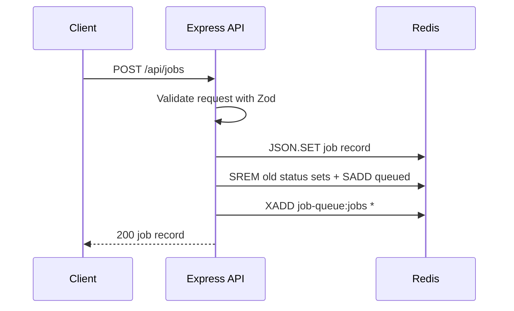
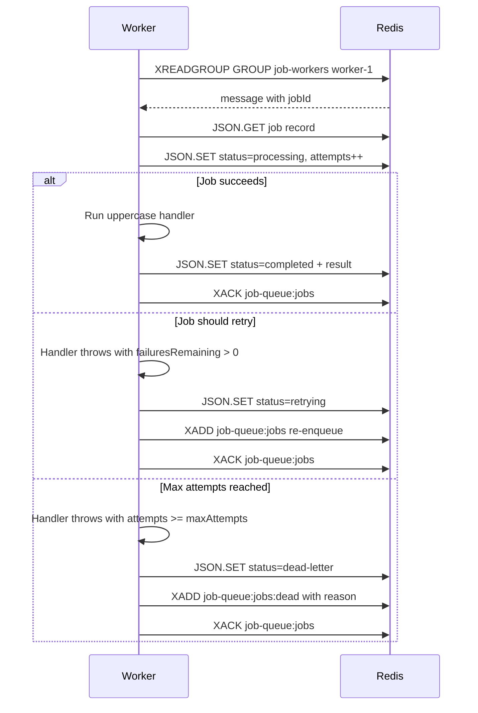
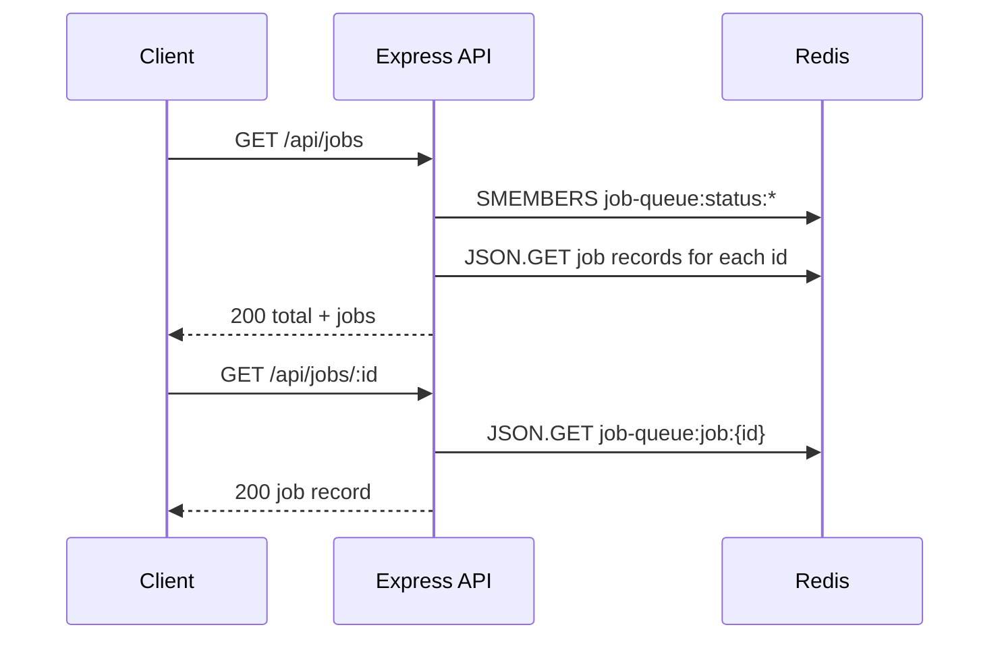

*Published 19 March 2026 · updated 25 March 2026*

> **TL;DR:**
>
> Use Redis Streams and a consumer group to queue jobs, let a worker claim and process each job, retry failures with a capped attempt count, and move exhausted work to a dead-letter stream.

> **Note:** This tutorial uses the code from the following git repository:
>
> [https://github.com/redis-developer/redis-backed-job-queue-for-background-workers](https://github.com/redis-developer/redis-backed-job-queue-for-background-workers)

To build a Redis-backed job queue, store each job as a JSON document, push the job id onto a Redis Stream, and let a worker claim messages through a consumer group with `XREADGROUP`. Track job status in Redis Sets so the API can filter by state without scanning every record. When a job fails, decrement a retry counter and re-enqueue it. When retries run out, move the job to a dead-letter stream.

## What you'll learn

- How to model queued jobs in Redis JSON
- How to enqueue work with `POST /api/jobs`
- How to read job state with `GET /api/jobs` and `GET /api/jobs/:id`
- How to process jobs with a Redis Stream consumer group
- How to retry failed work without losing the original job
- How to move exhausted jobs to a dead-letter stream
- How to shut down a worker gracefully with signal handling

## What you'll build

You'll build a Bun and Express app with two runnable processes:

- An API server that accepts jobs and exposes job status
- A worker that consumes jobs from Redis and updates their state

The app exposes these routes:

- `POST /api/jobs` -- enqueue a new job
- `GET /api/jobs` -- list all jobs, optionally filtered by status
- `GET /api/jobs/:id` -- inspect a single job

Each job record stores:

| Field                     | Purpose                                                                          |
| ------------------------- | -------------------------------------------------------------------------------- |
| `id`                      | Unique job identifier (UUID)                                                     |
| `type`                    | Job type (e.g. `uppercase`)                                                      |
| `status`                  | Current state: `queued`, `processing`, `retrying`, `completed`, or `dead-letter` |
| `attempts`                | How many times the worker has tried this job                                     |
| `maxAttempts`             | Maximum allowed attempts before dead-lettering                                   |
| `failuresRemaining`       | Simulated failures left (for demo purposes)                                      |
| `payload`                 | Input data for the job                                                           |
| `result`                  | Output data after successful processing                                          |
| `error`                   | Last error message if the job failed                                             |
| `createdAt` / `updatedAt` | Timestamps                                                                       |

## What is a job queue?

A job queue is a system that separates the act of requesting work from the act of doing it. Instead of processing a task inline during an HTTP request, the server pushes a job description onto a queue and returns immediately. A separate worker process picks up the job, executes it, and records the result.

The job lifecycle has three phases:

- **Enqueue** -- the API receives a request and adds a job to the queue.
- **Process** -- a worker claims the job, runs the task, and updates the result.
- **Complete or fail** -- the job either finishes successfully or fails. Failed jobs retry up to a limit, then move to a dead-letter queue for manual inspection.

This pattern matters because it decouples request handling from slow or unreliable work. Email delivery, image processing, third-party API calls, and data transformations all benefit from background execution. The caller gets a fast response, and the worker handles retries without blocking the API.

## Why use Redis for a job queue?

Redis is a strong fit for background job queues because it gives you fast writes, atomic delivery, and simple data structures that map directly to the problem.

| Structure            | Use                                                                                    |
| -------------------- | -------------------------------------------------------------------------------------- |
| Stream               | Append-only job delivery with consumer groups for reliable, at-most-once claiming      |
| JSON                 | Durable job records with structured fields that the API and worker both read and write |
| Set                  | Status indexes so `GET /api/jobs?status=completed` resolves in O(1) per member         |
| Stream (dead-letter) | Permanent record of exhausted work for later inspection or replay                      |

This demo uses Redis as the queue, the job registry, and the dead-letter sink. That keeps the moving parts small and makes failure behavior easy to see.

## Prerequisites

- [Bun](https://bun.sh/)
- [Docker](https://www.docker.com/)
- Basic TypeScript and HTTP knowledge

## Step 1. Clone the repo

```bash
git clone https://github.com/redis-developer/redis-backed-job-queue-for-background-workers.git
cd redis-backed-job-queue-for-background-workers
bun install
```

## Step 2. Configure environment variables

Copy the sample file:

```bash
cp .env.example .env
```

The app defaults to a local Redis connection when you run it in Docker. If you point it at [Redis Cloud](https://redis.io/try-free/) instead, update `REDIS_URL` in both your local and Docker env files.

You can also tune the queue behavior with these environment variables:

| Variable                           | Default               | Purpose                                             |
| ---------------------------------- | --------------------- | --------------------------------------------------- |
| `JOB_QUEUE_STREAM_KEY`             | `job-queue:jobs`      | Redis Stream key for the live queue                 |
| `JOB_QUEUE_DEAD_LETTER_STREAM_KEY` | `job-queue:jobs:dead` | Redis Stream key for dead-letter entries            |
| `JOB_QUEUE_GROUP_NAME`             | `job-workers`         | Consumer group name                                 |
| `JOB_QUEUE_CONSUMER_NAME`          | `worker-1`            | Consumer name within the group                      |
| `JOB_QUEUE_MAX_ATTEMPTS`           | `3`                   | Max attempts before dead-lettering                  |
| `JOB_QUEUE_BLOCK_MS`               | `1000`                | How long the worker blocks waiting for new messages |

## Step 3. Run the app with Docker

```bash
bun docker
```

That brings up Redis, the API server, and a worker. The server listens on `http://localhost:8080`.

To run a worker in a second terminal outside Docker Compose:

```bash
bun worker
```

## Step 4. Run the tests

```bash
bun test
```

The test suite covers the core job lifecycle: enqueuing a job, reading its status, processing retries, completing a job, and verifying that exhausted jobs move to the dead-letter stream.

## Step 5. Enqueue a job

```bash
curl -X POST http://localhost:8080/api/jobs \
  -H "Content-Type: application/json" \
  -d '{
    "type": "uppercase",
    "payload": { "text": "job queue" },
    "failuresRemaining": 1,
    "maxAttempts": 3
  }'
```

The response confirms the job is queued:

```json
{
    "id": "b8276423-af16-438e-a8e7-45172ad51904",
    "type": "uppercase",
    "status": "queued",
    "attempts": 0,
    "maxAttempts": 3,
    "failuresRemaining": 1,
    "payload": { "text": "job queue" },
    "result": null,
    "error": null,
    "createdAt": "2026-03-19T04:03:54.756Z",
    "updatedAt": "2026-03-19T04:03:54.756Z"
}
```

Under the hood, the app runs three Redis commands:

```text
JSON.SET job-queue:job:<uuid> $ '{"id":"...","type":"uppercase","status":"queued",...}'
SADD job-queue:status:queued <uuid>
XADD job-queue:jobs * jobId <uuid>
```

That gives you both queue delivery (the stream) and status lookup (the set and JSON record).

## Step 6. Observe the retry

With `failuresRemaining` set to `1`, the worker's first attempt throws a simulated error. Query the job after the worker picks it up:

```bash
curl http://localhost:8080/api/jobs/b8276423-af16-438e-a8e7-45172ad51904
```

The job shows `retrying` status with the failure count decremented:

```json
{
    "id": "b8276423-af16-438e-a8e7-45172ad51904",
    "type": "uppercase",
    "status": "retrying",
    "attempts": 1,
    "maxAttempts": 3,
    "failuresRemaining": 0,
    "payload": { "text": "job queue" },
    "result": null,
    "error": "Simulated job failure",
    "createdAt": "2026-03-19T04:03:54.756Z",
    "updatedAt": "2026-03-19T04:03:54.812Z"
}
```

The worker re-enqueued the job by pushing the same job id back onto the stream. On the next pass, `failuresRemaining` is `0`, so the job processes normally.

## Step 7. Verify completion

After the worker's second pass, query the job again:

```bash
curl http://localhost:8080/api/jobs/b8276423-af16-438e-a8e7-45172ad51904
```

The job is now `completed` with the uppercase result:

```json
{
    "id": "b8276423-af16-438e-a8e7-45172ad51904",
    "type": "uppercase",
    "status": "completed",
    "attempts": 2,
    "maxAttempts": 3,
    "failuresRemaining": 0,
    "payload": { "text": "job queue" },
    "result": { "text": "JOB QUEUE" },
    "error": null,
    "createdAt": "2026-03-19T04:03:54.756Z",
    "updatedAt": "2026-03-19T04:03:54.891Z"
}
```

To see a job reach the dead-letter stream instead, enqueue one where `failuresRemaining` exceeds `maxAttempts`:

```bash
curl -X POST http://localhost:8080/api/jobs \
  -H "Content-Type: application/json" \
  -d '{
    "type": "uppercase",
    "payload": { "text": "dead letter me" },
    "failuresRemaining": 5,
    "maxAttempts": 2
  }'
```

After the worker exhausts both attempts, query the job to see `"status": "dead-letter"` and an error message explaining why it was moved.

## Step 8. Monitor jobs by status

List every job:

```bash
curl http://localhost:8080/api/jobs
```

Filter by status:

```bash
curl "http://localhost:8080/api/jobs?status=completed"
```

```json
{
    "total": 1,
    "jobs": [
        {
            "id": "b8276423-af16-438e-a8e7-45172ad51904",
            "type": "uppercase",
            "status": "completed",
            "attempts": 2,
            "maxAttempts": 3,
            "failuresRemaining": 0,
            "payload": { "text": "job queue" },
            "result": { "text": "JOB QUEUE" },
            "error": null,
            "createdAt": "2026-03-19T04:03:54.756Z",
            "updatedAt": "2026-03-19T04:03:54.891Z"
        }
    ]
}
```

Because the app keeps status indexes in Redis Sets, these lookups stay fast even as the queue grows.

## How it works

### Redis data model

The app keeps queue state in five Redis key patterns:

| Key                         | Type           | Purpose                                                               |
| --------------------------- | -------------- | --------------------------------------------------------------------- |
| `job-queue:jobs`            | Stream         | Live queue; each message carries a `jobId` field                      |
| `job-queue:jobs:dead`       | Stream         | Dead-letter entries with `jobId`, `reason`, `attempts`, and `payload` |
| `job-queue:job:{id}`        | JSON           | Full job record (status, attempts, payload, result, timestamps)       |
| `job-queue:status:{status}` | Set            | Index of job ids grouped by current status                            |
| `job-workers`               | Consumer group | Attached to the `job-queue:jobs` stream                               |

### How does job enqueuing work?

When `POST /api/jobs` arrives, the app validates the request body with Zod, creates a `JobRecord`, and runs three Redis commands:

```text
JSON.SET job-queue:job:<uuid> $ '{"id":"<uuid>","type":"uppercase","status":"queued","attempts":0,...}'
SREM job-queue:status:queued <uuid>
SREM job-queue:status:processing <uuid>
SREM job-queue:status:retrying <uuid>
SREM job-queue:status:completed <uuid>
SREM job-queue:status:dead-letter <uuid>
SADD job-queue:status:queued <uuid>
XADD job-queue:jobs * jobId <uuid>
```

`JSON.SET` stores the full job record. The `SREM`/`SADD` sequence moves the job id into the correct status set (removing it from all others first). `XADD` appends the job id to the stream so the worker discovers it.

### How does the worker process jobs?

The worker starts in `server/worker.ts`. It initializes the consumer group and enters a loop that calls `XREADGROUP` to claim the next message:

```text
XREADGROUP GROUP job-workers worker-1 COUNT 1 BLOCK 1000 STREAMS job-queue:jobs >
```

The `>` id means "give me only messages that no other consumer in this group has claimed." `BLOCK 1000` makes the call wait up to 1 second for a new message before returning `null`.

When a message arrives, the worker:

1. Reads the `jobId` from the message fields.
2. Loads the full job record with `JSON.GET job-queue:job:<uuid>`.
3. Updates the job status to `processing` and increments `attempts`.
4. Runs the job handler (in this demo, uppercasing the payload text).
5. Saves the result and acknowledges the message with `XACK`.

```text
JSON.GET job-queue:job:<uuid>
JSON.SET job-queue:job:<uuid> $ '{"status":"processing","attempts":1,...}'
SREM job-queue:status:queued <uuid>
SADD job-queue:status:processing <uuid>
JSON.SET job-queue:job:<uuid> $ '{"status":"completed","result":{"text":"JOB QUEUE"},...}'
SREM job-queue:status:processing <uuid>
SADD job-queue:status:completed <uuid>
XACK job-queue:jobs job-workers <message-id>
```

The app uses the typed `redis.xReadGroup()` client method, which handles RESP parsing automatically.

### How do retries work?

The demo makes failures visible by design. Each job has a `failuresRemaining` counter that controls how many times the worker simulates a failure before processing normally.

If the job handler throws and the attempt count is still below `maxAttempts`, the worker:

1. Decrements `failuresRemaining`.
2. Updates the job status to `retrying` with the error message.
3. Pushes the same job id back onto the stream with `XADD`.
4. Acknowledges the original message with `XACK`.

```text
JSON.SET job-queue:job:<uuid> $ '{"status":"retrying","failuresRemaining":0,"error":"Simulated job failure",...}'
SREM job-queue:status:processing <uuid>
SADD job-queue:status:retrying <uuid>
XADD job-queue:jobs * jobId <uuid>
XACK job-queue:jobs job-workers <message-id>
```

On the next loop iteration, the worker claims the re-enqueued message and tries again. The job record keeps a running count of attempts so you can see exactly how many times the worker retried.

### How does dead-lettering work?

When a job's attempt count reaches `maxAttempts`, the worker stops retrying and moves the job to the dead-letter stream:

```text
JSON.SET job-queue:job:<uuid> $ '{"status":"dead-letter","error":"Moved to dead-letter after 2 attempts: ...",...}'
SREM job-queue:status:processing <uuid>
SADD job-queue:status:dead-letter <uuid>
XADD job-queue:jobs:dead * jobId <uuid> reason "Moved to dead-letter after 2 attempts: ..." attempts "2" payload '{"text":"..."}'
XACK job-queue:jobs job-workers <message-id>
```

The dead-letter stream is a separate Redis Stream that stores enough context to diagnose why the job failed. You can inspect it with `XRANGE job-queue:jobs:dead - +` in Redis Insight or replay the failed jobs by re-enqueuing them.

### How does graceful shutdown work?

The worker listens for `SIGTERM` and `SIGINT` signals. When a shutdown signal arrives, the worker sets a `running` flag to `false` and finishes processing the current job before exiting. This prevents the worker from abandoning a job mid-processing:

When a shutdown signal arrives, the worker:

- Sets `running = false`
- Finishes the current `XREADGROUP` and processing cycle
- Exits cleanly

If the worker is killed without a graceful shutdown, any unacknowledged message stays in the consumer group's pending entries list. The message can be reclaimed by another worker or the same worker on restart.

### Request flow

The request flow breaks into three sequences:







## FAQ

### Can Redis be used as a job queue?

Yes. Redis Streams are a strong fit for background jobs because they give you append-only delivery, consumer groups, and a built-in way to track what each worker has claimed.

### Should I use Lists or Streams for background jobs?

Use Streams when you need worker coordination, retries, and visibility into delivery state. Lists are simpler, but Streams are a better match once you need consumer groups and dead-letter handling.

### How do I retry failed jobs with Redis?

Store the job record in Redis, count attempts in the record, and requeue the job when the attempt limit is not reached. This demo does that by marking the job `retrying`, decrementing `failuresRemaining`, and pushing the job id back onto the stream with `XADD`.

### How do I avoid losing queued work?

Use a consumer group, persist the job state in Redis JSON, and acknowledge the message only after the job update succeeds. If a job fails too many times, move it to a dead-letter stream so you still have a record of what happened.

### What is a dead-letter queue in Redis?

A dead-letter queue is a separate destination for jobs that have failed too many times to retry. In this app, the dead-letter queue is a second Redis Stream (`job-queue:jobs:dead`) that stores the job id, the failure reason, the attempt count, and the original payload. That gives you enough context to diagnose the failure and replay the job if needed.

### How do Redis consumer groups work for job processing?

A consumer group attaches to a Redis Stream and distributes messages across one or more named consumers. Each message is delivered to exactly one consumer in the group. The consumer must acknowledge the message with `XACK` after processing it. If a consumer crashes before acknowledging, the message stays in the group's pending entries list and can be reclaimed.

### Can I run multiple workers with Redis Streams?

Yes. Each worker registers as a separate consumer in the same consumer group. Redis delivers each stream message to exactly one consumer, so no two workers process the same job. In this app, you set `JOB_QUEUE_CONSUMER_NAME` to a unique value per worker instance, and each worker calls `XREADGROUP` with its own consumer name.

## Troubleshooting

### The app starts but returns a Redis error

Check that `REDIS_URL` in your `.env` file points to a running Redis instance. If you are using Docker, verify the container is healthy:

```bash
docker ps
```

### Jobs stay in queued state

Make sure the worker process is running. If you are using Docker Compose, check that the worker container started:

```bash
docker logs redis-backed-job-queue-for-background-workers-worker-1
```

### Docker Compose fails to start

Make sure Docker is running and that port 8080 is not already in use by another service.

## Next steps

- Explore [Redis Streams basics](/tutorials/develop-dotnet-streams-stream-basics/)
- Compare queue delivery with [service-to-service communication](/tutorials/howtos-solutions-microservices-interservice-communication/)
- See another stream-driven pattern in [streaming LLM output](/tutorials/howtos-solutions-streams-streaming-llm-output/)

## Additional resources

- [Redis docs](https://redis.io/docs/latest/)
- [Redis Streams docs](https://redis.io/docs/latest/develop/data-types/streams/)
- [Redis JSON docs](https://redis.io/docs/latest/develop/data-types/json/)
- [Redis clients](https://redis.io/docs/latest/develop/clients/)
- [Redis Insight](https://redis.io/insight/)
