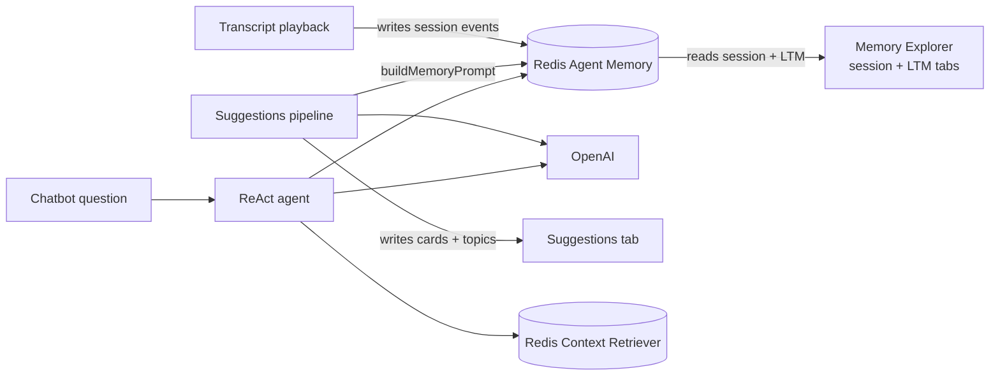
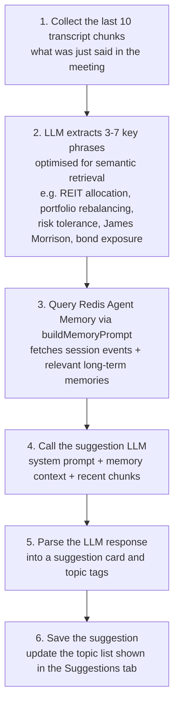

*Published 18 May 2026 · updated 2 June 2026*

> **TL;DR:** AI agents forget everything when a conversation ends, and can't query structured data without custom code. [**Redis Iris**](https://redis.io/iris/) solves both. **Redis Context Retriever** turns your entity data into auto-generated MCP tools any agent can discover and call. **Redis Agent Memory** gives agents persistent session memory and cross-session long-term memory backed by vector search. Together they make Redis a full context engine for AI applications.


> **Note:** This tutorial uses the code from the following git repository:
>
> `https://github.com/redis-developer/redis-agent-memory-explorer`

When a wealth advisor meets with a client every month, they're expected to remember what was discussed last quarter, the client's risk tolerance, their family situation, and every commitment made across a dozen previous meetings. Without a memory system, every LLM-powered assistant starts blank. The context window fills up fast, the session ends, and everything is forgotten.

This is the memory problem and it has three distinct parts:

- **Conversational memory**: what was said, what was decided, what the client revealed across many sessions over time
- **Structured knowledge**: portfolio holdings, financial goals, pending action items, and other data that belongs in a queryable store, not a chat log
- **Live meeting assistance**: during an active conversation, the advisor needs real-time nudges, which agenda topics haven't been covered yet, what the client said about this same issue last quarter, what action item just emerged, etc. without manually tracking anything

In this tutorial, you'll build the **Wealth Advisor Agent Memory Explorer** that solves all three using two Redis Cloud capabilities: **Redis Context Retriever** for structured data as auto-generated MCP tools, and **Redis Agent Memory** for persistent conversational memory. A LangGraph ReAct agent queries both layers to answer questions with source attribution, and a real-time suggestions pipeline surfaces live insights during meeting playback that are grounded in stored memory.

---

## How the two data layers compare

Before diving in, here's what each layer does and when to reach for it:

|                          | Redis Context Retriever                                                                      | Redis Agent Memory                                                                                                |
| ------------------------ | -------------------------------------------------------------------------------------------- | ----------------------------------------------------------------------------------------------------------------- |
| **What it stores**       | Structured business records: entities, fields, relationships (e.g. clients, holdings, goals) | Conversational history — session events, extracted facts, decisions, and sentiments                               |
| **When to use**          | Questions about current facts and business records: "What are James's holdings?"             | Questions about what was said, decided, or felt: "What did James say about bonds last month?"                     |
| **How agents access it** | Auto-generated MCP tools discovered at runtime: no hardcoded queries                         | SDK methods (`buildMemoryPrompt`, `searchLongTermMemory`) called from agent tools                                 |
| **Unique strength**      | Exact, complete answers: every matching record returned, no approximation                    | Cross-session context — connects what was said months ago to what is happening now                                |
| **Real-time assistance** | Provides ground-truth structured business data to back agent answers                         | Supplies conversation history and long-term memories so suggestions are grounded in what the client actually said |
| **Combined**             | "What is James's current allocation?" → exact records                                        | "…and what did he say about rebalancing?" → memory search: agent synthesises both in one reply                    |

---

## Prerequisites

- A [Redis Cloud](https://redis.io/try-free/) account with Redis Agent Memory and Redis Context Retriever enabled
- An [OpenAI API key](https://platform.openai.com/)
- [Docker](https://www.docker.com/) and Docker Compose
- [Node.js](https://nodejs.org/) 18+

---

## Setup

Clone the repo and copy the environment template:

```bash
git clone https://github.com/redis-developer/redis-agent-memory-explorer.git
cd redis-agent-memory-explorer
cp .env.example .env
```

Fill in your `.env`:

```bash
# Required
OPENAI_API_KEY=sk-your-openai-key-here
REDIS_URL=redis://your-cloud-redis-url:6379

# Redis Agent Memory
RAM_ENDPOINT=https://your-ram-endpoint.redis.io
RAM_API_KEY=your-ram-api-key
RAM_STORE_ID=your-store-id

# Redis Context Retriever
# Get your admin key from: https://cloud.redis.io/#/context-retriever/admin-keys
CTX_ADMIN_KEY=your-admin-key
CTX_ADMIN_API_URL=https://cloud.redis.io/context-surfaces
CTX_MCP_URL=https://gcp-us-east4.context-surfaces.redis.io/mcp

# Leave blank on first run so the app prints these after creating the surface.
# Copy the printed values here to reuse the surface on subsequent runs.
CTX_SURFACE_ID=
MCP_AGENT_KEY=
```

Start the app:

```bash
docker compose up -d
```

Open `http://localhost:3001`. On first run, the backend creates a Redis Context Retriever surface, loads entity records from `data/wealth-advisor/client-data.json`, and prints `CTX_SURFACE_ID` and `MCP_AGENT_KEY` to the console. Copy those values into your `.env`. Subsequent runs find them set, skip surface creation, and connect directly to the existing surface.

---

## What you'll build

The **Wealth Advisor Agent Memory Explorer** is a demo where Sarah Chen, a relationship manager at Acme Bank, conducts a live meeting with her client James Morrison. Rather than integrating a real meeting API, the app simulates the live call by streaming pre-recorded transcripts chunk by chunk. The focus is entirely on the Redis side: what happens to memory and context as the conversation unfolds in real time. As the meeting plays, session events are stored in Redis Agent Memory, long-term facts are extracted automatically in the background, and structured client data is accessible via Redis Context Retriever. A LangGraph ReAct chatbot can then query both layers to answer questions with source attribution.

### Architecture



> **Note:** The app runs as **two separate processes**: the API server (port 3001) handles REST routes and the suggestions pipeline; the LangGraph server (port 2024) hosts the ReAct chatbot agent. In Docker these are two containers from the same image (`demo-app` and `demo-langgraph`). Because they are separate OS processes, each initializes its own Redis Agent Memory and Context Retriever client instances on startup — both connecting to the same Redis Cloud endpoint via shared environment variables.

### Tech stack

| Layer           | Technology                                 |
| --------------- | ------------------------------------------ |
| Frontend        | Next.js 14 (App Router), React, CopilotKit |
| Backend         | Node.js, Express                           |
| Chatbot agent   | LangGraph/ LangChain                       |
| Memory          | Redis Agent Memory (Redis Cloud)           |
| Structured data | Redis Context Retriever (Redis Cloud)      |
| LLM             | OpenAI                                     |

---

## Redis Context Retriever

### What is Redis Context Retriever?

Redis Context Retriever is a Redis Cloud service that takes your structured entity data and turns it into **auto-generated MCP (Model Context Protocol) tools** that any agent can discover and call. You define an entity schema, load records, and Redis handles the rest, generating a full set of query tools without any custom API code.

For the wealth advisor demo, the entity schema defines four entities: `Client`, `Holding`, `FinancialGoal`, and `ActionItem`. Redis Context Retriever generates tools like `filter_holding_by_asset_class`, `search_financialgoal_by_text`, `find_holding_by_current_value_range`... and so on. Each self-describing, each callable by the LangGraph agent at runtime.

### Why this matters

| Aspect                  | Traditional approach                                   | With Redis Context Retriever                                                                    |
| ----------------------- | ------------------------------------------------------ | ----------------------------------------------------------------------------------------------- |
| **Accuracy**            | Vector search returns a semantically close chunk       | Typed MCP tools query exact structured records                                                  |
| **Agentic reasoning**   | One-shot retrieval; agent gets one answer and stops    | Agent chains multiple tool calls agentic-style, narrowing and enriching the answer at each step |
| **Runtime discovery**   | Hardcode entity knowledge in the agent's system prompt | Tools are self-describing; the agent discovers them at runtime                                  |
| **No custom API code**  | Build and maintain a custom API for every data source  | Auto-generated MCP tools, no custom API code                                                    |
| **Multi-surface scale** | One integration per data source                        | One retriever (surface) per dataset; the same agent queries them all                            |

### Key concepts

- **Retriever (Surface)**: A named retrieval service that ties a Redis data source to a multi-entity schema. Context Retriever reads that schema and auto-generates MCP tools the agent can call at runtime. You can view and manage all your surfaces in the [Redis Cloud Console](https://cloud.redis.io/#/context-retriever).
- **Entity schema**: Defines field names, types, and descriptions. This drives tool generation.
- **Admin key**: Used to create and manage surfaces and issue agent keys. Generate one from the [Context Retriever admin keys page](https://cloud.redis.io/#/context-retriever/admin-keys) in Redis Cloud and set it as `CTX_ADMIN_KEY` in your `.env`.
- **Agent key**: A scoped key the agent uses to call MCP tools, separate from the admin key used for retriever (surface) management.
- **MCP tools**: Auto-generated and self-describing. Tool names encode the query pattern: `filter_<entity>_by_<field>`, `search_<entity>_by_text`, `get_<entity>_by_id`, `find_<entity>_by_<field>_range`.

Once the wealth-advisor surface is created, the [Redis Cloud Console](https://cloud.redis.io/#/context-retriever) shows the full data model with all four entities: `Client`, `Holding`, `FinancialGoal`, and `ActionItem`. This confirms that MCP tools have been generated and are available for AI agents:


### What the entity schema looks like

Before creating a surface, you define an entity schema and pass it to the SDK. In this demo the schema lives in `client-data.json` for convenience, but it can come from any source (e.g. a separate config file, a database, or inline code). Each entity declares field names, types, descriptions, and the Redis index type for each field. This is what Redis Context Retriever reads to auto-generate the MCP tools.

Here is the `Client` entity (the primary entity) and the `Holding` entity (a related entity linked via `client_id`):

```json
[
    {
        "name": "Client",
        "description": "Wealth management client profile",
        "redisKeyTemplate": "wa_client:{client_id}",
        "fields": [
            {
                "name": "client_id",
                "type": "str",
                "description": "Unique client identifier",
                "isKeyComponent": true
            },
            {
                "name": "name",
                "type": "str",
                "description": "Full name",
                "redisIndices": [{ "type": "text", "weight": 2.0 }]
            },
            {
                "name": "age",
                "type": "int",
                "description": "Age in years",
                "redisIndices": [{ "type": "numeric", "sortable": true }]
            },
            {
                "name": "risk_profile",
                "type": "str",
                "description": "Investment risk tolerance level",
                "redisIndices": [{ "type": "tag" }]
            },
            {
                "name": "total_aum",
                "type": "float",
                "description": "Total assets under management in USD",
                "redisIndices": [{ "type": "numeric", "sortable": true }]
            }
        ],
        "relationships": [
            {
                "name": "holdings",
                "target": "Holding",
                "sourceField": "client_id"
            }
            //...
        ]
    },
    {
        "name": "Holding",
        "description": "Portfolio position in an asset class",
        "redisKeyTemplate": "wa_holding:{holding_id}",
        "fields": [
            {
                "name": "holding_id",
                "type": "str",
                "description": "Unique holding identifier",
                "isKeyComponent": true
            },
            {
                "name": "client_id",
                "type": "str",
                "description": "Owner client ID",
                "redisIndices": [{ "type": "tag" }]
            },
            {
                "name": "asset_class",
                "type": "str",
                "description": "Asset class category",
                "redisIndices": [{ "type": "tag" }]
            },
            {
                "name": "allocation_percent",
                "type": "float",
                "description": "Portfolio allocation percentage",
                "redisIndices": [{ "type": "numeric", "sortable": true }]
            },
            {
                "name": "current_value",
                "type": "float",
                "description": "Current market value in USD",
                "redisIndices": [{ "type": "numeric", "sortable": true }]
            }
        ]
    }
]
```

> **Note:** The `redisIndices` field controls which query tools are generated. A `tag` field produces a `filter_<entity>_by_<field>` tool. A `numeric` field produces a `find_<entity>_by_<field>_range` tool. A `text` field produces a `search_<entity>_by_text` tool. `isKeyComponent: true` produces a `get_<entity>_by_id` tool.

### What the actual records look like

The `records` section of `client-data.json` holds the sample data that will be loaded into the surface. For the demo there is one client, James Morrison, with few holdings:

```json
{
    "Client": [
        {
            "client_id": "jamesmorrison",
            "name": "James Morrison",
            "age": 52,
            "organization": "Meridian Technologies",
            "risk_profile": "moderate",
            "total_aum": 2400000
        }
    ],
    "Holding": [
        {
            "holding_id": "h001",
            "client_id": "jamesmorrison",
            "asset_class": "equities",
            "allocation_percent": 45,
            "current_value": 1080000
        },
        {
            "holding_id": "h002",
            "client_id": "jamesmorrison",
            "asset_class": "fixed_income",
            "allocation_percent": 30,
            "current_value": 720000
        }
        //...
    ]
}
```

Each `Holding` record carries a `client_id` that matches the `Client` record, which is how `filter_holding_by_client_id` knows which holdings to return when the agent queries for a specific client.

### Creating a context retriever tool and loading records

Creating a surface and loading records is a one-time activity. On the first run, the backend creates the surface, generates the agent key, and prints both to the console. You copy these values into your `.env` as `CTX_SURFACE_ID` and `MCP_AGENT_KEY`. Every subsequent run finds them already set, skips creation entirely, and connects directly to the existing surface:

```typescript
import { ContextSurfaces } from 'cau-context-surfaces';

const cs = ContextSurfaces.create({ adminKey: CTX_ADMIN_KEY });

// Create the surface with your entity schema
const surface = await cs.createSurface({
    name: 'wealth-advisor',
    dataModel: {
        title: 'Wealth Advisor',
        entities: datasetConfig.contextSurfaces.entities,
    },
    dataSource: {
        type: 'redis',
        name: 'redis',
        connectionConfig: { addr: REDIS_URL },
    },
});

// The admin key (CTX_ADMIN_KEY) is used for all surface management operations via the SDK create/ read/  update/ delete surfaces.
// The agent key is a separate, scoped credential required specifically for MCP tool access.  It is generated dynamically after the surface is created and must be passed to any agent  that will call MCP tools.
const agentKey = await cs.createAgentKey(surface.id, { name: 'chatbot-agent' });
cs.setAgentKey(agentKey.key);

// Load structured entity records
await cs.loadRecords(surface.id, {
    entity: 'Client',
    records: clientData.clients,
});
await cs.loadRecords(surface.id, {
    entity: 'Holding',
    records: clientData.holdings,
});
```

After the first run, the surface ID and agent key are printed to the console. Copy these values and set them manually in your `.env`:

```bash
CTX_SURFACE_ID=<printed surface ID>
MCP_AGENT_KEY=<printed agent key>
```

On subsequent runs the backend reads these values from `.env` and skips surface creation entirely, reusing the existing retriever.

### Discovering and calling MCP tools

At agent startup, the LangGraph server fetches all available tools for the surface and wraps each one as a LangGraph `DynamicStructuredTool`:

```typescript
import { ContextSurfaces } from 'cau-context-surfaces';
import { DynamicStructuredTool } from '@langchain/core/tools';

const cs = ContextSurfaces.getInstance();

// Fetch all auto-generated MCP tools for this surface
const mcpTools = await cs.listTools();

// Wrap each MCP tool as a LangGraph tool
const tools = mcpTools.map(
    (mcpTool) =>
        new DynamicStructuredTool({
            name: mcpTool.name,
            description: `[Context Retriever] ${mcpTool.description}`,
            schema: buildJsonSchemaToZod(mcpTool.inputSchema), // converts JSON Schema → Zod
            func: async (args) => {
                const result = await cs.callTool(mcpTool.name, args);
                return extractMcpText(result); // extracts text from MCP JSON-RPC response
            },
        }),
);
```

Here's what's happening step by step:

1. **`listTools()`** fetches the current tool list from the MCP server. The tool count and names depend entirely on the entity schema, adding an entity to the schema automatically adds new tools.
2. **`buildJsonSchemaToZod()`** converts each tool's JSON Schema parameters into a Zod schema so LangGraph can validate inputs and generate the tool signature for the LLM.
3. **`cs.callTool()`** sends a JSON-RPC request to the MCP server and returns the structured result, which `extractMcpText()` unwraps to a plain string for the agent.

The agent now has a set of tools it can discover and call at runtime.

### Context Retriever tools in the demo

For the wealth advisor entity schema, Redis Context Retriever generates multiple tools. Here are some examples:

| Tool                                  | What it queries                                |
| ------------------------------------- | ---------------------------------------------- |
| `filter_holding_by_client_id`         | All portfolio holdings for a client            |
| `filter_holding_by_asset_class`       | Holdings by equity, bond, or real estate class |
| `find_holding_by_current_value_range` | Holdings above or below a value threshold      |
| `filter_financialgoal_by_client_id`   | All financial goals for a client               |
| `filter_financialgoal_by_type`        | Goals by type (retirement, education, etc.)    |
| `search_financialgoal_by_text`        | Full-text search across goals                  |
| `filter_actionitem_by_status`         | Pending or completed action items              |
| `get_client_by_id`                    | Client profile by primary key                  |

These tools are available to the agent at runtime. When a user asks a question that requires structured client data, the agent picks the right tool, calls it, and cites its source in the response.

For example, asking **"What is James Morrison's portfolio allocation?"** causes the agent to invoke `filter_holding_by_client_id`, retrieve the full holdings breakdown, and return the answer with a `SOURCE: CONTEXT RETRIEVER` label so the user can always see where the data came from:


> **Note:** This is where Context Retriever has a meaningful accuracy advantage over a standard RAG approach. If the portfolio data were stored purely as embeddings and retrieved with a single vector search, the agent would get back a semantically close chunk of text, but it would have no guarantee of completeness or precision. It might miss holdings, return stale text, or conflate records from different clients.
>
> With Context Retriever, the agent operates against structured records through typed MCP tools. It can call `filter_holding_by_client_id` to get every holding for a client, follow up with `find_holding_by_current_value_range` to narrow by value, and chain further tool calls as the question demands. The agent isn't doing a one-shot retrieval; it's navigating the data the same way a developer would query a database, just driven by the LLM's reasoning at runtime.

---

## Redis Agent Memory

### What is Redis Agent Memory?

Redis Agent Memory is a Redis Cloud service that gives AI agents two tiers of persistent memory:

- **Session memory**: An ordered log of events for the current session, scoped by `sessionId`. Each event has a role (`user`, `assistant`, `system`), content, and optional metadata. Session memory has a configurable TTL; typically set in hours since it only needs to live as long as the active session. This is what lets the agent handle follow-up questions and maintain context across multiple turns in the same conversation.
- **Long-term memory (LTM)**: Cross-session, persistent facts and events extracted from conversations. Backed by vector search so agents can retrieve semantically relevant memories regardless of which session produced them. LTM also supports a configurable TTL so stale memories can expire automatically without manual cleanup. This is what prevents the agent from starting blank at the beginning of every new session.

### Memory types

| Type       | What it stores                   | Example from the demo                                              |
| ---------- | -------------------------------- | ------------------------------------------------------------------ |
| `episodic` | Events with context and time     | "Client expressed concerns about REIT exposure in the Feb meeting" |
| `semantic` | Facts, preferences, profile data | "Client has a moderate risk tolerance"                             |
| `message`  | Stored conversation records      | Raw dialogue segments                                              |

> **Note:** In this demo, all auto-extracted long-term memories are `episodic` type because they come from meeting conversations. Redis Agent Memory extracts them automatically in the background. You can also create LTMs manually via `createLongTermMemories()` at any time. This is the right approach when you run your own extraction pipeline: processing documents, emails, call transcripts, or any content outside of a live session and persist the resulting memories directly:

```typescript
await ram.createLongTermMemories([
    {
        text: 'Client expressed strong interest in ESG-focused funds during onboarding',
        memoryType: MemoryType.EPISODIC,
        ownerId: 'sarah-chen',
        topics: ['ESG', 'onboarding'],
    },
    {
        text: "Client's primary investment objective is capital preservation, not growth",
        memoryType: MemoryType.SEMANTIC,
        ownerId: 'sarah-chen',
        topics: ['risk-profile', 'investment-goals'],
    },
]);
```

> **Note**: Automatic extraction and manual creation end up in the same searchable LTM store.

### How to use session memory to store a live conversation

When the user presses Play on a transcript, the frontend calls the backend once per chunk. Each chunk is a timestamped dialogue turn from the meeting. The backend formats it and stores it as a session event in Redis Agent Memory:

```typescript
import { RedisAgentMemory, MessageRole } from 'cau-ram';

// Each transcript chunk becomes one session event
const event = await RedisAgentMemory.getInstance().addSessionEvent({
    sessionId, // e.g. "playback-meeting-2024-12-01-1715000000"
    actorId: userId,
    role: resolveMessageRole(chunk.role), // MessageRole.USER or ASSISTANT
    content: `[${chunk.timestamp}] ${chunk.speaker}: ${chunk.text}`,
});
```

The session ID is generated when playback starts (`playback-<transcriptId>-<timestamp>`) and is unique per playback run.

Reading the live session back is equally simple:

```typescript
const sessionMemory =
    await RedisAgentMemory.getInstance().getSessionMemory(sessionId);
// Returns { sessionId, ownerId, events: SessionEvent[] }
```

In the demo, the Session memory tab polls this every few seconds during playback to display events as they arrive.


### How Long-term memory allows the agent to remember across sessions

After a transcript plays, Redis Agent Memory analyzes session events in the background and extracts durable facts as long-term memories. These are available for semantic search across all future sessions.

The Long-term memory tab searches LTMs by user, with optional filters for memory type and topics:

```typescript
const { memories } =
    await RedisAgentMemory.getInstance().searchAllLongTermMemory({
        text: 'portfolio allocation bonds', // semantic search query
        filter: {
            ownerId: 'sarah-chen', // scoped to this user
        },
    });
```

To see only the memories extracted from a specific meeting, filter by `sessionId` instead:

```typescript
const { memories } =
    await RedisAgentMemory.getInstance().searchAllLongTermMemory({
        filter: {
            sessionId: 'playback-meeting-2024-12-01-...',
        },
    });
```


### How to build a prompt using Redis Agent Memory

An utility method `buildMemoryPrompt` is used to assemble a token-budgeted context string from session events plus relevant long-term memories ready to inject directly into any LLM system prompt.

```typescript
const result = await ram.buildMemoryPrompt({
    query: 'What did we discuss about portfolio allocation?',
    sessionId: 'playback-meeting-...',
    ownerId: 'sarah-chen',
    contextWindowMax: 1500, // optional: cap how many tokens to use
    longTermSearch: true, // include LTM semantic search results
});

// result.context  → formatted markdown string, ready to inject into system prompt
// result.tokenUsage → { budget, used }
```

The output format is structured markdown the LLM can immediately use:

```text
Long-term memory

- [episodic] Client expressed concerns about REIT concentration in Dec meeting
- [semantic] Client prefers quarterly review cadence over monthly

Session summary

Advisor and client reviewed Q4 performance. Client flagged concerns about
tech sector concentration and asked about rotating into bonds.

Recent conversation

[00:12:45] James Morrison (client): I'm seeing a lot of volatility in tech.
[00:13:10] Sarah Chen (rm): Let's look at your current allocation together.
```

---

## How to query Redis Iris

The CopilotKit chatbot sidebar connects to a **LangGraph ReAct agent** that has tools from both data layers. This is the centrepiece of the demo: the agent receives a natural language question, reasons about which tools to call, calls them, and synthesizes an answer.

The same agent handles three distinct question types without any special-casing:

> **Redis Context Retriever-only question:** "What is James Morrison's portfolio allocation?"

The agent calls a single MCP tool (`filter_holding_by_client_id`), gets back exact structured records, and returns a precise breakdown. Source badge: `CONTEXT RETRIEVER`.


---

> **Redis Agent Memory-only question:** "What happened in this meeting?"

The agent calls `getMemoryContext` with the active session ID, which combines live session events with long-term memories into a single hydrated prompt. Source badge: `RAM SESSION + LONG-TERM MEMORY`.


---

> **Combined question:** "What is James's current allocation and what did he say about rebalancing?"

The agent reasons that it needs both structured portfolio data (Context Retriever) and conversational context about what was discussed (RAM). It chains three tool calls: `filter_holding_by_client_id`, `searchMemoriesBySession`, and `search_client_by_text`. Then the agent synthesizes both results into a single answer. Source badge: `CONTEXT RETRIEVER, RAM SESSION MEMORY`.


This is the power of having two data layers wired into one agent: structured precision from Redis Context Retriever, conversational depth from Redis Agent Memory, and the LLM reasoning over both to produce a single coherent answer. The same routing logic handles any question. `listSessions → getMemoryContext` for a named meeting, `filter_actionitem_by_status` for pending tasks, `find_holding_by_current_value_range` for value-based portfolio queries ... and so on.

### How the agent is wired

The LangGraph graph is a single-node ReAct agent. At startup it initializes both data clients and fetches all available tools:

```typescript
import { createReactAgent } from '@langchain/langgraph/prebuilt';
import { ChatOpenAI } from '@langchain/openai';
import { RedisAgentMemory } from 'cau-ram';
import { ContextSurfaces } from 'cau-context-surfaces';

// The wrapper takes both `ram` (connection config) and `llm` (for higher-level
// operations like buildMemoryPrompt, which calls the LLM for summarization).
// Internally it creates an AgentMemory client using only the config.
RedisAgentMemory.create({
    ram: { endpoint: RAM_ENDPOINT, apiKey: RAM_API_KEY, storeId: RAM_STORE_ID },
    llm: { model: LLM_MODEL, apiKey: OPENAI_API_KEY },
});

// Context Retriever  needs the agent key for MCP tool calls.
const cs = ContextSurfaces.create({ adminKey: CTX_ADMIN_KEY });
cs.setAgentKey(MCP_AGENT_KEY);
```

With both clients initialized, `createAllTools()` assembles the full tool list:

```typescript
const createAllTools = async () => {
    // 5 hand-written tools: getMemoryContext, searchMemories,
    // searchMemoriesBySession, listSessions, getSessionState
    const ramTools = createMemoryTools();

    // Fetch all MCP tool definitions from Context Retriever and wrap each one
    // as a LangGraph DynamicStructuredTool with a [Context] prefix
    const mcpTools = await ContextSurfaces.getInstance().listTools();
    const csTools = mcpTools.map(
        (mcpTool) =>
            new DynamicStructuredTool({
                name: mcpTool.name,
                description: `[Context] ${mcpTool.description}`,
                schema: buildJsonSchemaToZod(mcpTool.inputSchema),
                func: async (args) => {
                    const result = await cs.callTool(mcpTool.name, args);
                    return extractMcpText(result);
                },
            }),
    );

    return {
        tools: [...ramTools, ...csTools], // all tools in one flat array
        mcpToolDefs: mcpTools.map((t) => ({
            name: t.name,
            description: t.description,
        })),
    };
};

const { tools, mcpToolDefs } = await createAllTools();
const llm = new ChatOpenAI({ model: LLM_MODEL, temperature: 0 });
const reactAgent = createReactAgent({ llm, tools });
```

The final `tools` array contains the 5 Redis Agent Memory tools plus however many MCP tools Context Retriever generated from the entity schema (25 for the wealth-advisor demo). The agent sees them all as equal. It doesn't know or care which layer a tool queries.

### Redis Agent Memory tools

| Tool                      | When the agent uses it                                                                                                               |
| ------------------------- | ------------------------------------------------------------------------------------------------------------------------------------ |
| `getMemoryContext`        | Primary tool: returns a full `buildMemoryPrompt` result for any question about an active session, with session events + LTM combined |
| `searchMemories`          | Semantic search across all long-term memories, cross-session                                                                         |
| `searchMemoriesBySession` | Search long-term memories scoped to a specific meeting                                                                               |
| `listSessions`            | When the user references a meeting by date or name                                                                                   |
| `getSessionState`         | Session metadata: `event count`, `owner`, `ID`                                                                                       |

### The dynamic system prompt

The agent's system prompt is built at startup from the dataset config and the live MCP tool definitions. `buildSystemPrompt` parses entity names directly from tool names (e.g. `filter_holding_by_*` → `Holding`) and inlines every tool's name and description so the agent knows exactly what is available:

```typescript
const buildSystemPrompt = (
    config: DatasetConfig,
    mcpTools: McpToolDef[],
): string => {
    // Extract entity names from tool name patterns (e.g. "filter_holding_by_*" → "Holding")
    const entities = extractEntities(mcpTools);

    const contextSurfacesSection = `
Context Tools (Structured Data)
Available entities: ${entities.join(', ')}.

### Available tools
${mcpTools.map((t) => `  - \`${t.name}\`: ${t.description}`).join('\n')}

### When to use Redis Context Retriever vs Redis Agent Memory
- Context retriever: current, structured facts (portfolio, goals, action items)
- RAM: conversational context (what was said, decisions, sentiments)
- Both: compound questions call both layers and synthesize
    `;

    return `You are a Memory Assistant for "${config.name}".
You have access to Redis Agent Memory tools (session + long-term memory) and Redis Context Retriever tools.
${contextSurfacesSection}
// ... routing rules for RAM, response formatting rules ...`;
};
```

This means adding a new entity to the schema automatically updates the system prompt.

> **Note:** Source attribution is not generated by the LLM. A `postProcessMessages` function runs after the ReAct agent completes. It inspects the graph's message history, maps each tool name to a human-readable source label (`Long-term memory`, `Session memory`, `Context Retriever`, etc.), and prepends the `**Source:**/<tools>` header to the final AI message. The frontend parses this header into a rendered badge and collapsible tools disclosure. The LLM is explicitly told in the system prompt not to add it.

---

## See real-time suggestions

### Why this exists

Before a client meeting, a relationship manager already has topics they want to cover. Things like reviewing the retirement plan, discussing some contribution, or following up on a previous action item. In the demo, these are **pre-seeded topics** loaded at session start. During the live conversation, two things happen automatically:

1. **Topics get tracked without any manual effort.** As the transcript plays, the system detects when a pre-seeded topic gets discussed and marks it `discussed`. If the client introduces something new that wasn't on the agenda, it gets added to the topic list as a `new` topic. If the client asks a direct question about something, it's flagged as `question`. By the end of the meeting, the RM has a full picture of what was covered or missed without taking a single note.

2. **The LLM acts as a live assistant.** Every few transcript chunks, the suggestion pipeline fires and the LLM analyzes what was just said in context of the client's full history. It can:
    - Perform a **topic recall**: "James raised this same concern about REITs in December"
    - Flag a **life event**: "Client mentioned their spouse may retire early"
    - Detect a **sentiment shift**: "Client sounds anxious about market exposure"
    - Generate an **agenda reminder**: "Bond allocation hasn't been discussed yet"
    - Spot an **action item**: "Client asked for a rebalancing proposal"
    - Answer a **client question** using memory context from past meetings

The RM doesn't have to ask for any of this. It is generated automatically, grounded in Redis Agent Memory, so every insight is backed by actual stored conversation history and long-term memories rather than the LLM guessing.

### How the pipeline works

Every N chunks (configurable), the suggestion pipeline fires automatically:



Here's the core of the pipeline with how it hydrates memory context before invoking the suggestion LLM:

```typescript
// Step 1: extract a search query from the most recent chunks
const extractedQuery = await extractSearchQuery(recentChunks);

// Step 2: hydrate session + LTM context using that query
const memoryContext = await RedisAgentMemory.getInstance().buildMemoryPrompt({
    query: extractedQuery,
    sessionId,
    ownerId: userId,
    longTermSearch: true,
});

// Step 3: inject memory context into the suggestion LLM call
const result = await llm.invoke([
    new SystemMessage(systemPrompt),
    new SystemMessage(`Memory context:\n${JSON.stringify(memoryContext)}`),
    new HumanMessage(formatRecentChunks(recentChunks)),
]);
```

The LLM returns a structured JSON response with a suggestion and topic updates:

```json
{
    "suggestion": {
        "type": "topicRecall",
        "title": "Bond exposure came up in a previous meeting",
        "summary": "James raised concerns about bond allocation in the December meeting.",
        "details": ["Client mentioned REIT concerns then as well"],
        "relatedTopics": ["bonds", "portfolio rebalancing"]
    },
    "topicUpdates": [{ "name": "Bond allocation", "status": "discussed" }]
}
```

Topics follow the lifecycle described above: pre-seeded as `pending` → `discussed` when covered → `question` when the client asks directly → `new` if an unexpected topic emerges. The LLM reports these transitions in `topicUpdates` and the topic store merges them into the session state in real time.

The suggestion LLM is also passed all previous suggestions to prevent duplicates.


---

## Running the demo

Open `http://localhost:3001`. The app loads the wealth advisor configuration with participant roles and suggestion types from the backend.

1. **Select a transcript** from the dropdown in the left panel and click **Play**


1. **Watch session memory fill** in the **Session memory** tab as each chunk is stored — you can see the session ID, owner, and every transcript event in real time


1. **Watch long-term memories appear** in the **Long-term memories** tab after extraction runs in the background. Episodic memories (decisions, life events) and semantic memories (facts, preferences) accumulate as the transcript plays


1. **Check the suggestions tab** for live insights and detected topics. Pre-seeded topics move from pending to discussed, new topics get added, and the LLM generates suggestion cards (question answers, action items, topic recalls) every few chunks


1. **Open the chatbot sidebar** (bottom-right button) and ask questions across both data layers. The agent routes each question to the right tool and shows the source and tools used


Here are some questions to try:

- "What is James Morrison's portfolio allocation?"
- "What equities does James hold?"
- "What are James's financial goals?"
- "Are there any pending action items?"
- "List all holdings worth more than $500K"
- "What happened in this meeting?"
- "What did James say about REIT concerns?"
- "What was discussed about Emily's education?"
- "Summarize the Feb 26 call"
- "What is James's current allocation and what did he say about rebalancing?"
- "What is the retirement goal target and what has been discussed about it?"
- "List everything you know about James"

Click **reset** to clear all sessions, long-term memories, and copilot stores for a clean run.

---

## Next steps

- [Learn more about Redis Iris](https://redis.io/iris/)
- [View the source code: redis-agent-memory-explorer](https://github.com/redis-developer/redis-agent-memory-explorer)
- [Get started with Redis Cloud](https://redis.io/try-free/)
- [Dive deeper with Redis Agent Memory and LangGraph](https://redis.io/tutorials/redis-agent-memory-with-langgraph/)
