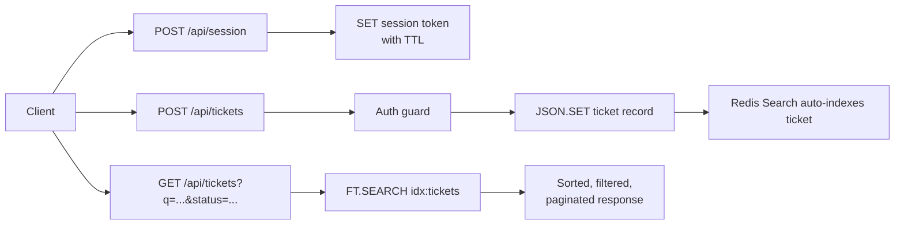

*Published 19 March 2026 · updated 25 March 2026*

> **TL;DR:**
>
> Use Redis as your NoSQL database when you need fast reads and writes, flexible document storage, and built-in search. In this app, each ticket lives as a JSON document, and a Redis Search index powers full-text search, TAG filtering, sorting, and pagination. Auth sessions are separate Redis keys with TTL, so login state expires automatically.

> **Note:** This tutorial uses the code from the following git repository:
>
> [https://github.com/redis-developer/redis-nosql-database-production-app](https://github.com/redis-developer/redis-nosql-database-production-app)

## What you'll learn

- How to model a production app around Redis JSON documents.
- How to create a search index with `FT.CREATE` over JSON documents.
- How to query, filter, and paginate documents with `FT.SEARCH`.
- How to use Redis for auth tokens with TTL.
- Where Redis fits well as a primary database, and where persistence tradeoffs matter.

## What you'll build

You'll work with a TypeScript app that exposes:

- `POST /api/session` to log in.
- `GET /api/tickets` to list and filter tickets.
- `GET /api/tickets/:id` to read one ticket.
- `POST /api/tickets` to create a ticket.
- `PATCH /api/tickets/:id` to update a ticket.
- `DELETE /api/tickets/:id` to delete a ticket.

## What is a NoSQL database?

A NoSQL database stores data without requiring fixed table schemas or SQL joins. Redis fits this model because it gives you JSON documents as a first-class data type and Redis Search as a query layer on top. You model your data around your access patterns instead of normalizing it into tables.

Redis works well as a primary NoSQL database when the app has simple, predictable access patterns — read by key, filter by index, search by keyword, expire by TTL. This tutorial builds an issue tracker that uses exactly those patterns.

## Why use Redis as a NoSQL database?

Redis gives you fast reads and writes, a built-in search and indexing engine, and TTL-based expiry for short-lived state. For an app like this issue tracker, that means:

- Each ticket is one JSON document with a single key.
- A Redis Search index auto-indexes documents for full-text search, TAG filtering, and sorted pagination.
- Auth sessions expire automatically without a cleanup job.

## Prerequisites

- Bun 1.3+
- Docker
- A Redis instance locally

## Step 1. Clone the repo

```bash
git clone https://github.com/redis-developer/redis-nosql-database-production-app.git
cd redis-nosql-database-production-app
```

## Step 2. Start the app with Docker

Docker is the primary run path for this tutorial.

```bash
bun docker
```

That starts the app on `http://localhost:8080` and Redis on `127.0.0.1:6379`.

> **Note:** The app uses Redis 8.0+ so JSON and Redis Search commands are available out of the box. That keeps the example close to a real production deployment, not a toy key-value sample.

## Step 3. Log in and get a bearer token

The app seeds an admin user at startup. Log in to get a session token:

```bash
curl -s -X POST "http://localhost:8080/api/session" \
  -H "Content-Type: application/json" \
  -d '{
    "email": "admin@redis.dev",
    "password": "redis-demo"
  }'
```

The response includes a `token` field. Save it for the next steps:

```json
{
    "token": "a1b2c3d4-...",
    "expiresAt": "2026-03-20T04:00:00.000Z",
    "user": { "id": "admin", "email": "admin@redis.dev", "role": "admin" }
}
```

That token is a bearer token stored in Redis with a TTL. Once it expires, the user must log in again.

## Step 4. Create a ticket

Use your token to create a ticket:

```bash
curl -s -X POST "http://localhost:8080/api/tickets" \
  -H "Authorization: Bearer <token>" \
  -H "Content-Type: application/json" \
  -d '{
    "title": "Billing dashboard export fails",
    "description": "Exports time out when the result set is large.",
    "status": "open",
    "priority": "high",
    "assignee": "sara@redis.dev",
    "labels": ["billing", "exports"],
    "requesterEmail": "customer@acme.test"
  }'
```

The app writes the ticket as a JSON document at `tickets:<id>` and Redis Search auto-indexes it. The response includes the generated `id`, timestamps, and `createdBy`.

## Step 5. List and filter tickets

The list route supports full-text search, TAG filters, and pagination — all handled server-side by `FT.SEARCH`:

```bash
curl "http://localhost:8080/api/tickets?q=billing&status=open&page=1&pageSize=10"
```

Try different filters:

```bash
curl "http://localhost:8080/api/tickets?priority=high"
curl "http://localhost:8080/api/tickets?label=exports"
curl "http://localhost:8080/api/tickets?assignee=sara@redis.dev"
```

The response includes `total`, `page`, `pageSize`, `hasMore`, and a `documents` array of ticket summaries.

## Step 6. Update and delete a ticket

Updates are partial. This request only changes the fields you send:

```bash
curl -X PATCH "http://localhost:8080/api/tickets/<ticket-id>" \
  -H "Authorization: Bearer <token>" \
  -H "Content-Type: application/json" \
  -d '{
    "status": "resolved",
    "labels": ["billing"]
  }'
```

The search index updates automatically when the JSON document changes.

Delete a ticket:

```bash
curl -X DELETE "http://localhost:8080/api/tickets/<ticket-id>" \
  -H "Authorization: Bearer <token>"
```

The app removes the JSON document, and the search index drops it.

## Step 7. Run the tests

The project includes integration and unit tests:

```bash
bun test
```

The integration tests start a Redis container, exercise the full CRUD flow, and verify filtering and pagination.

## How it works

### How does the data model work?

The app stores two kinds of data in Redis:

- **Tickets** are JSON documents keyed as `tickets:<id>`. Each document contains the full ticket with metadata like `createdAt`, `updatedBy`, and `labels`.
- **Users** are JSON documents keyed as `users:<id>`, with an email-to-key lookup at `users:email:<email>`.
- **Sessions** are plain string keys at `sessions:<token>` with a TTL. The value is the user id.

```text
tickets:<id>          JSON document (ticket data)
users:<id>            JSON document (user profile)
users:email:<email>   string pointing to users:<id>
sessions:<token>      string with TTL (user id)
idx:tickets           search index over tickets:* keys
```

This gives you one source of truth per entity, fast key-based lookups, and automatic expiry for sessions.

### How does the search index work?

At startup, the app creates a Redis Search index over all keys that match the `tickets:` prefix:

```typescript
await redis.ft.create(
    'idx:tickets',
    {
        '$.title': { type: SCHEMA_FIELD_TYPE.TEXT, AS: 'title' },
        '$.description': { type: SCHEMA_FIELD_TYPE.TEXT, AS: 'description' },
        '$.status': { type: SCHEMA_FIELD_TYPE.TAG, AS: 'status' },
        '$.priority': { type: SCHEMA_FIELD_TYPE.TAG, AS: 'priority' },
        '$.assignee': { type: SCHEMA_FIELD_TYPE.TAG, AS: 'assignee' },
        '$.labels[*]': { type: SCHEMA_FIELD_TYPE.TAG, AS: 'labels' },
        '$.requesterEmail': {
            type: SCHEMA_FIELD_TYPE.TAG,
            AS: 'requesterEmail',
        },
        '$.createdAt': {
            type: SCHEMA_FIELD_TYPE.TAG,
            SORTABLE: true,
            AS: 'createdAt',
        },
    },
    { ON: 'JSON', PREFIX: 'tickets:' },
);
```

- **TEXT** fields (`title`, `description`) support full-text search — when a user sends `?q=billing`, Redis tokenizes the query and matches against these fields.
- **TAG** fields (`status`, `priority`, `assignee`, `labels`, `requesterEmail`) support exact-match filtering — `?status=open` becomes `@status:{open}` in the query.
- **SORTABLE** on `createdAt` lets Redis sort results by creation date without loading every document.

When you call `JSON.SET` or `JSON.DEL`, the search index updates automatically. No manual index bookkeeping is needed.

### How does querying work?

The list route builds a single `FT.SEARCH` query from the request parameters:

```typescript
const result = await redis.ft.search('idx:tickets', '@status:{open} billing', {
    SORTBY: { BY: 'createdAt', DIRECTION: 'DESC' },
    LIMIT: { from: 0, size: 10 },
});
```

Redis handles filtering, full-text matching, sorting, and pagination in one round-trip. The app maps the result documents to ticket summaries and returns them.

### How does authentication work?

Login verifies the user's credentials and creates a session token:

1. Look up the user by email using the `users:email:<email>` key.
2. Compare the password hash.
3. Generate a UUID token and store it with `SET sessions:<token> <userId> EX <ttl>`.

Protected routes extract the bearer token from the `Authorization` header, look up the session key, and load the user. If the session key has expired, Redis returns `nil` and the request is rejected.

### Request flow



The app is intentionally small, but the shape is production-ready:

- `server/components/auth` seeds the admin user, hashes passwords, and issues session tokens.
- `server/components/tickets` stores tickets as JSON and delegates querying to Redis Search.
- `server/config.ts` centralizes Redis, auth, and runtime settings.
- `compose.yml` makes Docker the main run path and keeps Redis data on a volume.

## FAQ

### Can Redis be used as a primary database?

Yes. Redis can be the primary database when your app needs fast access, a flexible data model, and built-in search and indexing. This tutorial uses Redis that way for tickets and sessions.

### When should I use Redis as a NoSQL database?

Use it when your access patterns are known, low latency matters, and you want built-in search without a separate engine. Redis is a strong fit for app state, tickets, sessions, queues, and other operational data.

### How do I query JSON data in Redis?

Create a search index with `FT.CREATE` that maps JSON paths to field types like TEXT and TAG. Then query it with `FT.SEARCH`. In this app, `FT.SEARCH idx:tickets "@status:{open} billing"` finds open tickets matching the keyword "billing" in a single command.

### How do I create a search index for JSON documents?

Call `FT.CREATE` with `ON JSON` and a key prefix. Define each field you want to query or sort on — TEXT for full-text search, TAG for exact-match filters, and SORTABLE for ordering results. Redis maintains the index automatically as documents are created, updated, or deleted.

### What is the difference between Redis Search and manual indexes?

Manual indexes require your app to maintain sets or sorted sets alongside each document. Every create, update, and delete must update every index, which introduces race conditions and extra code. Redis Search maintains the index atomically — when you call `JSON.SET`, the index updates in the same operation.

### What about persistence and expiry?

Use TTL for short-lived state like sessions. For durable app data, keep Redis persistence enabled and back it with a volume or managed Redis service. This demo uses Docker volume persistence so the data survives container restarts.

## Troubleshooting

### The app starts but returns a Redis error

Check that `REDIS_URL` in your `.env` file points to a running Redis instance. This app uses Redis 8.0+ for JSON and Redis Search support. If you are using Docker, verify the container is healthy:

```bash
docker ps
```

### The ticket list returns empty results

Make sure the search index was created at startup. The app calls `FT.CREATE` during initialization — if Redis was not available at startup, the index may be missing. Restart the app to recreate it. If the index exists but results are empty, create at least one ticket with `POST /api/tickets`.

### Docker Compose fails to start

Make sure Docker is running and that ports 8080 and 6379 are not already in use by another service.

## Next steps

- Read [What is Redis?](/tutorials/what-is-redis/)
- Build [How to build a Hacker News clone using Redis](/tutorials/how-to-build-a-hackernews-clone-using-redis/)
- Learn [Indexing with Redis](/tutorials/guides/indexing/)

## Additional resources

- [Redis docs](https://redis.io/docs/latest/)
- [Redis JSON docs](https://redis.io/docs/latest/develop/data-types/json/)
- [Redis Search docs](https://redis.io/docs/latest/develop/interact/search-and-query/)
- [Redis clients](https://redis.io/docs/latest/develop/clients/)
- [Redis Insight](https://redis.io/insight/)
