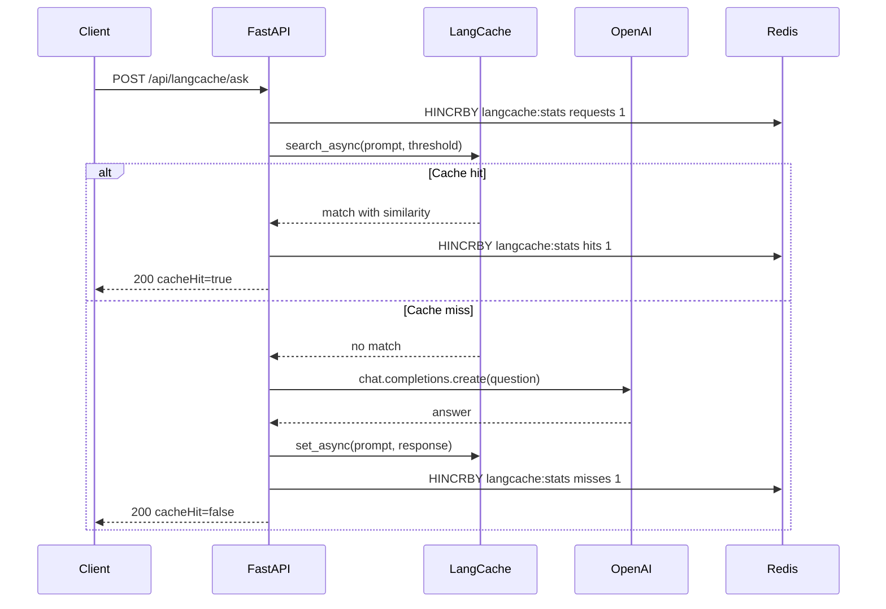
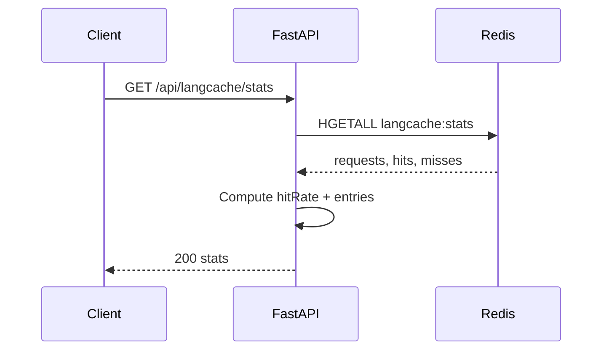

*Published 19 March 2026 · updated 25 March 2026*

> **TL;DR:**
>
> Semantic caching with Redis LangCache lets your app reuse LLM answers for similar questions instead of calling the model every time. In this tutorial, you'll build a FastAPI demo that checks LangCache first and returns a cached answer when the similarity is high enough. On a cache miss, the app calls OpenAI to generate a fresh answer, stores it in LangCache, and tracks hit rate in Redis.

> **Note:** This tutorial uses the code from the following git repository:
>
> [https://github.com/redis-developer/semantic-caching-with-redis-langcache](https://github.com/redis-developer/semantic-caching-with-redis-langcache)

To build a semantic cache with Redis LangCache, check the cache before every LLM call. When LangCache finds a semantically similar question, return the cached answer and skip the model entirely. When the cache misses, call OpenAI to generate a fresh answer, store the prompt-response pair in LangCache, and let the cache handle embeddings and similarity matching.

## What you'll learn

- How semantic caching differs from exact-match caching.
- How to use Redis LangCache as a semantic cache layer in front of an LLM.
- How to route requests through a cache-hit or cache-miss flow.
- How to track request stats in Redis.
- How to tune the similarity threshold so similar questions reuse answers without becoming too loose.

## What you'll build

You'll build a small FastAPI app with two routes:

- `POST /api/langcache/ask`
- `GET /api/langcache/stats`

The app will:

- Normalize an incoming question.
- Search LangCache for a semantically similar cached answer.
- Return the cached answer when similarity is high enough, skipping the LLM entirely.
- Call OpenAI to generate a fresh answer on a cache miss.
- Store the new prompt-response pair in LangCache for future reuse.

## What is semantic caching?

Semantic caching reuses a previously generated answer when a new question means the same thing, even if the words are different. Unlike exact-match caching, which only helps when the input text is identical, semantic caching compares the meaning of two questions by measuring the similarity between their vector embeddings.

This matters for support apps, product help, and internal Q&A where users rephrase the same request in many ways. A semantic cache catches those paraphrases and returns the cached answer instead of generating a new one.

## Why use Redis for semantic caching?

Redis LangCache handles the heavy lifting -- embedding, storage, and similarity search -- through a single API backed by Redis. That keeps the hot path simple:

- LangCache stores each prompt-response pair and computes embeddings automatically.
- A similarity search replaces the LLM call when a close enough match already exists.
- A single Redis stats hash gives you request, hit, and miss counters without extra storage.
- The app evaluates the cache before any expensive generation step, which keeps the response path fast.

For this demo, LangCache is the decision layer. The app searches the cache first and only calls OpenAI when the similarity is too low.

## Prerequisites

- Python 3.10 or later.
- Docker and Docker Compose.
- `make`.
- `uv`.
- An OpenAI API key.
- A Redis LangCache account (API URL, cache ID, and API key).

## Step 1. Clone the repo

```bash
git clone https://github.com/redis-developer/semantic-caching-with-redis-langcache.git
cd semantic-caching-with-redis-langcache
```

## Step 2. Configure environment variables

Copy the sample file:

```bash
cp .env.example .env
```

Open `.env` and fill in your credentials. Docker Compose reads from this file directly.

| Variable                    | Default                  | Purpose                                      |
| --------------------------- | ------------------------ | -------------------------------------------- |
| `REDIS_URL`                 | `redis://localhost:6379` | Redis connection string                      |
| `LANGCACHE_API_URL`         |                          | LangCache API endpoint                       |
| `LANGCACHE_CACHE_ID`        |                          | LangCache cache identifier                   |
| `LANGCACHE_API_KEY`         |                          | LangCache API key                            |
| `LANGCACHE_CACHE_THRESHOLD` | `0.65`                   | Minimum similarity to return a cached answer |
| `OPENAI_API_KEY`            |                          | OpenAI API key for LLM calls                 |
| `OPENAI_MODEL`              | `gpt-5.4-mini`           | OpenAI model to use on cache miss            |

## Step 3. Run the app with Docker

```bash
docker compose up -d --build
```

Once the services are up, the server is available on `http://localhost:8080` by default.

## Step 4. Run the tests

```bash
make test
```

The test suite covers the core cache lifecycle: asking a question, verifying a cache miss on the first request, confirming a cache hit on a paraphrased follow-up, and checking that the stats endpoint reports the correct counts.

## Step 5. Try the cache flow

Send the first question. The cache is empty, so the app calls OpenAI to generate an answer and stores it in LangCache:

```bash
curl -s http://localhost:8080/api/langcache/ask \
  -H 'Content-Type: application/json' \
  -d '{"question":"How do I reset my password?"}'
```

The response confirms a cache miss. The answer came from the LLM:

```json
{
    "question": "How do I reset my password?",
    "answer": "To reset your password, go to Settings, select Account, and click Reset Password. A reset link will be sent to your email.",
    "cacheHit": false,
    "source": "llm",
    "similarity": 0.0,
    "entryId": "b8276423-af16-438e-a8e7-45172ad51904"
}
```

Send a related follow-up question. LangCache finds the first question is semantically similar and returns the cached answer without calling OpenAI:

```bash
curl -s http://localhost:8080/api/langcache/ask \
  -H 'Content-Type: application/json' \
  -d '{"question":"I forgot how to change my login password."}'
```

The response shows a cache hit with the same answer:

```json
{
    "question": "I forgot how to change my login password.",
    "answer": "To reset your password, go to Settings, select Account, and click Reset Password. A reset link will be sent to your email.",
    "cacheHit": true,
    "source": "cache",
    "matchedPrompt": "How do I reset my password?",
    "similarity": 0.833,
    "entryId": "b8276423-af16-438e-a8e7-45172ad51904"
}
```

Check the cache stats:

```bash
curl -s http://localhost:8080/api/langcache/stats
```

```json
{
    "requests": 2,
    "hits": 1,
    "misses": 1,
    "entries": 2,
    "hitRate": 0.5
}
```

## How it works

### LangCache and Redis

The app uses two systems for state:

- **LangCache** manages cache entries. The LangCache SDK handles embedding, storage, and similarity search through its cloud API. The app never touches cache entry data in Redis directly.
- **Redis** stores a single `langcache:stats` hash with aggregate counters for requests, hits, and misses.

| Key               | Type | Purpose                                           |
| ----------------- | ---- | ------------------------------------------------- |
| `langcache:stats` | Hash | Aggregate counters for requests, hits, and misses |

### How does cache lookup work?

When `POST /api/langcache/ask` arrives, the app increments the request counter in Redis and then calls `lang_cache.search_async()` via the LangCache SDK:

```python
result = await self.lang_cache.search_async(
    prompt=question,
    similarity_threshold=self.similarity_threshold,
)
```

LangCache embeds the question, compares it against stored entries, and returns any match that meets the similarity threshold. The app does not compute embeddings or run similarity comparisons locally.

### How does a cache miss work?

When LangCache returns no match, the app calls OpenAI to generate an answer, stores the prompt-response pair in LangCache, and increments the miss counter:

```python
response = await self.openai.chat.completions.create(
    model=self.model,
    messages=[{"role": "user", "content": question}],
)
answer = response.choices[0].message.content

await self.lang_cache.set_async(prompt=question, response=answer)
```

```text
HINCRBY langcache:stats misses 1
```

`set_async` stores the prompt and response in LangCache, which handles embedding and indexing. `HINCRBY` bumps the miss counter in the stats hash.

### How does a cache hit work?

When LangCache returns a match above the similarity threshold, the app skips the LLM call entirely and increments the hit counter:

```text
HINCRBY langcache:stats hits 1
```

The app returns the cached answer along with the similarity score and the matched prompt so the caller can see where the answer came from.

### How do the stats work?

`GET /api/langcache/stats` reads the stats hash:

```text
HGETALL langcache:stats
```

The app computes `hitRate` as `hits / requests` and derives `entries` from `hits + misses`.

### Request flow

The request flow breaks into two sequences:





### Tune the similarity threshold

The default similarity threshold is `LANGCACHE_CACHE_THRESHOLD=0.65`.

Start around `0.65` for support-style FAQs. If the app starts missing obvious paraphrases, lower it slightly. If it starts returning the wrong cached answer for an unrelated question, raise it.

## FAQ

### What is semantic caching?

Semantic caching reuses a previously generated answer when a new question means the same thing, even if the words are different. Exact-match caching only helps when the text is identical. Semantic caching helps when users rephrase the same request.

### When should I use semantic caching instead of exact-match caching?

Use semantic caching when users ask the same thing in many ways, such as support questions, product help, or internal Q&A. Use exact-match caching when the input must match byte-for-byte or when you only expect repeated identical requests.

### How does Redis LangCache reduce LLM cost?

LangCache checks for a semantically similar question before the app calls OpenAI. If a match exists, the cached answer is returned and the LLM call is skipped entirely. That reduces token spend, latency, and load on the model.

### How does semantic caching reduce LLM latency?

A LangCache lookup takes milliseconds compared to hundreds of milliseconds or more for an LLM generation call. By returning a cached answer instead of calling the model, the app cuts response time for repeat and paraphrased questions dramatically. The heavier the model or the longer the expected output, the larger the latency saving.

### Can I use Redis for caching LLM responses?

Yes. Redis LangCache is purpose-built for this. The LangCache SDK stores each prompt-response pair, computes embeddings, and handles similarity search through its API. The app in this tutorial also uses a Redis hash to track hit-rate counters. This shows the full pattern end-to-end with FastAPI, OpenAI, and Docker.

### What Redis data types does semantic caching use?

This app uses a Redis hash (`langcache:stats`) for aggregate counters: total requests, hits, and misses. Cache entries themselves are managed by the LangCache API, which handles embedding storage and similarity search.

### What similarity threshold should I start with?

Start around `0.65` for a support FAQ flow like this one. That is a good middle point for paraphrases. Tune down if you miss too many close matches, and tune up if you get false positives.

## Troubleshooting

### The app starts but returns a Redis error

Check that `REDIS_URL` in your `.env` file points to a running Redis instance. If you are using Docker, verify the container is healthy:

```bash
docker ps
```

### The ask endpoint always misses the cache

Check the `LANGCACHE_CACHE_THRESHOLD` value in your `.env` file. If it is set too high, the app will never match a cached answer. Start around `0.65` for support-style questions.

### The ask endpoint returns an OpenAI error

Verify that `OPENAI_API_KEY` in your `.env` file is set to a valid API key. Check that the key has access to the model specified in `OPENAI_MODEL`.

### Docker Compose fails to start

Make sure Docker is running and that port 8080 is not already in use by another service.

## Next steps

- Build a document agent that uses Redis memory and retrieval: [Build a document agent with Redis, RAG, and agent memory](/tutorials/build-a-document-agent-with-redis-rag-and-agent-memory/)
- See how LangGraph-based agents use Redis for memory and context: [Product management agent with LangGraph](/tutorials/howtos-product-management-agent-langgraph/)
- Learn how context engineering changes the shape of agent apps: [Context engineering workshop with Java](/tutorials/context-engineering-workshop-java/)
- Compare this cache-first flow with agent memory patterns: [Agent memory with LangGraph and Redis](/tutorials/what-is-agent-memory-example-using-langgraph-and-redis/)

## Additional resources

- [Redis docs](https://redis.io/docs/latest/)
- [Redis LangCache](https://redis.io/docs/latest/develop/ai/langcache/)
- [Redis hashes](https://redis.io/docs/latest/develop/data-types/hashes/)
- [Redis clients](https://redis.io/docs/latest/develop/clients/)
- [Redis Insight](https://redis.io/insight/)
- [OpenAI API docs](https://platform.openai.com/docs)
